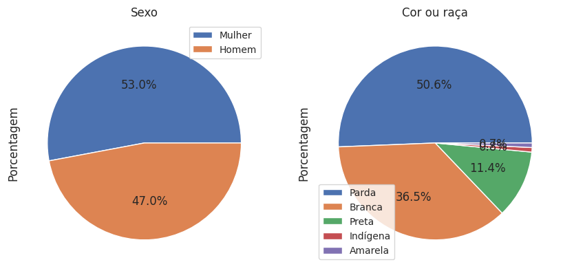
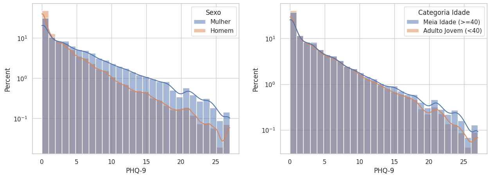
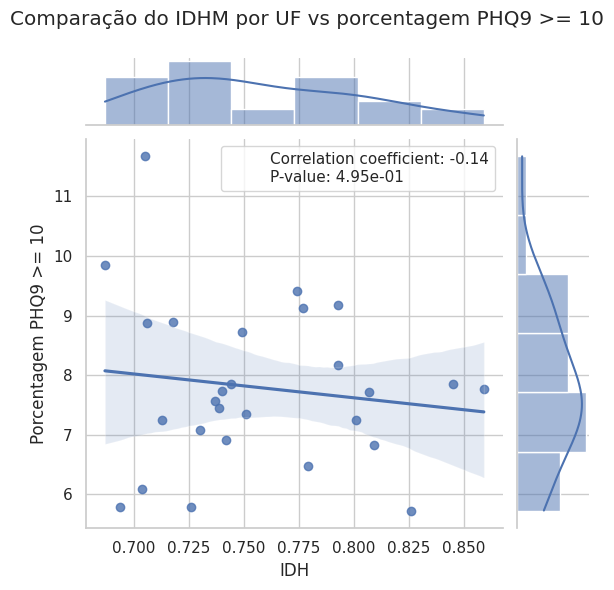

# Projeto `Associação de fatores de estilo de vida com depressão`
### Project `Association of lifestyle factors with depression`

# Apresentação

O presente projeto foi originado no contexto das atividades da disciplina de pós-graduação [*Ciência e Visualização de Dados em Saúde*](https://github.com/datasci4health/home), oferecida no primeiro semestre de 2023, na Unicamp.

|Nome  | RA | Especialização|
|--|--|--|
| Beatriz Silva Nunes  | 167428  | Saúde - [Conta GitHub](https://github.com/beatrizsnunes)|
| Arthur Rezende Salles   | 166003  | Computação - Líder Github - [Conta GitHub](https://github.com/Arthur-Salles)|
| Anderson Nogueira Cotrim  | 163993  | Computação - [Conta GitHub](https://github.com/AndersonCotrim)|
| Guilherme Magalhães Soares  | 217241  | Elétrica - [Conta GitHub](https://github.com/gsoso01)|

# Descrição Resumida do Projeto

As doenças crônicas não transmissíveis (DCNT) são um problema de saúde pública global [1]. DCNT estão associadas a diversos fatores de risco, dentre eles o uso de tabaco, inatividade física, consumo excessivo de álcool e dietas não saudáveis [1]. Entre as doenças crônicas temos a desordem depressiva ou depressão que é uma doença mental comum, caracterizada como uma persistência da tristeza e baixo interesse ou prazer em atividades anteriormente colocadas como comuns ou agradáveis [2, 3].

A depressão afeta cerca de 5% da população adulta mundial [2]. O tratamento da depressão é complexo e infelizmente ineficaz, reduz somente cerca de um terço da carga da desordem depressiva [4]. Com isso, a prevenção é a melhor forma de combater a depressão, similarmente a situação de outras doenças crônicas não transmissíveis como a obesidade.

Compreender as características da população com depressão e os fatores de risco associados à doença no Brasil é essencial para o desenvolvimento de políticas públicas e diretrizes considerando as particularidades da população brasileira.

A utilização de inquéritos de saúde nacional se torna extremamente pertinente para a compreensão da prevalência da doença e dos fatores associados, visto que são produzidos com amostragens representativas da população brasileira e têm o propósito de orientar diretrizes e políticas públicas de Saúde no país [5].

Com isso, o objetivo do estudo é buscar fatores de risco para a depressão e possíveis cenários que diminuiriam a chance de desenvolvimento de depressão utilizando a Pesquisa Nacional de Saúde.

[Link para vídeo de apresentação da proposta do projeto](https://drive.google.com/file/d/1uQ0wQsbig9BBA0OvvMyG8jLpcLTL104L/view?usp=share_link)

1. Hunter DJ, Reddy KS. Noncommunicable Diseases. N Engl J Med [Internet]. 2013 [cited 2023 Apr 14];369(14):1336–43. Available from: https://www.who.int/health-topics/noncommunicable-diseases#tab=tab_1

2. World Health Organisation. Mental health in emergencies [Internet]. 2019 [cited 2023 Apr 14]. p. 1–70. Available from: https://www.who.int/news-room/fact-sheets/detail/mental-health-in-emergencies

3. Soares B, Kanevsky G, Teng CT, Pérez-Esparza R, Bonetto GG, Lacerda ALT, et al. Prevalence and Impact of Treatment-Resistant Depression in Latin America: a Prospective, Observational Study. Psychiatr Q [Internet]. 2021 Dec 1 [cited 2023 Apr 14];92(4):1797–815. Available from: /pmc/articles/PMC8531108/

4. Chisholm D, Sanderson K, Ayuso-Mateos JL, Saxena S. Reducing the global burden of depression: Population-level analysis of intervention cost-effectiveness in 14 world regions. Br J Psychiatry [Internet]. 2004 May [cited 2023 Apr 14];184(MAY):393–403. Available from: https://pubmed.ncbi.nlm.nih.gov/15123502/

5. Stopa SR, Szwarcwald CL, Oliveira MM de, Gouvea E de CDP, Vieira MLFP, Freitas MPS de, et al. Pesquisa Nacional de Saúde 2019: histórico, métodos e perspectivas. Epidemiol e Serv saude Rev do Sist Unico Saude do Bras [Internet]. 2020 [cited 2023 Apr 14];29(5):e2020315. Available from: http://scielo.iec.gov.br/scielo.php?script=sci_arttext&pid=S1679-49742020000500035&lng=pt&nrm=iso&tlng=pt

# Perguntas de Pesquisa

Algumas perguntas de pesquisa foram pensadas visando uma compreensão aprofundada da prevalência e fatores de risco associados à depressão no Brasil.

 - Quais hábitos de vida estão associados à depressão? 
 - É possível quantificar o grau de impacto de cada hábito, considerando tanto as influências positivas quanto negativas? 
 - A influência desses fatores varia ao longo do curso da vida?
 - Será que o consumo de ultraprocessados está associado ao desenvolvimento da depressão?
 - Será que as pessoas que possuem depressão também possuem outras doenças crônicas que estão associadas com alto consumo de ultraprocessados como obesidade?

Através dos experimentos exploratórios, análise de correlação e gráficos de distribuição, foram confirmados alguns fatores associados com a depressão (utilizando χ2 de Pearson), como fumar tabaco, atividade física, algumas doenças crônicas, variaveis que estão em consonância com a literatura existente. Essas descobertas já contribuem para responder a primeira questão de pesquisa.

Para abordar a segunda questão, pretende-se utilizar a análise de regressão logística. Essa abordagem permitirá avaliar de forma mais precisa o grau de impacto de cada hábito, considerando tanto as influências positivas quanto as negativas, relacionadas à depressão.

Em relação à terceira questão, observou-se uma diferença na distribuição do potencial de depressão em relação à idade. No entanto, os fatores que influenciam essa diferença serão confrontados e explorados por meio da análise de regressão logística, possibilitando uma compreensão mais aprofundada.

Quanto às demais questões de pesquisa, espera-se aprimorar os resultados obtidos até o momento e fornecer contribuições mais significativas na entrega final.

# Metodologia

Este trabalho de forma geral procura avaliar e descobrir os fatores de risco para a depressão no Brasil. Para este fim, abordaremos uma metodologia baseada quatro estratégias principais:

- Realização de um estudo bibliográfico, que permitirá entender os padrões esperados para cada pergunta de pesquisa.
- Análise exploratória, incluindo seleção e pré-processamento dos dados. Mostrar o que os dados de forma macro contam diretamente. Exemplos: como é a distribuição da depressão pelas regiões do Brasil? Há correlação com IDH regional? Como essa doença se evoluiu ao longo dos anos no Brasil e em cada Estado? 
- Realização de uma análise estatística, utilizando técnicas de estatística descritiva e visualização, como gráficos de dispersão, caixa, e barras, a fim de extrair conhecimento dos dados.
- Aplicação de técnicas de aprendizado de máquina (regressão), que nos permita uma análise aprofundada e a quantificação da relevância de cada característica para variável de interesse (depressão). 

## Bases de Dados e Evolução

### Bases Estudadas mas Não Adotadas

Base de Dados  | Descrição | Anos
----- | ----- |  -----
[Pesquisa Nacional de Saúde do Escolar (PeNSE)](https://www.ibge.gov.br/en/statistics/social/population/16837-national-survey-of-school-health-editions.html?=&t=downloads) | O Instituto Brasileiro de Geografia e Estatística - IBGE - realiza a Pesquisa Nacional de Saúde do Escolar (PeNSE), em diversas cidades do Brasil, em parceria com o Ministério da Saúde e com o apoio do Ministério da Educação. Os objetivos da pesquisa são: conhecer e medir fatores de risco e de proteção relacionados à saúde dos adolescentes; apoiar o monitoramento da saúde dos estudantes brasileiros; oferecer orientação às iniciativas de saúde voltadas para esse grupo populacional, fornecendo informações confiáveis sobre o assunto. | 2019 (último)

Esta base de dados possui um total de 159245 alunos, com 306 características cada. Os dados estão estruturados e contam com dicionário. Inicialmente, tentamos utilizá-la para especificar mais o escopo da proposta de análise da depressão em adolescentes. Exploramos essa base por meio dos arquivos Jupyter Notebook, [pense_preprocessing.ipynb](notebooks/pense_preprocessing.ipynb) e [pense_hello_world.ipynb](notebooks/pense_hello_world.ipynb). No entanto, apesar do grande número de características, percebemos que essa base aborda pouco sobre doenças crônicas e apresenta algumas limitações relacionadas à saúde mental. Infelizmente, não encontramos nenhum indicador de depressão como o [PHQ9](https://www.mdcalc.com/calc/1725/phq9-patient-health-questionnaire9) que possa ser utilizado como na PNS (Pesquisa Nacional de Saúde).

Base de Dados  | Descrição | Anos
----- | ----- |  -----
[Sistema de Vigilância de Fatores de Risco e Proteção para Doenças Crônicas por Inquérito Telefônico (Vigitel)](https://svs.aids.gov.br/download/Vigitel/) | O Vigitel é parte integrante do sistema de Vigilância de Fatores de Risco para doenças crônicas não transmissíveis (DCNT) do Ministério da Saúde, juntamente com outros inquéritos, como os domiciliares e os direcionados à população escolar. Conhecer a situação de saúde da população é o primeiro passo para planejar ações e programas que possam reduzir a ocorrência e a gravidade dessas doenças, melhorando assim a saúde da população. A pesquisa Vigitel é realizada anualmente pela Secretaria de Vigilância em Saúde (SVS) do Ministério da Saúde e as entrevistas telefônicas são conduzidas com amostras da população adulta (18 anos ou mais) residente em domicílios com linha de telefone fixo. A partir de 2022, as entrevistas também passaram a ser realizadas em telefones celulares. | 2006-2021

Não tivemos a oportunidade de explorar a fundo essa base de dados, mas, à primeira vista, ela parece apresentar um número mais limitado de características (~300) em comparação com o PNS (~1000) que aborda de forma mais abrangente os fatores de estilo de vida que propomos analisar. Além disso, essa base de dados possui informações verificáveis se o diagnóstico de depressão já foi feito, mas não oferece parâmetros para avaliar o estado atual da saúde mental do entrevistado no momento da coleta dos dados.

### Bases Estudadas e Adotadas

Base de Dados  | Descrição | Anos
----- | ----- |  -----
[Pesquisa Nacional de Saúde (PNS)](https://www.ibge.gov.br/estatisticas/sociais/saude/9160-pesquisa-nacional-de-saude.html?=&t=downloads) | Realizada pelo Instituto Brasileiro de Geografia e Estatística (IBGE) em parceria com o Ministério da Saúde, tem como objetivo coletar informações sobre o desempenho do sistema nacional de saúde em relação ao acesso e uso dos serviços disponíveis, bem como garantir a continuidade dos cuidados necessários. Além disso, a pesquisa visa avaliar as condições de saúde da população, monitorar doenças crônicas não transmissíveis e identificar os principais fatores de risco associados a elas. |  2019 (último)

O dicionário disponibilizado pela PNS pode ser encontrado [aqui](data/raw/PNS_2019/dicionario.xlsx). O dicionário dispõe das perguntas feitas aos individuos e as possíveis respostas. Nota-se a grande variedade de perguntas relacionadas à doenças crônicas e aos hábios do domicílio. 

Foi necessário filtrar de forma arbitrária as perguntas de interesse para responder às perguntas de pesquisas escolhidas anteriormente. Mais especificamente, manteve-se no banco de dados para a análise do estudo perguntas para caracterização da amostra como sexo, cor ou raça, nível de escolaridade, renda média, características do domicílio, para verificação de hábitos de vida como consumo de álcool, tabaco, hábitos alimentares e atividade física, e para avaliar as doenças crônicas como diagnóstico de alguma doença crônica não transmissível (doenças cardíacas, artrite, diabetes, entre outras) por algum médico especialista.

Para adequar a níveis escolares simplificados, foi necessário agregar a população em quatro níveis escolares: Sem instrução e fundamental incompleto, fundamental completo e médio incompleto, médio completo e superior incompleto, superior completo.

Para realizar uma análise sobre a prevalência de depressão na população da pesquisa, aplicou-se o indicador [PHQ9](https://www.mdcalc.com/calc/1725/phq9-patient-health-questionnaire9), que indica a severidade da doença em cinco intervalos: nenhum ou mínimo, leve, moderada, moderadamente grave e grave. Por limitação da análise, apenas pessoas com idade entre 18 e 60 anos podem ser avaliadas neste índice. Devido à isso, os dados foram reduzidos a este intervalo.

Ao final do processamento obtivemos 90846 linhas e 380 colunas de dados relevantes paras as perguntas de pesquisa. Em reação a dados faltantes, vamos definir a melhor estratégia para tratamento durante a pipeline de regressão logistica conforme as features forem selecionadas.

Abaixo temos um resumo do workflow dos experimentos realizados com esta base:

Nas proximas seções decrevemos uma análise exploratoria inicial e mais detalhes desta base.

## Análise Exploratória

Nesta seção, apresentamos algumas características identificadas na base de dados selecionada, juntamente com os resultados da análise exploratória.

### Características descritivas da população

Os gráficos abaixo descrevem abaixo a proporção em relação a sexo, cor ou raça das amostras da população. Onde podemos observar uma base balanceada em genrero e predominatimente composta por pessoas da cor ou raça parda.

Abaixo podemos observar curvas de distribuição dos individuos da base em reação a idade e peso, podemos notar que estas curva estão num intervalo de valores a primeira vista aceitavel indicando que aparentemente grande parte dos dados em relação a este atributo estão confiaveis. Abaixo temos a distribuição destas mesmas caracteristicas, porém limitados à amostragem aplicável ao PHQ9 (pessoas de 18 à 59 anos - [onde este indicador foi desenvolvido e avalido](https://doi.org/10.1046/j.1525-1497.2001.016009606.x)).

Por fim nos gráficos de barras abaixo temos a proporção do nível escolar e da renda percapita da população estudada:

Em relação à distribuição do valor PHQ9 (inteiro de 0 à 27) num comportamento similar ao uma exponecial negativa, conforme podemos observar na figura abaixo:

Nas figuras abaixo podemos comparar as distribuições do score PHQ-9 em confrontando algumas variaveis de interesse.

Abaixo temos o gráfico da porcentagem de pessoas que já disseram diagnosticadas por depressão por estado brasileiro.

Curiosamente, notou-se uma alta correlção entre o IDH médio de cada estado com a porcentagem de depressão.

O grupo concluiu que essa observação deve-se provavelmente ao fato de que haver um dignostico de depressão ou não deve-se muito à facilidade de acesso à saúde o que tende a ser mais fácil em locais com IDH elevado, por isso observo-se essa tendencia.

Avaliando o PHQ9 (indicativo acimida de moderado) questionario que foi aplicado durante à entrevista temos obtivemos o gráfico de correlaçao abaixo, reforçando o argumento da observação acima.

### Testes de associação

Devido ao fato das nossas variáveis de interesse serem qualitativas, utilizamos o teste χ2 de Pearson para buscar associação.
Primeiramente, buscamos associações entre as variáveis que possam nos auxiliar na discussão dos achados, por exemplo, percepção de saúde e nível de escolaridade e percepção de saúde e raça-cor, e minimizar as variáveis de caracterização da amostra, como associação entre nível de escolaridade e renda per capita. 

| Variáveis confrontadas                                 |        χ2 |   p-value |
|:-------------------------------------------------------|----------:|----------:|
| Nível de escolaridade e renda per capita               |  23047.00 |         0 |
| Percepção de saúde e nível de escolaridade             |   6137.04 |         0 |
| Percepção de saúde segundo OMS e nível de escolaridade |   4083.09 |         0 |
| Percepção de saúde e raça-cor                          |   1020.99 |         0 |
| Percepção de saúde segundo OMS e raça-cor              |    695.94 |         0 |

Em seguida, realizamos associações entre variáveis de caracterização dos indivíduos com alto potencial de depressão baseado no score PHQ9. Obtivemos que sexo, cor, idade, escolaridade, percepção da própria saúde, percepção da saúde segundo OMS, renda per capita possui associação (p< 0,05) com alto potencial de depressão.

| Variáveis confrontadas com alto potencial de depressão (PHQ9 score > 20) |        χ2 |    p_value |
|:-------------------------------------------------------------------------|----------:|-----------:|
| Sexo                                                                     |    650.12 |          0 |
| Cor                                                                      |     27.46 |    0.00005 |
| Categoria idade                                                          |     23.64 |          0 |
| Escolaridade                                                             |      9.63 |    0.02198 |
| Percepção da própria saúde                                               |   3007.41 |          0 |
| Percepção da saúde segundo a OMS                                         |   4762.96 |          0 |
| Possui animal de estimação?                                              |      2.64 |   0.10445* |
| Renda per capita                                                         |    263.28 |          0 |
| Frequência bebida alcoólica                                              |      2.61 |   0.27098* |
| Fuma tabaco                                                              |    101.61 |          0 |
| Atividade física nos últimos 3 meses                                     |    105.78 |          0 |
| Teve diagnostico artrite ou reumatismo                                   |    183.69 |          0 |
| Teve diagnostico AVC                                                     |     50.22 |          0 |
| Teve diagnostico doenças cardiovasculares                                |    150.73 |          0 |
| Teve diagnostico hipercolesterolemia                                     |    130.91 |          0 |
| Teve diagnostico diabetes                                                |     13.57 |    0.00023 |
| Teve diagnostico pressão alta                                            |     35.73 |          0 |
| Teve diagnostico câncer                                                  |      5.25 |    0.02193 |
| Teve diagnostico depressão                                               |   4597.09 |          0 |

Em relação aos hábitos de vida, encontramos associação entre fumar tabaco e atividade física nos últimos 3 meses (p< 0,05), porém não encontramos associação entre consumo de bebida alcoólica e depressão (p=0,27). Neste bloco, pretendemos realizar análises sobre consumo alimentar, porém é necessário criar um índice a partir das informações presentes no inquérito, visto que são perguntas baseadas em um grupo de alimento ou alimento, por esse motivo, iremos buscar a associação de padrão alimentar saudável e não saudável com alto potencial de depressão para a próximo entrega. 
Por fim, analisamos as doenças crônicas não transmissíveis com depressão e verificamos que diagnóstico de artrite ou reumatismo, AVC, doenças cardiovasculares, hipercolesterolemia, diabetes, hipertensão e câncer estão associados com alto potencial de depressão. Como na análise de hábitos de vida, pretendemos incluir para próxima etapa a análise de associação de obesidade com alto potencial para depressão.
A partir dessas análises, pretendemos levar para o modelo final todas as variáveis de hábitos de vida e doenças crônicas não transmissíveis que possuem associação com o alto potencial de depressão.

# Ferramentas

Ferramenta | Descrição
----- | -----
Python 3 | Linguagem de programação a ser utilizada para o desenvolvimento das soluções propostas.
Jupyter Notebook | Código principal e solução reprodutível em arquivos de Jupyter Notebook, ajuda também na visualização de dados.
Pandas | Ferramenta para manipulação e análise de dados tabulares.
NumPy | Biblioteca utilizada para manipulação de vetores multidimensionais.
Scipy | Biblioteca com algoritmos/cálculos estatísticos gerais.
Matplotlib/Plotly/Seaborn | Bibliotecas para visualização dos dados.
Scikit-learn | Biblioteca com grande variedade de algoritmos de aprendizagem de máquina.
ChatGPT | Ferramenta imprescindível, quase outro integrante do grupo, também conhecido como o evangelista da programação.

# Cronograma

Semanas | Tarefas                                           | Conclusão
----- |---------------------------------------------------| -----
Semana 01 (16/04 - 22/04) | Definir escopo do projeto e revisão bibliográfica | :heavy_check_mark:
Semana 02 (23/04 - 29/04) | Compreensão do dados                              | :heavy_check_mark:
Semana 03 (30/04 - 06/05) | Processamento dos dados                           | :heavy_check_mark:
Semana 04 (07/05 - 13/05) | Processamento dos dados                           | :heavy_check_mark:
Semana 05 (14/05 - 20/05) | Análise exploratória e Entrega 2                  | :heavy_check_mark:
Semana 06 (21/05 - 27/05) | Modelagem da solução                              |
Semana 07 (28/05 - 03/06) | Modelagem da solução                              |
Semana 08 (04/06 - 10/06) | Análise e discussão dos resultados                |
Semana 09 (11/06 - 17/06) | Relatório                                         |
Semana 10 (18/06 - 24/06) | Apresentação e Entrega Final                      |

# Material bibliográfico

[Barros MBA, Lima MG, Azevedo RCS, Medina LBP, Lopes CS, Menezes PR, Malta DC. Depression and health behaviors in Brazilian adults - PNS 2013. Rev Saude Publica. 2017 Jun 1;51(suppl 1):8s. doi: 10.1590/S1518-8787.2017051000084. PMID: 28591352; PMCID: PMC5676399.](https://pubmed.ncbi.nlm.nih.gov/28591352/)

[Godos J, Bonaccio M, Al-Qahtani WH, Marx W, Lane MM, Leggio GM, Grosso G. Ultra-Processed Food Consumption and Depressive Symptoms in a Mediterranean Cohort. Nutrients. 2023 Jan 18;15(3):504. doi: 10.3390/nu15030504. PMID: 36771211; PMCID: PMC9919031.](https://pubmed.ncbi.nlm.nih.gov/36771211/)

[Tian YR, Deng CY, Xie HC, Long QJ, Yao Y, Deng Y, Zhao H, Li Y, Liu H, Xiao L. Ultra-processed food intake and risk of depression: a systematic review. Nutr Hosp. 2023 Feb 15;40(1):160-176. English. doi: 10.20960/nh.03723. PMID: 36537321.](https://pubmed.ncbi.nlm.nih.gov/36537321/)

[Melo, A. P. S., Bonadiman, C. S. C., Andrade, F. M. de ., Pinheiro, P. C., & Malta, D. C.. (2023). Depression Screening in a population-based study: Brazilian National Health Survey 2019. Ciência & Saúde Coletiva, 28(4), 1163–1174. https://doi.org/10.1590/1413-81232023284.14912022](https://www.scielo.br/j/csc/a/wWKFtv8ZVZZTwVDM94Q3gFt/)

[Elizabeth L, Machado P, Zinöcker M, Baker P, Lawrence M. Ultra-Processed Foods and Health Outcomes: A Narrative Review. Nutrients. 2020 Jun 30;12(7):1955. doi: 10.3390/nu12071955. PMID: 32630022; PMCID: PMC7399967.](https://pubmed.ncbi.nlm.nih.gov/32630022/)

[Antunes JT, Dumont-Pena Érica, Silva AG da, Moutinho C dos S, Vieira MLFP, Malta DC. A saúde mental dos adolescentes brasileiros: Pesquisa Nacional de Saúde do Escolar de 2019. REME Rev Min Enferm.](https://periodicos.ufmg.br/index.php/reme/article/view/38984)

[Lane MM, Gamage E, Travica N, Dissanayaka T, Ashtree DN, Gauci S, Lotfaliany M, O'Neil A, Jacka FN, Marx W. Ultra-Processed Food Consumption and Mental Health: A Systematic Review and Meta-Analysis of Observational Studies. Nutrients. 2022 Jun 21;14(13):2568. doi: 10.3390/nu14132568. PMID: 35807749; PMCID: PMC9268228.](https://pubmed.ncbi.nlm.nih.gov/35807749/)

[Hecht EM, Rabil A, Martinez Steele E, Abrams GA, Ware D, Landy DC, Hennekens CH. Cross-sectional examination of ultra-processed food consumption and adverse mental health symptoms. Public Health Nutr. 2022 Nov;25(11):3225-3234. doi: 10.1017/S1368980022001586. Epub 2022 Jul 28. PMID: 35899785; PMCID: PMC9991859.](https://pubmed.ncbi.nlm.nih.gov/35899785/)
