# Projeto `Maiores causas de morte no Brasil – Uma Análise Temporal`
# Project `Major causes of death in Brazil – A Time Analysis `

# Apresentação

O presente projeto foi originado no contexto das atividades da disciplina de pós-graduação [*Ciência e Visualização de Dados em Saúde*](https://github.com/datasci4health/home), oferecida no primeiro semestre de 2023, na Universidade Estadual de Campinas (Unicamp).

> Discentes:
> |Nome  | RA | Especialização|
> |--|--|--|
> | Dorival Junior  | 215076  | Computação|
> | Camila Quadros  | 261300  | Computação - Líder Github - Conta <[*milqsimmer*](https://github.com/milqsimmer/projects2023)>|
> | Thayane Oliveira  | 216114  | Agrícola|
> | Yuri Richard  | 247016  | Saúde|

# Link de Slides da Apresentação Final
> https://docs.google.com/presentation/d/160ijI4cnk75xUS9M2HCCmQBcM1yehuCMKqK-J4q8v3w/edit?usp=sharing

# Introdução
> A mortalidade por doenças é um problema de saúde pública de grande relevância no Brasil e no mundo. Sua análise torna-se uma ferramenta essencial para entendermos as principais causas de morte e identificar os problemas de saúde de uma população, além de servir como base para propostas de intervenção e monitoramento da eficácia dessas estratégias (FRENTZEL-BEYME et al., 1980).
>
> As doenças cardiovasculares (DCV) representam um dos maiores desafios para a saúde em todo o mundo. Condições que afetam direta ou indiretamente o sistema circulatório, são responsáveis por um número significativo de mortes e impactam diretamente a qualidade de vida das pessoas. Compreender a evolução dessas doenças, seus fatores de risco e implementar estratégias eficazes de prevenção são fundamentais para reduzir a incidência e o impacto negativo que elas têm na sociedade (VADUGANATHAN et al., 2022).
>
> As DCV são um grupo de doenças que afetam o coração e os vasos sanguíneos. Incluindo cardiopatias em geral (arritmia, hipertensão, insuficiência cardíaca, etc.), vasculopatias (aterosclerose, trombose, aneurisma, etc.) e os eventos agudos como ataques cardíacos e acidentes vasculares cerebrais, que são resultado do interrompimento do fluxo sanguíneo para essas regiões (WORLD HEALTH ORGANIZATION., 2021).
>
> De acordo com dados publicados no último relatório da Sociedade Brasileira de Cardiologia (SBC), as DCV são a causa número 1 de morte no Brasil e foram responsáveis em 2019 por 1/3 do total de mortes no país. Dentre as doenças que compõem este grupo, a doença arterial coronariana foi a principal causa de morte e liderou o ranking em 25 dos 27 estados do Brasil (OLIVEIRA et al., 2022).  
>
> Objetiva-se realizar uma análise temporal sobre o número de óbitos por DCV nos últimos anos, buscando identificar padrões e informações que possam ser úteis para tomadores de decisão na implementação de medidas para prevenção e controle da doença.
>
> Para tanto, utilizaremos técnicas estatísticas e ferramentas de visualização de dados para examinar características no número de óbitos por DCV, bem como algumas das possíveis variáveis que podem estar associadas a um maior risco de desenvolvimento dessas condições.
>
> No entanto, há algumas limitações sobre os insights fornecidos pelo estudo devido à natureza dos dados. Ao trabalhar somente com número de óbitos, é possível haver uma subnotificação por fatores confundidores como comorbidades, além de não haver dados sobre estilo de vida do indivíduo, fator esse que tem impacto direto no desenvolvimento de doenças cardiovasculares. Além da ausência de informações sobre casos não fatais, que são igualmente relevantes para o entendimento do problema.
>
> Dessa forma, outros databases com informações de características físicas e exames de pacientes, foram escolhidas para ensaios por meio de técnicas de Machine Learning. Utilizada com objetivo de identificar quais fatores de risco mais relevantes e desenvolver um modelo preditivo de desenvolvimento da doença no período de 10 anos.

# Perguntas de Pesquisa e Objetivos
## Perguntas de pesquisa
* Qual a principal causa de mortalidade no Brasil no período de 1996 a 2021? 
* É possível estabelecer um modelo de série temporal adequado e estatisticamente significante para analisar os dados de mortalidade no Brasil, entre os anos de 1996 a 2021? É possível realizar uma predição baseada nesses dados?
* Quais fatores de risco são mais significantes para o desenvolvimento de Doenças Cardiovasculares?
* É possível utilizar técnicas de Machine Learning como classificador e preditor dos dados de doenças cardiovasculares? 
## Objetivo Geral
> Realizar um estudo temporal e analítico sobre a principal causa de morte no Brasil e no mundo e seus fatores de riscos.
## Objetivos Específicos
> (i)	Identificar a principal causa de morte no Brasil no período de 1996 a 2021;
>
> (ii)	Identificar um modelo de Séries Temporais que atenda plenamente aos pressupostos estatísticos estabelecidos por esta metodologia de modelagem, durante o recorte temporal considerado para a análise;
>
> (iii)	Gerar projeções a partir de uma Série Temporal do número de óbitos por Doenças Cardiovasculares;
>
> (iv)	Utilizar Machine Learning para tentar identificar a presença de Doenças Cardiovasculares em uma pessoa, baseado nas características físicas e exames;
>
> (v)	Utilizar Machine Learning para tentar prever a possibilidade de desenvolvimento de Doenças Cardiovasculares no período de 10 anos, baseado nas características físicas e exames.

# Métodos e Análises Realizadas
> Para atingir o objetivo do projeto, serão utilizadas três técnicas: (i) Análise exploratória de dados; (ii) análise de séries temporais; e (iii) Machine Learning.
> 
> A análise exploratória dos dados é utilizada para melhor compreensão e visualização dos dados, buscando padrões e correlações permitindo assim a aplicação de técnicas estatísticas. Suas apresentações são por meio de gráficos, tabelas, medidas de tendência central etc.
> 
> Uma série temporal é uma sequência de observações feitas ao longo do tempo, a característica fundamental desses dados é a dependência entre observações adjacentes, sendo o interesse principal analisar e modelar essa dependência (EHLERS, 2005).
> 
> A aplicação de séries temporais requer a consideração de certos pressupostos, que podem ser divididos em três estágios: descrição, que envolve a identificação da natureza do fenômeno em estudo; explicação, que utiliza a variação em uma série para explicar a variação em outra série; e predição, que busca prever a evolução da variável na série temporal por meio de um modelo estatístico que descreva o comportamento das observações (CARVALHO Jr.; COSTA Jr., 2017).
> 
> Ao trabalhar com séries temporais, pressupõe-se que elas sejam estacionárias, o que significa que elas se desenvolvem aleatoriamente ao redor de uma média constante, refletindo algum tipo de equilíbrio estável (MORETTIN; TOLOI, 2004). Segundo Morettin e Toloi (2004), caso a série não apresente estacionariedade, é necessário aplicar uma transformação aos dados originais para torná-la estacionária, a transformação mais comumente utilizada consiste em calcular as diferenças sucessivas da série original até obter uma série estacionária.
> 
> Para o teste de estacionariedade, o teste DF (Dickey-Fuller) realiza uma regressão e testa a presença na série de raiz unitária contra sua defasagem. Ele produz estimativas de equações por mínimos quadrados e avalia a estatística de teste t da hipótese τ = 0. Neste trabalho, será utilizado o teste DF com o valor de p, e para a hipótese nula, teremos a seguinte condição: se o valor de p > α, a série possui uma raiz unitária (Dickey; Fuller, 1979). As hipóteses são as seguintes: H0: A série possui uma raiz unitária, portanto, não é estacionária versus H1: A série não possui uma raiz unitária, portanto, é estacionária.
> 
> De acordo com Morettin (2006), em séries temporais, se os dados forem considerados normais, seu comportamento pode ser descrito por um modelo linear, como um modelo ARMA. As hipóteses são as seguintes: H0: Se o valor de p < α, os dados seguem uma distribuição normal versus H1: Se o valor de p > α, os dados não seguem uma distribuição normal.
> 
> Conforme o modelo clássico, todas as séries temporais são compostas por quatro padrões: tendência, ciclo, sazonalidade e ruído aleatório ou erro (MORETTIN; TOLOI, 2004). Tendência em uma série temporal indica seu comportamento de longo prazo, demonstrando crescimento ou decrescimento ao longo do tempo. A sazonalidade ocorre quando há flutuações repetitivas na série, que podem ocorrer em períodos inferiores a um ano. Já o ciclo refere-se a flutuações que se repetem em períodos superiores a um ano. Os erros, por sua vez, são flutuações na série que não possuem uma explicação clara e, portanto, não podem ser modeladas (SATORIS, 2003).
> 
> Para alcançar o objetivo deste trabalho, serão utilizados diferentes modelos de séries temporais para analisar os dados. Entre eles, estão o modelo ARIMA (Autoregressive Integrated Moving Average), o modelo SARIMA (Seasonal Autoregressive Integrated Moving Average), modelos de suavização exponencial, entre outros (MORETTIN; TOLOI, 2004). Cada modelo possui características específicas que se adequam melhor a determinados tipos de dados, sendo importante avaliar diversas abordagens para selecionar o modelo mais adequado aos dados em questão.
> 
> Além disso, o parâmetro de Erro Médio Absoluto (MASE) foi utilizado como fator decisivo para escolha do modelo por avaliar a precisão e melhor ajuste aos dados (KOEHLER; HYNDMAN, 2006).
>
> O machine learning é uma área da ciência da computação que procura combinar técnicas matemáticas e estatísticas com algoritmos computacionais (DEO, 2015; OBERMEYER, 2016). O seu objetivo é utilizar algoritmos com base em inteligência artificial para identificar padrões em conjuntos de variáveis e prever resultados específicos de interesse (WALJEE; HIGGINS, 2010; DARCY; LOUIE; ROBERTS, 2016).
>
> Na área da medicina, a maioria dos sistemas computacionais convencionais utiliza algoritmos baseados em regras, conhecidos como "sistemas especialistas"(WALJEE; HIGGINS, 2010). Nesses sistemas, os desenvolvedores codificam o conhecimento médico sobre um determinado assunto usando regras já conhecidas (WALJEE; HIGGINS, 2010). Por outro lado, as técnicas de aprendizagem automática lidam com um grande número de variáveis, explorando diversas combinações que possam prever resultados com confiabilidade, muitas vezes em conjuntos de dados volumosos, como o big data (WALJEE; HIGGINS, 2010).
>
> O avanço da capacidade computacional nas últimas décadas teve um impacto significativo no campo da detecção e previsão de doenças cardiovasculares através da interpretação de dados (FAN; SHEN; DAVATZIKOS, 2006). Esses dados incluem estudos de prontuários médicos, exames de imagem, bancos de dados biológicos e genômicos, bem como informações de avaliação molecular, a cardiologia é uma das áreas que mais se beneficiou dessas técnicas de aprendizado de máquina, desde a previsão de eventos cardiovasculares até aprimoramentos nos diagnósticos eletrocardiográficos, a inteligência artificial (IA) tem se mostrado uma ferramenta importante na pesquisa científica (SLOMKA; DEY; SITEK; MOTWANI; BERMAN; GERMANO; CARDIAC, 2017; MINCHOLÉ; CAMPS;  LYON; RODRÍGUEZ, 2019; D’AGOSTINO; PENCINA; MASSARO; COADY, 2013).
>
> Para o presente trabalho foram utilizados os modelos de regressão logística, random forest e K-Nearest Neighbour.
De acordo com Kutner et al. (2004), a análise de regressão é um conjunto de métodos estatísticos utilizados para interpretar a relação funcional entre variáveis que possuem uma relação de causa e efeito, o objetivo é estimar ou prever uma variável de resposta com base em uma ou mais variáveis preditoras. A análise de regressão logística é uma técnica estatística que é usada para analisar a relação entre uma variável dependente binária e uma ou mais variáveis independentes, onde o objetivo é prever se uma observação pertence a uma categoria ou não. É amplamente utilizada em estudos de epidemiologia e outras áreas de pesquisa, pois permite a estimativa da probabilidade de um evento ocorrer com base em um conjunto de variáveis explicativas (HOSMER JR et al., 2013).
>
> Random Forest (floresta aleatória) é um algoritmo de aprendizado de máquina que pertence à categoria de métodos de conjunto (ensemble methods). Ele é usado principalmente para tarefas de classificação e regressão (HO, 1995). A Random Forest é uma combinação de árvores de decisão individuais, onde cada árvore é treinada em um subconjunto aleatório dos dados de treinamento (HO, 1995). A Random Forest é amplamente utilizada em diversos domínios, devido à sua eficácia, capacidade de lidar com conjuntos de dados complexos e boa resistência a ruídos e outliers (BREIMAN, 2001). Além disso, ela pode fornecer medidas de importância das características, o que ajuda a identificar quais variáveis são mais relevantes para a tarefa de classificação ou regressão (BREIMAN, 2001).
>
> O K-Nearest Neighbors ou KNN é um algoritmo de aprendizado de máquina supervisionado utilizado para tarefas de classificação e regressão. Sua ideia fundamental é baseada na proximidade dos exemplos de treinamento no espaço de características. O KNN classifica um novo exemplo atribuindo-lhe a classe mais frequente entre seus K vizinhos mais próximos. O valor de K é um parâmetro que determina quantos vizinhos devem ser considerados na classificação (DUDANI, 1976).
>
> Na figura 1 é representado o desenvolvimento do trabalho desde a criação do projeto até a construção do relatório final.
>
> Figura 1: Workflow do desenvolvimento do projeto.
> 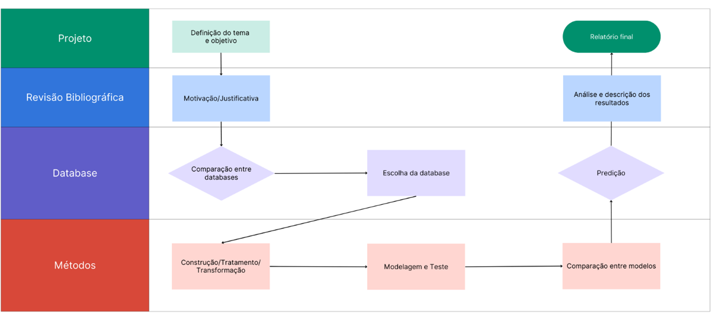
> 

# Bases de Dados e Evolução
## Bases Estudadas e Não Adotadas

> |Base de Dados  | Endereço na Web | Resumo Descritivo |
> |--|--|--|
> | WHO Mortality Database  | https://www.who.int/data/data-collection-tools/who-mortality-database  | Dados sobre óbito em nível global por doença. Banco codificado.|
> | Framingham Heart Study-Cohort (FHS-Cohort) | https://biolincc.nhlbi.nih.gov/studies/framcohort/ | Database com dados clínicos para investigação de fatores de risco que influenciam o desenvolvimento de DCV. Acesso Restrito.|

> A Base da organização mundial da saúde possui dados em nível global por doença. Base open-source com documentação disponível, no entanto a codificação dificulta o tratamento e agrupamento dos dados por classificação das doenças.
>
> Em relação ao dataset do “FHS-Cohort”, o tempo de aplicação para solicitar acesso varia entre 6 a 8 semanas. Inviabilizando o uso do mesmo no desenvolvimento do projeto.

## Bases Estudadas e Adotadas

> |Base de Dados  | Endereço na Web | Resumo Descritivo |
> |--|--|--|
> | Our World in Data (Database 1) | https://ourworldindata.org/grapher/annual-number-of-deaths-by-cause  | Dados sobre óbito em nível global de 1990 a 2019. |
> | Datasus Tabnet (Database 2) | http://tabnet.datasus.gov.br/cgi/tabcgi.exe?sim/cnv/obt10uf.def  | Dados sobre óbito no Brasil de 1996 a 2021. |
> | Cardiovascular Study Dataset – Kaggle (Database 3) | https://www.kaggle.com/datasets/christofel04/cardiovascular-study-dataset-predict-heart-disea?select=train.csv  | Dataset baseado no “Framingham Heart Study-Cohort (FHS-Cohort)”, sem atualização dos dados mais recentes. Acesso Livre. |
> | Cardiovascular Disease dataset – Kaggle (Database 4) | https://www.kaggle.com/datasets/sulianova/cardiovascular-disease-dataset | Dataset usado pra treino de Machine Learning. Dados Simulados. |

> A primeira base de dados selecionada foi retirada do projeto “Our World in Data”, uma plataforma open-source colaborativa mantida pela Universidade de Oxford e pela organização sem fins lucrativos Global Change Data Lab (GCDL). Disponível em: https://ourworldindata.org/causes-of-death. Essa base de dados compilou informações oriundas do Institute of Health Metrics and Evaluation (IHME), Global Burden of Disease (GBD) e da Organização Mundial da Saúde (OMS) que são bases open-source alimentadas com relatórios enviados pelos estados membros. 
> 
> Os dados disponíveis são globais desde 1990 a 2019: causa da morte; número total de mortes para ambos os sexos e todas a idades; ano; e país. Dados disponíveis de 1990 a 2019.
> 
> A segunda base de dados utilizada foi elaborada a partir de dados disponibilizados pelo TABNET - DataSUS, com os dados de óbitos por doenças cardiovasculares no Brasil filtrados a partir do Sistema de informações sobre Mortalidade (SIM). Permitindo a análise por sexo e faixa etária no período de 1996 a 2021.
>
> A terceira base de dados é uma versão antiga da FHS-Cohort de acesso livre. E a quarta database é uma simulação de dados de pacientes. Ambas estão disponíveis na plataforma Kaggle e reúnem características individuais, dados de estilo de vida e resultados de exames.

# Integração entre bases e análise exploratória
> A figura 2 mostra as cinco maiores causas de morte no período de 1990 a 2019 no Brasil de acordo com os dados da database 1.
> 
> Figura 2: Mapa das maiores causas de óbitos por país no ano de 2019.
> 
> 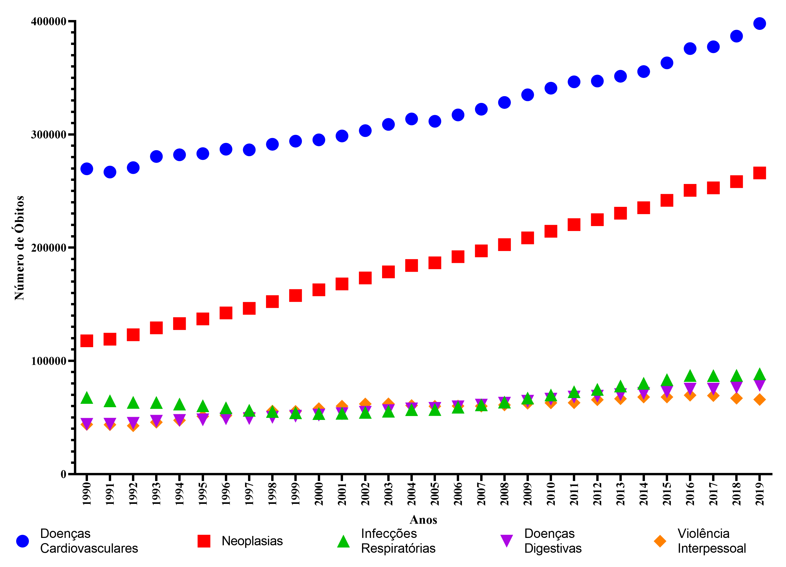
> 
> Fonte: Construção dos autores a partir de dados do “Our world in data” - database1.

> Na tabela 1, está a estatística descritiva e as medidas de tendência central dos dados disponíveis no database 1 sobre as doenças cardiovasculares no Brasil, no período de 1990 a 2019.
>
> Tabela 1: Descritiva sobre Número de óbitos por doenças cardiovasculares - database 1
>
> | Variável | N | Média | EP Média	| DesvPad | Mínimo	| Q1 | Mediana	| Q3 | Máximo |
> |--|--|--|--|--|--|--|--|--|--|
> | Doença Cardiovascular | 31 | 618646	| 299086 | 1665238	| 266804 | 286928 | 31365 | 351474 | 9589019 |
>
> Fonte: Construção dos autores a partir de dados do “Our world in data” – database1.

> A figura 3 ilustra as principais causas de mortalidade por país, no último ano analisado no database 1, o ano de 2019, evidenciando um predomínio no número de óbitos por doenças cardiovasculares, seguidas de neoplasias.
> 
> Figura 3: Mapa das maiores causas de óbitos por país no ano de 2019 – database 1
> 
> 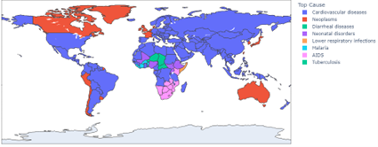
> 
> Fonte: Construção dos autores a partir de dados do “Our world in data”.

> Na Figura 4 é representado o número de óbitos por doenças cardiovasculares do Brasil de 1996 a 2021 segundo dados da database 2
>
> Figura 4: Número de óbitos por doenças cardiovasculares no Brasil no período de 1996 a 2021 por mês.
> 
> 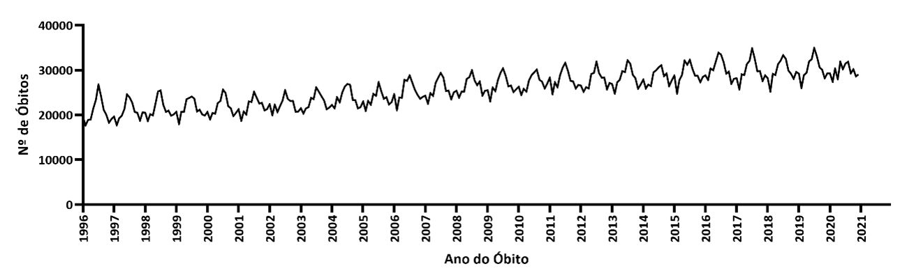
> 
> Fonte: Construção dos autores a partir de dados do DataSUS-Tabnet/SIM.

> Na figura 5 está evidenciado a divisão de 75% dos dados reais para treino e 25% para teste.
> 
> Figura 5: Divisão de dados para modelagem de Série Temporal. Número de óbitos por doenças cardiovasculares no Brasil no período de 1996 a 2021. 
> 
> 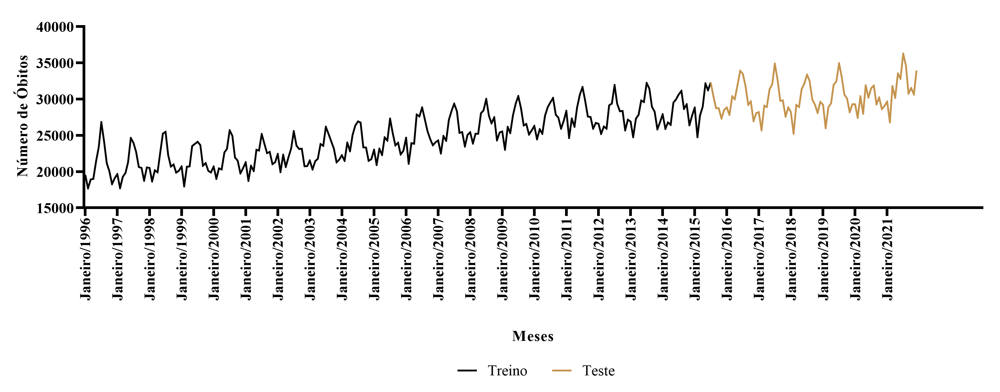
> 
> Fonte: Construção dos autores a partir de dados do DataSUS-Tabnet/SIM.

> Tabela 2: Descritiva sobre doenças cardiovasculares - database 2
>
> | Variável | N | Média | EP Média	| DesvPad | Mínimo	| Q1 | Mediana	| Q3 | Máximo |
> |--|--|--|--|--|--|--|--|--|--|
> | Doença Cardiovascular | 312 | 25976	| 226 | 3992 | 17689 | 22893 | 25965 | 29036 | 36263 |
>
> Fonte: Construção dos autores a partir de dados do DataSUS-Tabnet/SIM.

> A figura 6 mostra os maiores número de óbitos por 100 mil habitantes entre os estados brasileiros. O estado de São Paulo lidera o ranking com 2055 óbitos, seguido pelo Rio de Janeiro com 937 óbitos a cada 100 mil habitantes.
>
> Figura 5: Estados do Brasil com o maior número de óbitos por 100 mil habitantes devido a doenças cardiovasculares no período de 1996 a 2021.
>
> 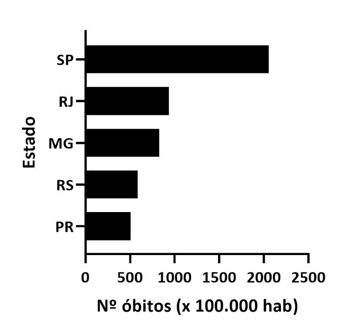
>
> Fonte: Construção dos autores a partir de dados do DataSUS-Tabnet/SIM.

> A partir da database 3, foi retirada as características individuais para classificação e predição por Machine Learning. As quais possui a descritiva na tabela 3 e 4.
>
> Tabela 3: Descritiva database 3 – Variáveis individuais – Sexo e Tabagismo
>
> | Variável | Categoria | N | 
> |--|--|--|
> | Faixa Etária (em anos) | 31 a 35 / 36 a 40 / 41 a 45 / 46 a 50 / 51 a 55 / 56 a 60 / 61 a 65 / 66 a 70 | 66 / 680 / 841 / 768 / 711 / 593 / 469 / 110 |
> | Sexo | Feminino / Masculino | 2419 / 1819 |
> | Fumante | Não / Sim | 2144 / 2094 |
>
> Fonte: Construção dos autores a partir de dados do FHS-Cohort - database 3.

> Tabela 4: Descritiva database 3 – Variáveis individuais – Exames 
>
> 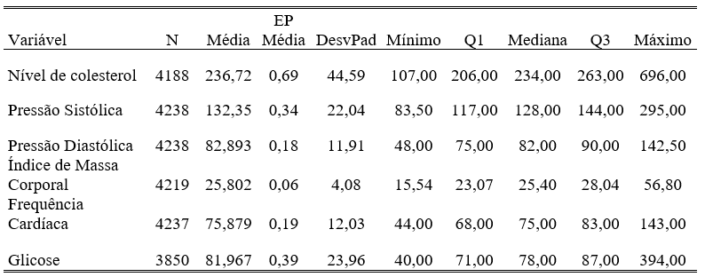
>
> Fonte: Construção dos autores a partir de dados do FHS-Cohort - database 3.

> Tabela 5: Descritiva database 4 – Variáveis individuais – Exames 
>
> 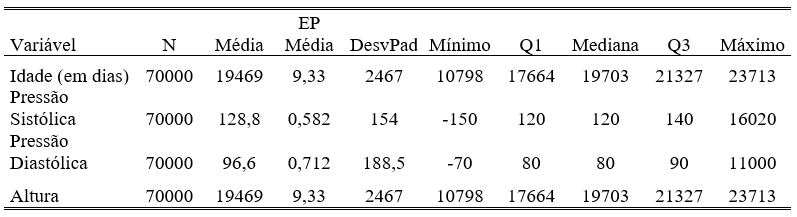
>
> Fonte: Construção dos autores a partir de dados simulado - database 4

# Ferramentas
> Como ferramentas na análise de dados, foi utilizado programas auxiliares que não necessitam da expertise em linguagem de programação como GraphPad Prism e Minitab, o que facilita algumas análises estatísticas em dados tabulares e na confecção de algumas imagens. Além disso, foi utilizado Python para processamento de um maior volume de dados e realização de Machine Learning.
>
> Devido à natureza multidisciplinar do projeto, tal interação entre diferentes softwares e maneiras de realizar análises facilita a evolução e desenvolvimento do mesmo. Pois a limitação de alguns softwares, em relação ao formato específico, volume de dados, ou até mesmo do uso por seus operadores pode ser contornado. 

# Resultados e Discussão
> Observa-se que na série temporal (Figura 3) há um comportamento repetitivo em partes na série, ou seja, existe sazonalidade. Além de também apresentar uma tendência de crescimento ao longo dos anos. Essas flutuações sazonais podem estar relacionadas a fatores como mudanças no estilo de vida ou comportamentos relacionados à saúde que ocorrem repetidamente em um determinado período de tempo, como estações do ano ou períodos festivos.
>
> No processo de modelagem dos óbitos por doenças cardiovasculares, optou-se por usar a classe dos modelos de Box-Jenkins, que consiste em consiste em ajustar modelos (p, d, q), a um conjunto de dados (MORETTIN; TOLOI, 2004). Para um ajuste de modelos ARIMA (Autorregressivo Integrado de Médias Móveis) é preciso que a série seja livre de tendência, ou seja, estacionária. Utilizando o teste de Dickey-Fuller foi possível ver que o p-valor é maior que o nível de significância, ou seja, 0,97 > 0,05 não se pode rejeitar H_0. Portanto, há uma raiz unitária, logo, a série não é estacionária, ao nível de 5% de significância. Portanto, se faz necessário aplicar a diferença para ajustar o modelo de previsão.
>
> Com o objetivo de determinar a ordem dos termos foi calculado a Função de Autocorrelação Amostral (FAC) e a Função de Autocorrelação Parcial (FACP). Analisando as Figuras 6 e 7. É possível perceber que em ambas há lag´s (níveis) significativos, o que indica significância estatísticas ao nível de 5% para os termos destas duas funções.

> Figura 7: Função de autocorrelação amostral para o número de óbitos por doenças cardiovasculares no Brasil, no período de janeiro de 1996 a dezembro de 2021.
> 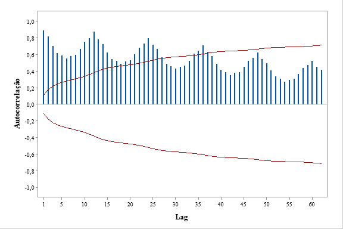
>
> Fonte: Construção dos austores a partir de informações do DataSUS-Tabnet/SIM.

> Figura 8: Função de Autocorrelação Parcial para o número de óbitos por doenças cardiovasculares no Brasil, no período de janeiro de 1996 a dezembro de 2021.
>
> 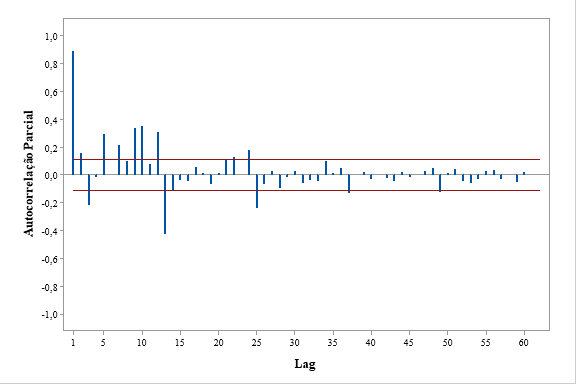
>
> Fonte: Construção dos autores a partir de informações do DataSUS-Tabnet/SIM.

> Com isso foram testados várias possibilidades de parâmetros, o modelo SARIMA(1;1;1)(3;2;1)12 foi o melhor ajustado. Verificou-se que todos os parâmetros são estatisticamente diferentes de zero e menor que o nível de significância de 5%, logo, devem ser mantidos no modelo de previsão da série em questão (Tabela 6).
>
> Tabela 6: Testes de Significância Estatística dos Parâmetros do Modelo SARIMA(1;1;1)(3;2;1)12 para o número de óbitos por doenças cardiovasculares no Brasil, no período de janeiro de 1996 a dezembro de 2021.
>
> 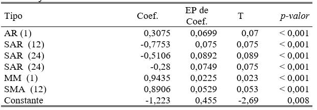
>
> Fonte: Construção dos autores a partir de informações do DataSUS-Tabnet/SIM.

> Na tentativa de encontrar um modelo que melhor representasse o comportamento dos dados em estudo, foram testados outros modelos: tendência linear, tendência quadrático,  curva de crescimento, alisamento exponencial simples, alisamento exponencial duplo, holt-winters multiplicativo e aditivo (Tabela 7).
>
> Analisando a Tabela 6 é possível perceber que após o processo de validação dos modelos de séries temporais identificados, os melhore modelos foram método de SARIMA (1;1;1)(3;2;1)12, método de Winters aditivo e método de Winters multiplicativo, respectivamente. Para a proposta do trabalho, foi escolhido o modelo SARIMA (1;1;1)(3;2;1)12, pois obteve o menor valor de MASE e por ser um modelo amplamente utilizado em séries temporais.
>
> Tabela 7: Comparação dos Erros Produzidos pelos Modelos de Séries Temporais Ajustados aos Dados para o número de óbitos por doenças cardiovasculares no Brasil, no período de janeiro de 1996 a dezembro de 2021.
>
> 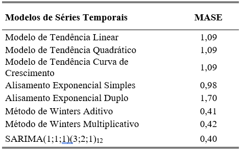
>
> Fonte: Construção dos autores a partir de informações do DataSUS-Tabnet/SIM.

> Após esse processo foi analisado os resíduos gerados pelo modelo SARIMA (1;1;1)(3;2;1)12 (Tabela 8) é possível concluir que os resíduos gerados pelo modelo ajustado são independentes para todas os lag’s, ou seja, os lag’s 12, 24, 36 e 48 não são correlacionados, ao nível de significância de 5%. Verificou-se também a normalidade dos resíduos (Figura 9), onde foi possível concluir que os resíduos seguem uma distribuição normal ao nível de 5% de significância. Portanto, a suposição estabelecida na metodologia de Séries Temporais de independência dos resíduos gerados pelo modelo de previsão está sendo plenamente atendido, o que viabiliza a utilização deste modelo para previsões.
>
> Tabela 8: Testes de Significância Estatística de Box Pierce para Independência dos Resíduos do Modelo de Previsão Identificado para o número de óbitos por doenças cardiovasculares no Brasil, no período de janeiro de 1996 a dezembro de 2021.
>
> 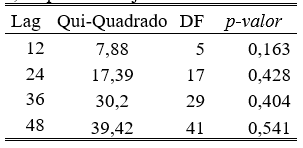
>
> Fonte: Construção dos autores a partir de informações do DataSUS-Tabnet/SIM.

> Figura 9: Testes de Normalidade dos Resíduos do Modelo de Previsão Identificado para o número de óbitos por doenças cardiovasculares no Brasil, no período de janeiro de 1996 a dezembro de 2021.
>
>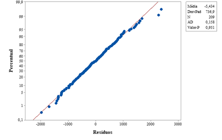
>
> Fonte: Construção dos autores a partir de informações do DataSUS-Tabnet/SIM

> Figura 10: Modelo de Série Temporal SARIMA(1;0;0)(2;0;3)12 a partir de dados de óbitos por doenças cardiovasculares no Brasil.
>
> 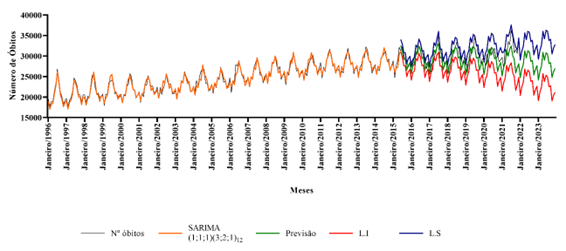
>
> Fonte: Construção dos autores a partir de informações do DataSUS-Tabnet/SIM.
> Nota: L.I = Limite Inferior de Predição / L.S = Limite Superior de Predição.

> Para o uso da técnica de machine learning foi feito a análise de correlação para seleção de features, remoção de multicolinearidade e entendimento entre a reação das variáveis (Figura 11).
>
> Figura 11: Correlograma do número de óbitos por doenças cardiovasculares no Mundo.
>
> 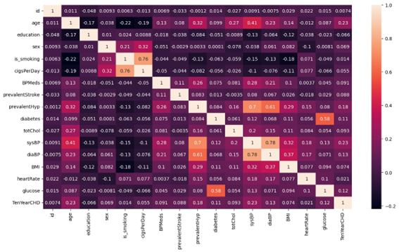
>
> Fonte: Construção dos autores a partir de dados do FHS-Cohort - database 3

> A partir disso, foram feitos os modelos para as técnicas de regressão logística, Random forest e K-Nearest Neighbors, onde obtivemos as matrizes de confusão (Figura 12), acurácia 0,59, 0,78 e 078 e recall 0,65, 018 e 0,20 respectivamente.
> 
> Figura 12: Matriz de confusão de regressão logística (a), Random forest (b) e K-Nearest Neighbors (c).
>
> 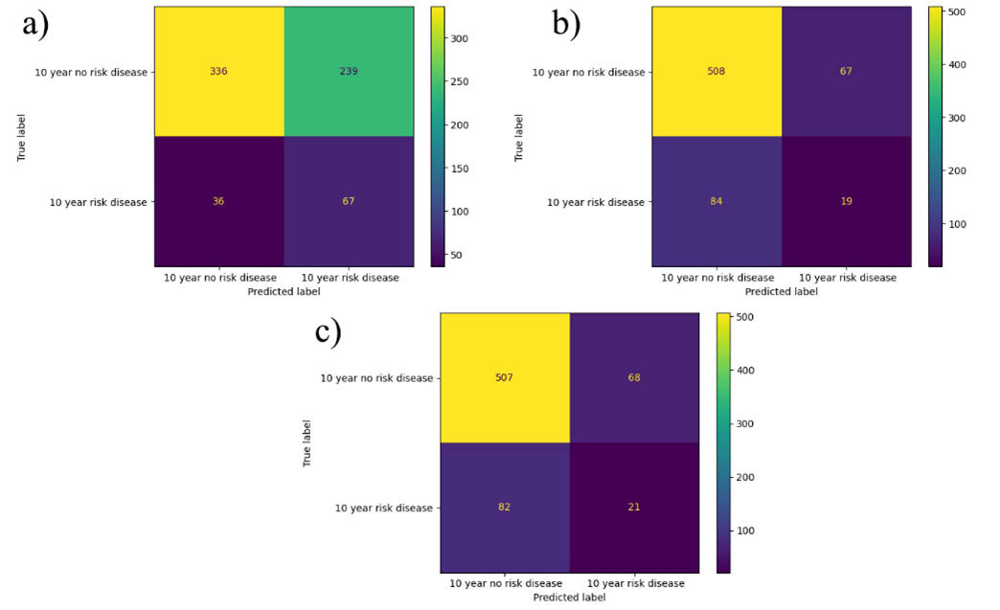
>
> Fonte: Construção dos autores a partir de dados do FHS-Cohort - database 3
Apesar de ser o que teve a menor acurácia, o modelo de regressão logística foi o modelo que apresentou a melhor métrica de Recall. Apresentando um Recall de 65%. Entretanto na predição do conjunto de test (que não temos a resposta), o modelo final (Regressão logística) prevê em 100% dos casos afirmando que a pessoa terá doença cardiovascular no período de 10 anos. Apesar disso, o Random Forest também afirmou que 100% dos casos a pessoa terá uma doença cardiovascular em 10 anos, então é possível que o conjunto de teste tenha em sua maioria pessoas que terão doença cardiovascular. Observando o gráfico de correlação entre as features é possível observar que as características idade, pressão arterial sistólica e se o paciente teve algum histórico de AVC são as que tem uma maior correlação com a presença ou não de doença cardiovascular no período de 10 anos.
Na segunda etapa de machine learning foi feito novamente a análise de correlação para os mesmos fins (Figura 13).

> Figura 13: Correlograma do número de óbitos por doenças cardiovasculares no Mundo.
>
> 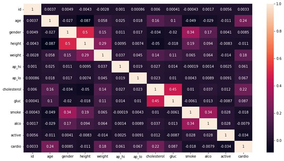
>
> Fonte: Construção dos autores a partir de dados simulado - database 4

> Nos modelos de regressão logística, Random forest e K-Nearest Neighbors, obtivemos as matrizes de confusão (Figura 14), acurácia 0,72, 0,71 e 0,65 e recall 0,68, 0,70 e 0,63 respectivamente. 
>
> Figura 14: Matriz de confusão de regressão logística (a), Random forest (b) e K-Nearest Neighbors (c).
>
> 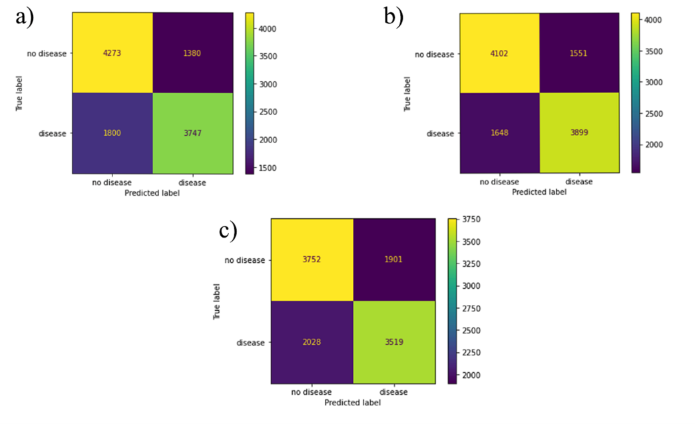
>
> Fonte: Construção dos autores a partir de dados simulado - database 4

> O melhor modelo apresentado foi o Random Forest. Este modelo mostrou uma acurácia de 71% no treinamento e foi o que apresentou o menor número de falso negativos. Na predição final, utilizando novos dados - total de 14 mil pessoas, o modelo previu corretamente que 5359 pessoas não tinham doenças cardiovasculares e 4451 tinham doenças cardiovasculares, mas previu de forma incorreta 2562 pessoas com falsos negativos e 1628 pessoas com falsos positivos. Observando o gráfico de correlação entre as features é possível observar que as características idade, peso e colesterol são as que tem uma maior correlação com a presença ou não de doença cardiovascular.
> 
> Brant e colaboradores (2022) evidenciaram fatores de riscos determinantes, entre fatores sociais, ambientais, comportamentais e metabólicos. Os quais se interrelacionam, pois fatores de riscos modificáveis como, pressão arterial, glicemia e colesterol estão diretamente associados a hábitos de vida como dieta inadequada e sedentarismo (BRANT et al., 2022).
> 
> Determinados fatores de risco tiveram suas taxa reduzidas ao longo do tempo, como consequência da urbanização e mudança de hábitos comportamentais resultantes de maior conscientização e evolução de políticas públicas voltadas para a prevenção de diversas doenças (BRANT et al., 2022), como por exemplo, a redução de taxa de tabagismo entre homens e mulheres a partir da década de 90 (RIBEIRO et al., 2016). No entanto, outras taxas como idade e estado nutricional tiveram suas participações aumentadas. A maior urbanização e o desenvolvimento da tecnologia levaram ao aumento da expectativa de vida dos indivíduos, mas também ao desenvolvimento de hábitos não-saudáveis em prol da acomodação, como o maior consumo de alimentos ultraprocessados e sedentarismo (RIBEIRO et al., 2016). 
As abordagens de última geração têm sido empregadas para auxiliar os sistemas de saúde médica, utilizando diversas técnicas de machine learning e séries temporais (PRADEEP; NAVEEN, 2018; TARAWHNEH; EMBARAK, 2019; KOUKARAS; BEZAS; GKAIDATZIS; IOANNIDIS; TZOVARAS; TJORTJIS, 2021), utilizando o histórico do paciente como recurso para gerar alertas de saúde necessários. No entanto, até o momento, essas técnicas têm se limitado a prever apenas as condições em tempo real, poucos estudos atuais têm se concentrado na previsão do estado futuro de um paciente (AHMED; LIN; SRIVASTAVA, 2023). Em situações médicas críticas, a condição de saúde de um paciente pode deteriorar-se em questão de segundos (JABEEN; MAQSOOD; GHAZANFAR; AADIL; KHAN; KHAN; MEHMOOD, 2019; LIU; GÖRGES; JENKINS, 2012). Em cenários de emergência, o tempo de resposta usualmente varia entre um e três minutos (JABEEN; MAQSOOD; GHAZANFAR; AADIL; KHAN; KHAN; MEHMOOD, 2019; HELLINGS et al., 2017). Durante esse intervalo, os profissionais de saúde podem enfrentar um cenário perigoso devido à falta de informações precisas sobre o estado de saúde do paciente. A previsão da condição futura de um paciente pode ser fundamental para uma terapia eficaz (AHMED; LIN; SRIVASTAVA, 2023). Além disso, a previsão das condições futuras pode reduzir o risco de perda de vidas valiosas e fornecer aos cuidadores informações relevantes a longo prazo a serem consideradas (AHMED; LIN; SRIVASTAVA, 2023).
> 
> Os resultados de nossos testes estão em consonância com a literatura, visto que apontaram a idade, pressão arterial sistólica e colesterol como fatores de risco com alta correlação para o desenvolvimento de DCV (OLIVEIRA et al., 2022). 

# Conclusão
> O presente trabalho realizou um estudo temporal sobre a principal causa de morte no Brasil e no mundo, incluindo alguns de seus fatores de risco. Primeiramente, indo de encontro a literatura e identificando que a principal causa de morte são as Doenças Cardiovasculares, dado que foi confirmado pelos nossos resultados. Por segundo, estabelecendo uma série temporal que obedeceu a todos os pressupostos necessários de maneira satisfatória e viabilizou seu uso para predição em relação ao número de óbitos por doenças cardiovasculares no Brasil. E servindo como ferramenta de aprendizado e modelagem por meio de Machine Learning, podendo ser uma poderosa ferramenta na análise e visualização de dados biomédicos.
Tais dados podem servir como base inicial para tomadores de decisões e monitoramento de eficácia de políticas públicas para o enfrentamento e prevenção das doenças e suas consequências.

# Trabalhos Futuros
> Estudos mais detalhados e a aplicação de novas ferramentas e tecnologias podem fornecer insights sobre quais os fatores que continuam se modificando e alterando sua influência ou particularidades de grupos que podem ser subnotificadas. Incluindo novos hábitos adotados pela sociedade e características regionais de grupos de indivíduos. É imprescindível que a relação ambiente x individuo seja levada em consideração nas mais diversas análises.

# Referencias
> Ahmed U, Lin JCW, Srivastava G. Multivariate time-series sensor vital sign forecasting of cardiovascular and chronic respiratory disease. Sustainable Computing: Informatics and Systems. Volume 38. 2023.
> BRANT, L. C. C.; NASCIMENTO, B. R.; VELOSO, G. A.; GOMES, C. S.; POLANCZYK, C.; DE OLIVEIRA, G. M. M.; FLOR, L. S.; GAKIDOU, E.; RIBEIRO, A. L. P.; MALTA, D. C. Burden of Cardiovascular diseases attributable to risk factors in Brazil: data from the “Global Burden of Disease 2019” study. Revista da Sociedade Brasileira de Medicina Tropical, [s. l.], v. 55, n. Suppl I, p. 1–11, 2022. 
> BREIMAN L. Random forests. Mach. Learn., 45 (1) (2001), pp. 5-32.
> CARVALHO Jr., J. G.; COSTA Jr., C. T. Identification method for fuzzy forecasting models of time series, Applied Soft Computing. v. 50, p. 166-182, 2017.
> D’AGOSTINO RB SR, PENCINA MJ, MASSARO JM, COADY S. Cardiovascular Disease Risk Assessment: Insights from Framingham. Glob Heart. 2013.
> DARCY AM, LOUIE AK, ROBERTS LW. Machine Learning and the Profession of Medicine. JAMA. 2016.
> DEO RC. Machine Learning in Medicine. Circulation. 2015;132(20):1920-30. doi: 10.1161/CIRCULATIONAHA.115.001593.
> DUDANI, S.A. The distance-weighted k-nearest-neighbor rule. EEE Transactions on Systems, Man, and Cybernetics (4) (1976), pp. 325-327
> EHLERS, R. S. Análise de Séries Temporais. Departamento de Estatística, UFPR, 2005. 
> FAN Y, SHEN D, DAVATZIKOS C. Detecting Cognitive States from fMRI Images by Machine Learning and Multivariate Classification. CVPRW’06 2006: Conference on Computer Vision and Pattern Recognition Workshop; 2006 Jun 17-22; Ney York, USA: IEEE; 2006. p. 89.
> FRENTZEL-BEYME, R.; KEIL, U.; PFLANZ, M.; STRUBA, R.; WAGNER, G. [Mortality data and statistics, importance for health services and  epidemiological research (author’s transl)]. MMW, Munchener medizinische Wochenschrift, Germanyv. 122, n. 24, p. 901–906, 1980. 
Hellings P.W. et al. European summit on the prevention and self-management of chronic respiratory diseases: Report of the European union parliament summit (29 March 2017). Clin. Transl. Allergy (1) (2017).
> HO T.K. Random decision forests. Proceedings of 3rd International Conference on Document Analysis and Recognition, vol. 1 (1995), pp. 278-282 vol.1.
> HOSMER JR, D. W.; LEMESHOW, S.; STURDIVANT, R. X. (2013). Applied logistic regression. John Wiley & Sons.
Jabeen F., Maqsood M., Ghazanfar M.A., Aadil F., Khan S., Khan M.F., Mehmood I. An IoT based efficient hybrid recommender system for cardiovascular disease. Peer Peer Netw. Appl. (5) (2019).
> KOEHLER, A. B.  HYNDMAN R. J. Another look at measures of forecast accuracy, Int. 2006.
Koukaras P., Bezas N., Gkaidatzis P., Ioannidis D., Tzovaras D., Tjortjis C. Introducing a novel approach in one-step ahead energy load forecasting. Sustain. Comput. Inform. Syst. (2021).
> 
> KUTNER, et al. (2004) Applied Linear Statistical Models. 5th Edition, Boston.
Liu D., Görges M., Jenkins S.A. University of queensland vital signs dataset: development of an accessible repository of anesthesia patient monitoring data for research. Anesthesia & Analgesia (3) (2012).
> 
> MINCHOLÉ A, CAMPS J, LYON A, RODRÍGUEZ B. Machine Learning in the Electrocardiogram. J Electrocardiol. 2019.
> 
> MORETTIN, P. A.; TOLOI, C. M. C. Análise de Séries Temporais. Edgard Blücher, São Paulo, 2004.
> 
> OBERMEYER Z, EMANUEL EJ. Predicting the Future - Big Data, Machine Learning, and Clinical Medicine. N Engl J Med. 2016;375(13):1216-9.
> 
> OLIVEIRA, G. M. M. de; BRANT, L. C. C.; POLANCZYK, C. A.; MALTA, D. C.; BIOLO, A.; NASCIMENTO, B. R.; SOUZA, M. de F. M. de; LORENZO, A. R. De; FAGUNDES, A. A. de P.; SCHAAN, B. D.; CASTILHO, F. M. de; CESENA, F. H. Y.; SOARES, G. P.; XAVIER, G. F.; BARRETO, J. A. S.; PASSAGLIA, L. G.; PINTO, M. M.; MACHLINE-CARRION, M. J.; BITTENCOURT, M. S.; PONTES, O. M.; VILLELA, P. B.; TEIXEIRA, R. A.; SAMPAIO, R. O.; GAZIANO, T. A.; PEREL, P.; ROTH, G. A.; RIBEIRO, A. L. P. Estatística Cardiovascular – Brasil 2021. Arquivos Brasileiros de Cardiologia, [s. l.], v. 118, n. 1, p. 115–373, 2022. 
Pradeep K.R., Naveen N.C. Lung cancer survivability prediction based on performance using classification techniques of support vector machines, C4.5 and naive Bayes algorithms for healthcare analytics. Procedia Comput. Sci. (2018).
> 
> RIBEIRO, A. L. P.; DUNCAN, B. B.; BRANT, L. C. C.; LOTUFO, P. A.; MILL, J. G.; BARRETO, S. M. Cardiovascular Health in Brazil Trends and Perspectives. Circulation, [s. l.], v. 133, n. 4, p. 422–433, 2016.
> 
> SARTORIS, A. Estatística e Introdução à Econometria. Saraiva. 2003
> SLOMKA PJ, DEY D, SITEK A, MOTWANI M, BERMAN DS, GERMANO G. Cardiac Imaging: Working Towards Fully-Automated Machine Analysis & Interpretation. Expert Rev Med Devices. 2017.
Tarawneh M., Embarak O. Hybrid approach for heart disease prediction using data mining techniques. International Conference on Emerging Internetworking, Data & Web Technologies, Springer (2019).
> 
> VADUGANATHAN, M.; MENSAH, G. A.; TURCO, J. V.; FUSTER, V.; ROTH, G. A. The Global Burden of Cardiovascular Diseases and Risk: A Compass for Future Health. Journal of the American College of Cardiology, [s. l.], v. 80, n. 25, p. 2361–2371, 2022.
> 
> WALJEE AK, HIGGINS PD. Machine Learning in Medicine: A Primer for Physicians. Am J Gastroenterol. 2010;105(6):1224-6. doi: 10.1038/ajg.2010.173.
> 
> WORLD HEALTH ORGANIZATION. Cardiovascular diseases (CVDs). [S. l.: s. n.], 2021. Disponível em: https://www.who.int/news-room/fact-sheets/detail/cardiovascular-diseases-(cvds).

