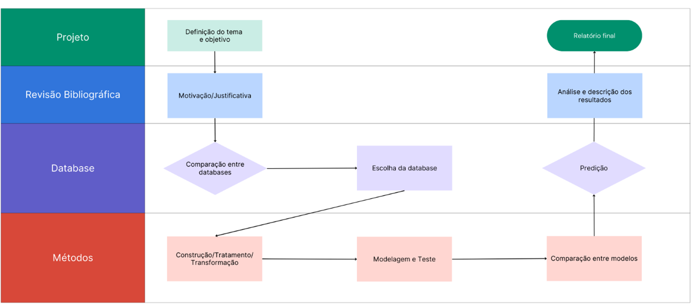
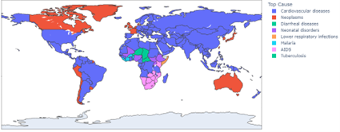
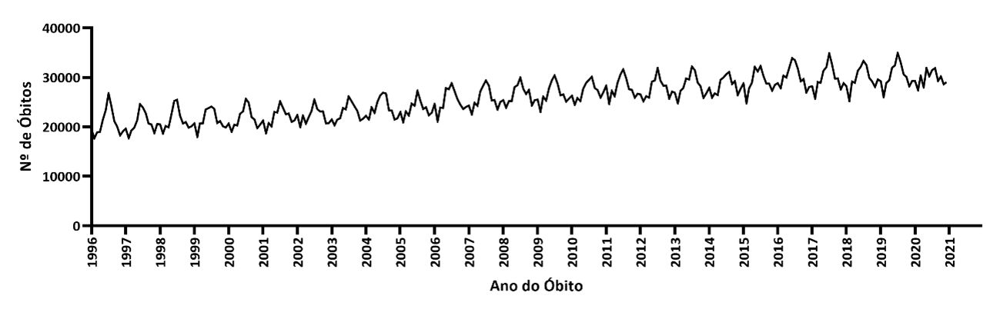
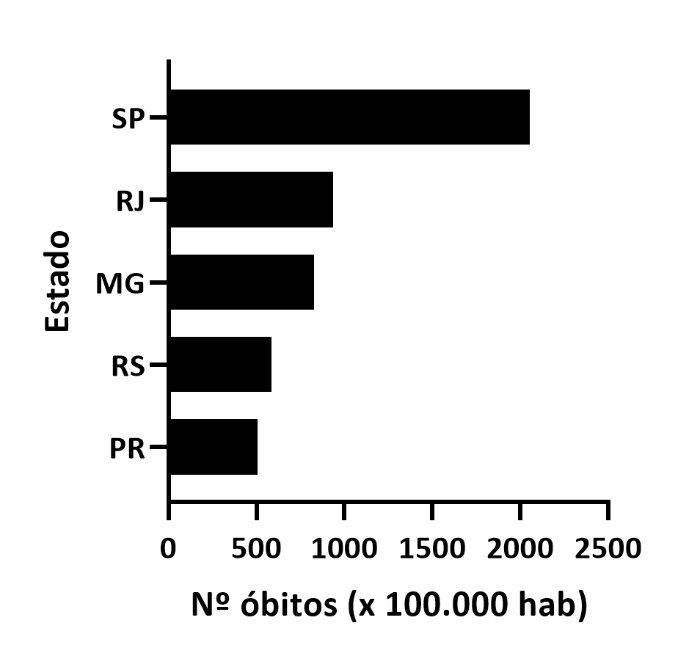

# Projeto `Maiores causas de morte no Brasil – Uma Análise Temporal`
# Project `Major causes of death in Brazil – A Time Analysis `

# Apresentação

O presente projeto foi originado no contexto das atividades da disciplina de pós-graduação [*Ciência e Visualização de Dados em Saúde*](https://github.com/datasci4health/home), oferecida no primeiro semestre de 2023, na Universidade Estadual de Campinas (Unicamp).

> Discentes:
> |Nome  | RA | Especialização|
> |--|--|--|
> | Dorival Junior  | 215076  | Computação|
> | Camila Quadros  | 261300  | Computação - Líder Github - Conta <[*milqsimmer*](https://github.com/milqsimmer/projects2023)>|
> | Thayane Oliveira  | 216114  | Agrícola|
> | Yuri Richard  | 247016  | Saúde|

# Descrição Resumida do Projeto
> A mortalidade por doenças é um problema de saúde pública de grande relevância no Brasil e no mundo. E sua análise torna-se uma ferramenta essencial para entendermos as principais causas de morte, além de servir como base para propostas de intervenção efetivas para redução dessa taxa. A partir da principal causa de morte no Brasil no período de 1996 a 2021, o projeto visa caracterizar e estabelecer um modelo de previsão por meio de análise exploratória de dados e séries temporais.

# Introdução
> As doenças cardiovasculares representam um dos maiores desafios para a saúde pública em todo o mundo. Condições que afetam direta ou indiretamento o sistema circulatório, são responsáveis por um número significativo de mortes e impactam diretamente a qualidade de vida das pessoas. Compreender a evolução dessas doenças, seus fatores de risco e implementar estratégias eficazes de prevenção são fundamentais para reduzir a incidência e o impacto negativo que elas têm na sociedade.
>
> O objetivo deste projeto é realizar uma análise temporal sobre o número de óbitos por doenças cardiovasculares nos últimos anos, buscando identificar padrões e informações que possam ser úteis para tomadores de decisão na implementação de medidas para prevenção e controle da doença.
>
> Para tanto, utilizaremos técnicas estatísticas e ferramentas de visualização de dados para examinar características no número de óbitos por doenças cardiovasculares, bem como algumas das possíveis variáveis que podem estar associadas a um maior risco de desenvolvimento dessas condições. Além disso, objetiva-se desenvolver um modelo preditivo simples que permita estimar o risco de óbito por doenças cardiovascular.
>
> No entanto, há algumas limitações sobre os insights fornecidos pelo estudo devido a natureza dos dados. Ao trabalhar somente com número de óbitos, é possível haver uma subnotificação por fatores confundidores como comorbidades, além de não haver dados sobre estilo de vida do individuo, fator esse que tem impacto direto no desenvolvimento de doenças cardiovasculares. Além da ausência de informações sobre casos não fatais, que são igualmente relevantes para o entendimento do problema. 

# Perguntas de Pesquisa
> Qual a principal causa de mortalidade no Brasil no período de 1996 a 2021? 
> 
> É possível estabelecer um modelo de série temporal adequado e estatisticamente significante para analisar os dados de mortalidade no Brasil, entre os anos de 1996 a 2021?

# Metodologia
> Para atingir o objetivo do projeto, serão utilizadas duas técnicas estatísticas (i) Análise exploratória de dados e (ii) análise de séries temporais.
> 
> A análise exploratória dos dados é utilizada para melhor compreensão e visualização dos dados, buscando padrões e correlações permitindo assim a aplicação de técnicas estatísticas. Suas apresentações são por meio de gráficos, tabelas, medidas de tendência central etc.
> 
> Uma série temporal é uma sequência de observações feitas ao longo do tempo, a característica fundamental desses dados é a dependência entre observações adjacentes, sendo o interesse principal analisar e modelar essa dependência (EHLERS, 2005).
> 
> A aplicação de séries temporais requer a consideração de certos pressupostos, que podem ser divididos em três estágios: descrição, que envolve a identificação da natureza do fenômeno em estudo; explicação, que utiliza a variação em uma série para explicar a variação em outra série; e predição, que busca prever a evolução da variável na série temporal por meio de um modelo estatístico que descreva o comportamento das observações (CARVALHO Jr.; COSTA Jr., 2017).
> 
> Ao trabalhar com séries temporais, pressupõe-se que elas sejam estacionárias, o que significa que elas se desenvolvem aleatoriamente ao redor de uma média constante, refletindo algum tipo de equilíbrio estável (MORETTIN; TOLOI, 2004). Segundo Morettin e Toloi (2004), caso a série não apresente estacionariedade, é necessário aplicar uma transformação aos dados originais para torná-la estacionária, a transformação mais comumente utilizada consiste em calcular as diferenças sucessivas da série original até obter uma série estacionária.
> 
> Para o teste de estacionariedado, o teste DF (Dickey-Fuller) realiza uma regressão e testa a presença na série de raiz unitária contra sua defasagem. Ele produz estimativas de equações por mínimos quadrados e avalia a estatística de teste t da hipótese τ = 0. Neste trabalho, será utilizado o teste DF com o valor de p, e para a hipótese nula, teremos a seguinte condição: se o valor de p > α, a série possui uma raiz unitária (Dickey; Fuller, 1979). As hipóteses são as seguintes: H0: A série possui uma raiz unitária, portanto, não é estacionária versus H1: A série não possui uma raiz unitária, portanto, é estacionária.
> 
> De acordo com Morettin (2006), em séries temporais, se os dados forem considerados normais, seu comportamento pode ser descrito por um modelo linear, como um modelo ARMA. As hipóteses são as seguintes: H0: Se o valor de p < α, os dados seguem uma distribuição normal versus H1: Se o valor de p > α, os dados não seguem uma distribuição normal.
> 
> Conforme o modelo clássico, todas as séries temporais são compostas por quatro padrões: tendência, ciclo, sazonalidade e ruído aleatório ou erro (MORETTIN; TOLOI, 2004). Tendência em uma série temporal indica seu comportamento de longo prazo, demonstrando crescimento ou decrescimento ao longo do tempo. A sazonalidade ocorre quando há flutuações repetitivas na série, que podem ocorrer em períodos inferiores a um ano. Já o ciclo refere-se a flutuações que se repetem em períodos superiores a um ano. Os erros, por sua vez, são flutuações na série que não possuem uma explicação clara e, portanto, não podem ser modeladas (SATORIS, 2003).
> 
> Para alcançar o objetivo deste trabalho, serão utilizados diferentes modelos de séries temporais para analisar os dados. Entre eles, estão o modelo ARIMA (Autoregressive Integrated Moving Average), o modelo SARIMA (Seasonal Autoregressive Integrated Moving Average), modelos de suavização exponencial, entre outros (MORETTIN; TOLOI, 2004). Cada modelo possui características específicas que se adequam melhor a determinados tipos de dados, sendo importante avaliar diversas abordagens para selecionar o modelo mais adequado aos dados em questão.
> 
> Além disso, serão realizadas análises utilizando diferentes métricas de desempenho dos modelos, como o Erro Médio Absoluto (MASE), o Erro Quadrático Médio (EQM) e o Erro Médio Absoluto (MAD), com o objetivo de comparar a precisão de cada modelo e selecionar aquele que melhor se ajusta aos dados (KOEHLER; HYNDMAN, 2006).
>
> Figura 1: Workflow do desenvolvimento do projeto.
> 

# Bases de Dados e Evolução
## Bases Estudadas e Não Adotadas

> |Base de Dados  | Endereço na Web | Resumo Descritivo |
> |--|--|--|
> | WHO Mortality Database  | https://www.who.int/data/data-collection-tools/who-mortality-database  | Dados sobre óbito em nível global por doença. Banco codificado.|

> A Base da organização mundial da saúde possui dados em nível global por doença. Base open-source com documentação disponível, no estanto a codificação dificulta o tratamento e agrupamento dos dados por classificação das doenças.

## Bases Estudadas e Adotadas

> |Base de Dados  | Endereço na Web | Resumo Descritivo |
> |--|--|--|
> | Our World in Data | https://ourworldindata.org/grapher/annual-number-of-deaths-by-cause  | Dados sobre óbito em nível global de 1990 a 2019. |
> | Datasus Tabnet | http://tabnet.datasus.gov.br/cgi/tabcgi.exe?sim/cnv/obt10uf.def  | Dados sobre óbito no Brasil de 1996 a 2021. |

> A primeira base de dados selecionada foi retirada do projeto “Our World in Data”, uma plataforma open-source colaborativa mantida pela Universidade de Oxford e pela organização sem fins lucrativos Global Change Data Lab (GCDL). Disponível em: https://ourworldindata.org/causes-of-death. Essa base de dados compilou informações oriundas do Institute of Health Metrics and Evaluation (IHME), Global Burden of Disease (GBD) e da Organização Mundial da Saúde (OMS) que são bases open-source alimentadas com relatórios enviados pelos estados membros. 
> 
> Os dados disponíveis são globais desde 1990 a 2019: causa da morte; número total de mortes para ambos os sexos e todas a idades; ano; e país. Dados disponíveis de 1990 a 2019.
> 
> A segunda base de dados utilizada foi elaborada a partir de dados disponibilizados pelo TABNET - DataSUS, com os dados de óbitos por doenças cardiovasculares no Brasil filtrados a partir do Sistema de informações sobre Mortalidade (SIM). Permitindo a análise por sexo e faixa etária no período de 1996 a 2021.

# Integração entre bases e análise exploratória
> A figura 2 ilustra as principais causas de mortalidade por país no ano de 2019, evidenciando um predomínio no número de óbitos por doenças cardiovasculares, seguidas de neoplasias.
> 
> Figura 2: Mapa das maiores causas de óbitos por país no ano de 2019.
> 
> Fonte: Construção dos autores a partir de dados do “Our world in data”.
> 
> Na Figura 3 é representado o número de óbitos por doenças cardiovasculares do Brasil de 1996 a 2021. Observa-se que na série temporal há um comportamento repetitivo em partes na série, ou seja, existe sazonalidade. Além de também apresentar uma tendência de crescimento ao longo dos anos. Essas flutuações sazonais podem estar relacionadas a fatores como mudanças no estilo de vida ou comportamentos relacionados à saúde que ocorrem repetidamente em um determinado período de tempo, como estações do ano ou períodos festivos.
> 
> Figura 3: Série Temporal do Número de óbitos por doenças cardiovasculares no Brasil no período de 1996 a 2021.
> 
> Fonte: Construção dos autores a partir de dados do DataSUS-Tabnet/SIM.
> 
> Na figura 4 é possivel perceber que até os 44 anos, há um correlação negativa que varia entre moderada e forte. Na faixa etária entre 45 e 54 anos a correlação torna-se positiva moderada. A partir dos 55 anos, a correlação é positiva e muito forte, evidenciando que o avanço da idade é um fator de risco importante para o óbito por doenças cardiovasculares. 
>
> Figura 4: Correlação das faixas etárias com o número de óbitos por doenças cardiovasculares no Brasil no período de 1996 a 2021.
> 
> Fonte: Construção dos autores a partir de dados do DataSUS-Tabnet/SIM.
> 
> A figura 5 mostra os maiores número de óbitos por 100 mil habitantes entre os estados brasileiros. O estado de São Paulo lidera o ranking com 2055 óbitos, seguido pelo Rio de Janeiro com 937 óbitos a cada 100 mil habitantes.
> 
> Figura 5: Estados do Brasil com o maior número de óbitos por 100 mil habitantes devido à doenças cardiovasculares no período de 1996 a 2021.
> 
> Fonte: Construção dos autores a partir de dados do DataSUS-Tabnet/SIM.

# Ferramentas
> Foram utilizadas Python: Para realização do heatmap com correlograma;
Graphpad para a confecção de alguns gráficos;
Minitab para realização de testes estatísticos e confecção do histograma. 

# Cronograma
> |Atividades | Data|
> |--|--|
> | Segunda Entrega (Checkpoint dos resultados Parciais)  | 21/05/2023  |
> | Desenvolvimento e ajuste dos modelos  | 21/05/23 - 30/05/23  |
> | Análise dos resultados parciais e escrita do relatório final  | 31/05/23 - 24/06/23  |
> | Entrega do relatório final  | 25/06/23  |
> | Compartilhamento de experiências  | 22/06/23 e 27/06/23  |

> [*Link para vídeo de apresentação da proposta do projeto.*](https://drive.google.com/file/d/1TuVvB7_tuUpy89DZRqpBYQg3cny7RNCt/view?usp=share_link)

# Referencias
> CARVALHO Jr., J. G.; COSTA Jr., C. T. Identification method for fuzzy forecasting models of time series, Applied Soft Computing. v. 50, p. 166-182, 2017.
> 
> EHLERS, R. S. Análise de Séries Temporais. Departamento de Estatística, UFPR, 2005.
> 
> KOEHLER, A. B.  HYNDMAN R. J. Another look at measures of forecast accuracy, Int. 2006.
> 
> MORETTIN, P. A.; TOLOI, C. M. C. Análise de Séries Temporais. Edgard Blücher, São Paulo, 2004.
> 
> SARTORIS, A. Estatística e Introdução à Econometria. Saraiva. 2003
