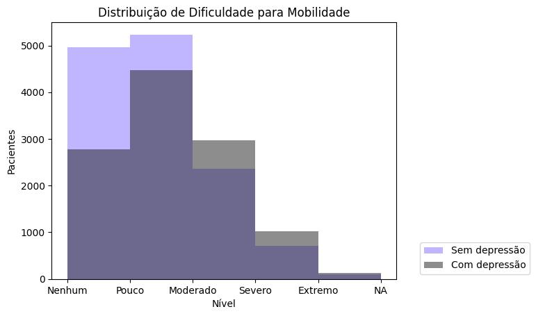
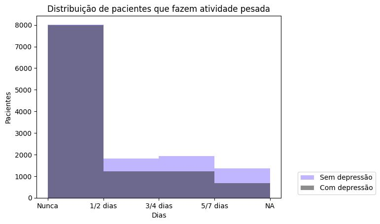

# O impacto das atividades físicas na melhora da mobilidade e sintomas depressivos em pacientes com doença de Parkinson: um estudo de associação
# The impact of physical activities on the improvement of mobility and depressive symptoms in patients with Parkinson's disease: an association study
# Apresentação 
| Nome | RA| Especialização |
| :---         |     :---:      |          ---: |
| Giovani Luiz dos Reis    | 259156   | Análise e Desenvolvimento de Sistemas  |
| Julia de Melo Franco Fernandes |  248945   | Eng computação  |
| Lauana Andrade Messias| 183936  | Mestranda em Neurociências    |
| Maria Victoria  Soares Fiori  | 256905    | Mestranda Ciência da computação    |
| Suelen Aparecida Ribeiro de Souza   | 252483   |Mestranda em clinica medica  |
## Slides da Apresentação Final
https://www.canva.com/design/DAFm92CK0Ug/7_XVzfX5cOSVP-bCDcpa4Q/edit

# Introdução e Referenciais Teóricos
O Parkinson é uma doença degenerativa complexa que afeta uma região importante do cérebro, resultando na degeneração dos neurônios. Os pacientes com DP sofrem com a perda gradativa na coordenação motora apresentando sintomas como: mudança no comportamento, lentidão nos movimentos, desequilíbrio e rigidez muscular devido a uma deficiência na neurotransmissão dopaminérgica localizada no putâmen posterior e no circuito motor cerebral (Rodriguez et al., 2009). Muitos pacientes percebem que os sintomas motores pioram durante períodos de estresse e podem apresentar sintomas de depressão e ansiedade (Crizzle et al., 2006). 

Atualmente, o diagnóstico é feito quando os sintomas estão evidentes, já em estágio avançado da doença, e não existem medicamentos capazes de curá-la (Myszczynska et al., 2020). À medida que a doença progride, os pacientes tendem a se tornar mais sedentários e diminuir suas atividades sociais, o que também piora a qualidade de vida relacionada à saúde. Estudos indicam que cerca de 50% dos pacientes desenvolvem depressão, o que contribui para o sedentarismo, independentemente do estágio da doença de Parkinson (Janet et al., 2017). Manifestações psiquiátricas como apatia, ansiedade e depressão são comuns na DP, e podem ser atribuídas a um déficit dopaminérgico no estriado ventral, além de uma redução na disponibilidade de serotonina e norepinefrina (Rodriguez et al., 2009).
Outros estudos apontam correlações ao comprometimento motor e global mais significativo em pacientes com depressão. Isso não significa que um paciente deprimido terá um prognóstico pior ou que a doença avançará mais rapidamente, mas provavelmente ele precisará de reposição de dopamina em estágios iniciais da doença (Prange et al., 2022).

Existe evidência de que a prática de atividade física intensa pode melhorar não apenas os sintomas motores, mas também os sintomas não motores, como o funcionamento cognitivo e o sono em pacientes com DP. Além disso, estudos preliminares indicam que a atividade física intensa pode ter efeitos modificadores na progressão da doença em pacientes com DP (de Vries NM et al,. 2021).

Diversas pesquisas mostram que a prática de atividade física melhora a qualidade de vida e aumenta a sobrevida dos pacientes. Isso ocorre porque o exercício físico aumenta os níveis de dopamina, reduz o estresse e alivia os sintomas da doença de Parkinson (Van der Heide et al., 2021). Além dos benefícios mencionados, o exercício físico também tende a diminuir a degradação dos neurônios dopaminérgicos e melhorar a função motora nos gânglios de base (Janet et al., 2017). 

Embora esses resultados ainda precisem ser confirmados por mais pesquisas, eles sugerem que a atividade física intensa pode ser uma estratégia promissora para melhorar a qualidade de vida de pacientes com DP (de Vries NM et al,. 2021).
O uso de bancos de dados é uma das ferramentas fundamentais na análise de dados biomédicos. Eles permitem o armazenamento de grandes volumes de dados gerados na pesquisa biomédica e sua análise mais eficiente. Fornecem uma forma organizada de armazenar e acessar dados brutos, permitindo que os pesquisadores analisem e interpretem esses dados de maneira eficaz e eficiente (Rajkomar, A et al,.2018). 

O artigo refere-se a um estudo cujo objetivo foi investigar os efeitos a longo prazo da atividade física regular e dos hábitos de exercício na progressão da doença de Parkinson (DP). Este estudo utilizou dados da Parkinson's Disease Progression Marker Initiative (PPMI), que inclui avaliação longitudinal de parâmetros clínicos em pacientes com doença de Parkinson. Os pesquisadores levaram em consideração fatores de confusão como idade, sexo, dose equivalente de levodopa(remédio) e duração da doença para determinar os efeitos da interação entre atividade física regular e moderada a vigorosa no curso dos parâmetros clínicos.

No final  conclui classificando as evidências de que o estudo descobriu que aumentos sustentados nos níveis gerais de atividade física regular em pacientes com DP inicial foram associados a declínios moderados em vários parâmetros clínicos. Ele aponta que fornece evidências de Classe II de que sim. Este estudo destaca a necessidade de tratamentos modificadores da doença de Parkinson e sugere que o exercício e a atividade física regular podem alterar o curso clínico a longo prazo desta doença.

- Objetivo Geral: 
Demonstrar através da visualização de dados a correlação entre fazer exercício físico e a melhora dos sintomas do Parkinson, como por exemplo melhoria na mobilidade e depressão.
- [vídeo](https://youtu.be/67sz-QkUunE)
# Perguntas de Pesquisa
1. Qual é a melhor forma de exercício físico para ajudar a melhorar os sintomas de
Parkinson e reduzir a depressão (Atividades de baixa, média e alta intensidade)?
2. Existem riscos adicionais associados a exercícios físicos em pacientes com
Parkinson e depressão?
3. Qual é a duração mínima e frequência ideal para sessões de exercícios físicos para obter benefícios na melhora dos sintomas de Parkinson e redução da depressão ?

# Banco de dados
## Bases Estudadas mas Não Adotadas
| Base de Dados | Endereço na Web | Resumo descritivo |
| :---         |     :---:      |          ---: |
| Brain Diseases - BrainBase - CNCB-NGDC | https://ngdc.cncb.ac.cn/brainbase/diseases | Dados sobre o tema de Alzheimer, que descreve a doença, tipo e símbolo do gene e a fonte |
| CTD_MESHD003704_exposure_20230520230416 | https://ctdbase.org/detail.go?type=disease&acc=MESH%3AD003704&view=expStudies | Dados sobre o tema de Alzheimer/Demência, mostrando resumo, países, agentes de estresse para algumas doenças cerebrais|
| CTD_MESHD000544_exposure_20230520230729 | https://ctdbase.org/detail.go?type=disease&acc=MESH%3AD000544&view=expConsol | O dataset mostra dados de países, receptores da doença, tipos de estressor, sua relação com alguns eventos de exposição |


Como as bases encontradas eram muito pequenas ou não possuíam dados o suficiente para a análise de  Alzheimer/Demência, foi decidido a troca de tema para encontrar uma base mais estruturada com informação. 

Para as bases não adotadas foi necessário o filtro para a doença de Alzheimer, juntamente com o tratamento para valores nulos ou não respondidos.

A análise pode ser encontrada em data/external/bases não adotadas .

## Bases Estudadas e Adotadas
| Base de Dados | Endereço na Web | Resumo descritivo |
| :---         |     :---:      |          ---: |
| Michael J. Fox Foundation for Parkinson's Research | https://foxden.michaeljfox.org/insight/explore/fox.jsp | Base de dados retirada de um site com dados sobre a doença de Parkinson, que descreve os dados desde questões de saúde, emocional e médicas, até condições próprias que o paciente descreve |

- Michael J. Fox Foundation for Parkinson's Research

O site michaeljfox.org é o site oficial da Fundação Michael J. Fox, uma organização sem fins lucrativos dedicada a encontrar uma cura para a doença de Parkinson e a melhorar a vida das pessoas afetadas por ela. O site oferece informações e recursos valiosos sobre a doença de Parkinson, opções de tratamento, pesquisas em andamento e suporte emocional. Além disso, a fundação financia pesquisas em todo o mundo e oferece uma comunidade online chamada "Fox Insight", onde pessoas com Parkinson podem se conectar e compartilhar suas experiências para ajudar a avançar a pesquisa.

O banco de dados é em formato '.csv' e qualquer um com cadastro no site pode acessar a base. É um banco extremamente completo que compreende questões biológicas, médicas e pessoais, sendo necessário uma filtragem inicial para selecionar características e fatos específicos para a pesquisa. Foi selecionado variáveis sobre exercício físico e questões sobre saúde mental para responder as perguntas de pesquisa.

Inicialmente foi feita uma limpeza de valores incorretos sobre a idade dos participantes, retirando os valores, além de uma decisão inicial de utilizar somente um conjunto de dados de cada participando, excluindo dados de participantes que responderam mais de uma vez os questionários. Foi feito também uma categorização das idades, transformando-as em grupos de acordo com os quartis da base.

A análise pode ser vista em data/external/bases adotadas 
# Metodologia  
Para a seleção cuidadosa de artigos relacionados à doença de Parkinson, depressão e atividade física no total 10, será utilizado um banco de dados renomado e acessível, como o MichaelJ.Fox. Os dados obtidos serão cruzados por meio de um fluxograma preciso e organizados em clusters, permitindo extrair insights relevantes e aprofundar o conhecimento sobre essa doença complexa. A visualização e análise dessas informações serão facilitadas pela construção de fluxogramas interligados a clusters, utilizando ferramentas de dados como o Orange. Esse processo permitirá a identificação de padrões e tendências importantes, fornecendo subsídios para a criação de novas abordagens terapêuticas e para a melhoria da qualidade de vida dos pacientes com Parkinson. Com essa metodologia rigorosa, espera-se que os resultados sejam confiáveis e úteis para a comunidade médica e científica no desenvolvimento de tratamentos mais eficazes para a doença de Parkinson.
## Banco de dados e Bases de Dados e Evolução
### Bases Estudadas mas Não Adotadas
| Base de Dados | Endereço na Web | Resumo descritivo |
| :---         |     :---:      |          ---: |
| Brain Diseases - BrainBase - CNCB-NGDC | https://ngdc.cncb.ac.cn/brainbase/diseases | Dados sobre o tema de Alzheimer, que descreve a doença, tipo e símbolo do gene e a fonte |
| CTD_MESHD003704_exposure_20230520230416 | https://ctdbase.org/detail.go?type=disease&acc=MESH%3AD003704&view=expStudies | Dados sobre o tema de Alzheimer/Demência, mostrando resumo, países, agentes de estresse para algumas doenças cerebrais|
| CTD_MESHD000544_exposure_20230520230729 | https://ctdbase.org/detail.go?type=disease&acc=MESH%3AD000544&view=expConsol | O dataset mostra dados de países, receptores da doença, tipos de estressor, sua relação com alguns eventos de exposição |


Como as bases encontradas eram muito pequenas ou não possuíam dados o suficiente para a análise de  Alzheimer/Demência, foi decidido a troca de tema para encontrar uma base mais estruturada com informação. 

Para as bases não adotadas foi necessário o filtro para a doença de Alzheimer, juntamente com o tratamento para valores nulos ou não respondidos.

A análise pode ser encontrada em data/external/bases não adotadas .

### Bases Estudadas e Adotadas
| Base de Dados | Endereço na Web | Resumo descritivo |
| :---         |     :---:      |          ---: |
| Michael J. Fox Foundation for Parkinson's Research | https://foxden.michaeljfox.org/insight/explore/fox.jsp | Base de dados retirada de um site com dados sobre a doença de Parkinson, que descreve os dados desde questões de saúde, emocional e médicas, até condições próprias que o paciente descreve |

- Michael J. Fox Foundation for Parkinson's Research

O site michaeljfox.org é o site oficial da Fundação Michael J. Fox, uma organização sem fins lucrativos dedicada a encontrar uma cura para a doença de Parkinson e a melhorar a vida das pessoas afetadas por ela. O site oferece informações e recursos valiosos sobre a doença de Parkinson, opções de tratamento, pesquisas em andamento e suporte emocional. Além disso, a fundação financia pesquisas em todo o mundo e oferece uma comunidade online chamada "Fox Insight", onde pessoas com Parkinson podem se conectar e compartilhar suas experiências para ajudar a avançar a pesquisa.

O banco de dados é em formato '.csv' e qualquer um com cadastro no site pode acessar a base. É um banco extremamente completo que compreende questões biológicas, médicas e pessoais, sendo necessário uma filtragem inicial para selecionar características e fatos específicos para a pesquisa. Foi selecionado variáveis sobre exercício físico e questões sobre saúde mental para responder as perguntas de pesquisa.

Inicialmente foi feita uma limpeza de valores incorretos sobre a idade dos participantes, retirando os valores, além de uma decisão inicial de utilizar somente um conjunto de dados de cada participando, excluindo dados de participantes que responderam mais de uma vez os questionários. Foi feito também uma categorização das idades, transformando-as em grupos de acordo com os quartis da base.

A análise pode ser vista em data/external/bases adotadas 
### Integração entre Bases e Análise Exploratória

No Gráfico 1  é representado o nível de ansiedade vs a mobilidade. A mobilidade na base de dados é descrita e classificada como: 



Foi possível observar que quanto menor a mobilidade do paciente maior o nível de ansiedade. 

No Gráfico 2  é representado o nível de ansiedade vs autocuidado. A autocuidado na base de dados é descrita e classificada como:


Diante disso, é visto que há uma relação similar entre a mobilidade e o autocuidado, pois se o paciente consegue realizar atividades de forma independente o nível de ansiedade demonstrado pelo gráfico é menor.

No Gráfico 3  é representado o nível de ansiedade vs atividade. A atividade na base de dados é descrita e classificada como:


No Gráfico 4 é representado o nível de ansiedade vs dor. A dor na base de dados é descrita e classificada como:


Foi possível observar que quanto menor a ansiedade do paciente menor o nível de dor. 
 Diante disso, é visto que há uma relação entre a mobilidade, autocuidado e realização de atividade, pois se o paciente consegue realizar atividades de forma independente o nível de ansiedade demonstrado pelo gráfico é menor. Sendo assim, conclui-se que ansiedade pode ser apresentada em pacientes de parkinson com a maior perda de mobilidade e mudanças severas na rotina. 


No gráfico, 5, há a distribuição dos grupos de pessoas em idades por ranges


 A partir da análise do gráfico, é possível concluir que o range 1, com pessoas entre 31 e 57 anos, representa o grupo de idade mais afetado pela doença, com mais de 12.000 pacientes. Os ranges 2, 3 e 4, apresentam praticamente os mesmos números de pessoas, com aproximadamente 10.000 em cada um. Já o range 0, com pessoas entre 18 e 30 anos apresenta o menor índice, com menos de 1.000 pessoas.

Usuários que possuem problema em atividade X depressão


No gráfico, 6, há a distribuição dos grupos de pessoas por ranges, onde contagem das pessoas vs problemas de atividades físicas:

0	I have no problems doing my usual activities  

1	I have slight problems doing my usual activities

2	I have moderate problems doing my usual activities

4	I am unable to do my usual activities

3	I have severe problems doing my usual activities

5	Prefer not to answer

6	N/A
Range de atividades 0: Qtda de pessoas 16.000

Range de atividades 1: Qtda de pessoas 12.000

Range de atividades 2: Qtda de pessoas 6.000

Range de atividades 3: Qtda de pessoas 0

Range de atividades 4: Qtda de pessoas 500

Range de atividades 5: Qtda de pessoas 1000

Range de atividades 6: Qtda de pessoas 9000

Podemos observar que o grupo de range 1: com quantidade de 12.000 pessoas tem pequenos problemas em fazer atividades habituais comparado ao grupo 0 na qual não possui nenhuma atividade. E em relação ao grupo de range de atividades 2: onde possui 6.000 pessoas tem moderados problemas ao realizarem atividades habituais. Enquanto os demais grupos de ranges de atividades 3 possuem severos problemas em realizar atividades habituais e o 6 apresentaram 9.000 pessoas que não responderam.

O gráfico 7 representa a contagem de pessoas com problemas de depressão, classificadas em ranges:
Range 0: não possui depressão

Range 1: possui depressão 

Range 3: preferiram não responder

Range 4: dados não foram disponibilizados

 Diante da análise desse gráfico, foi possível concluir que não houve diferença significativa entre os grupos 0 e 1, representando algo em torno de 1.000 pessoas. A quantidade de pessoas no range 3 ou não é significativa a ponto de aparecer no gráfico, ou não existem pessoas nesse grupo. Já o range 4, incluiu mais de 40.000 pessoas que não tiveram essa informação disponibilizada.


imagens dos  ultilizadas gráficos na análise estão no arquivo data/external/bases adotadas/analisys.ipynb 

 video da analise feita pelo orange: https://youtu.be/5N9QGw55-Qo

Utilizando questionários respondidos por pessoas entre 51 e 86 anos, constatamos que uma grande quantidade de participantes apresentava problemas de mobilidade associados ao Parkinson. Mais da metade relatou dificuldades de locomoção devido à condição. Além disso, uma proporção significativa dessas pessoas manifestava sintomas de ansiedade e depressão. Esses resultados ressaltam a correlação entre os problemas de mobilidade decorrentes do Parkinson e os sintomas de ansiedade e depressão, destacando a importância de abordar não apenas os aspectos motores, mas também os emocionais e psicológicos da doença

# Análises Realizadas
À princípio, o nosso grupo pesquisaria sobre o Alzheimer e aspectos neurológicos e genéticos, mas por conta da complexidade do assunto e do curto espaço de tempo para a realização do trabalho, tivemos que mudar a nossa pergunta de pesquisa. 
Ao longo das nossas discussões, resolvemos pesquisar sobre a importância do exercício físico em pacientes com Parkinson. Durante as nossas pesquisas, encontramos o banco de dados do Michael J. Fox que aparentemente, é o dataset aberto mais completo em informações sobre os pacientes com Parkinson.
O Fluxograma representa as epatas realizadas realizar a ánalise: 


# Ferramentas 
Ferramenta de dados de linguagem  Python e Orange para design dos gráficos 
# Resultados


Pacientes com Parkinson, com e sem depressão, de acordo com a faixa etária. Grupos de pacientes com até 60 anos, com e sem depressão não apresentam diferença significativa entre os grupos. A partir dos 60 anos, o número de pacientes com Parkinson aumenta, e dentre eles, a maioria não possui depressão. Por volta dos 70 anos, a quantidade de pacientes com a doença começa a diminuir e até os 80 anos é a fase que mais apresenta pacientes sem depressão quando comparado com o grupo com a doença. Dos 80 aos 90 anos, há o declínio no total de pacientes, justificado pelo aumento da mortalidade dos pacientes com a doença nessa faixa etária, no entanto, o grupo ausente de depressão ainda se sobrepõe ao grupo com depressão..


Segundo o histograma, mais de 12000 pessoas com Parkinson não apresentam ansiedade ou depressão, aproximadamente 9.000 pessoas apresentam baixos níveis. Quase 4.000 pessoas têm quadros moderados. Menos de 1.000 pessoas apresentam quadros mais severos e/ou extremos de ansiedade ou depressão.

Inicialmente realizamos uma analise exploratoria no banco de dados, Michael J. Fox Foundation, como obejetivo de obter dados basicos sobre a população representada no banco. Diante disso, percebemos que existem entre 8000 e 10000 pacientes portadores de Parkison e depressão, classificado entre pouco, moderado, severo e extremo. 

Para responder as perguntas de pesquisa analisamos a relação entre exercício físico, parkinson e  depresão, o estudo foi dividido em três partes:

 Duração das atividades fisicas realizadas;
 
Riscos das atividades ;

intensidade. 


Comparando os resultados dos graficos de distribuição de pacientes que realizam atividades fisica com/sem depressão, é observado que os pacientes sem depressão tem mais constância nos exercicios fisicos. Além disso, a mesma tentencia é confirmada na intensidade dos exercícios leve,modera e severo. 





Sintomas de Parkinson em pacientes com depressão: De acordo com o gráfico, foram classificados sintomas como tremor, sono e outros em pacientes com depressão. Os sintomas foram classificados na escala de 0 a 8, e os números foram atribuídos a ruins e bons, representados no eixo x e o número de pacientes está representado no eixo y. A classificação mais alta, abaixo de 2, é considerada ruim relacionada ao sono em pacientes com depressão. Na classificação de tremor, o nível 3 apresenta o maior número de pacientes. Já na classificação outros, a faixa com maior número de pacientes está entre 5 e 6.


 Tempo de duração de atividades físicas dos pacientes que se encontram sentados devido a perda de mobilidade. Podemos observar a relação de quantidade de pacientes  abaixo de 2.000 e acima de 10.000. Correlacionados ao tempo de duração entre abaixo de 1 hora e acima de 4 horas.  De 100 pacientes que constam de depressão apresentaram tempo de atividade entre < 1hora comparado ao grupo de 150 pacientes sem depressão com aumento significativo. Já no decorrer do tempo de de 1-2h a 4h em que o número de pacientes entre abaixo de 1000 e 9.000 do grupo com depressão apresentaram baixa atividade física em relação ao grupo sem depressão, o número de pacientes entre abaixo de 2000 e 10.000 apresentaram maior interação nas atividades.


Gráfico: Tempo de duração de atividades físicas dos pacientes que se encontram sentados devido a perda de mobilidade. Podemos observar a relação de quantidade de pacientes  abaixo de 10 e acima de 40. Correlacionados ao tempo de duração entre abaixo de 1 hora e acima de 10 horas.  De 40 pacientes que constam de depressão e 50 pacientes sem depressão apresentaram tempo de atividade maior significativo entre < 1hora comparado ao grupo de 30 pacientes com depressão e 35 pacientes sem depressão com tempo de atividade entre < 1-4 horas. Já no decorrer do tempo de de 5-10hs em que o número de pacientes com depressão está bem abaixo de 5 comparado ao grupo sem depressão no total de 20 pacientes. Logo, nota-se que pacientes com Parkinson sem depressão possuem uma desenvoltura maior para as atividades físicas. 


# Discussão
com base no  artigo que motivou esse estudo, cujo objetivo foi investigar os efeitos a longo prazo da atividade física regular e dos hábitos de exercício na progressão da doença de Parkinson (DP). Este estudo utilizou dados da Parkinson's Disease Progression Marker Initiative (PPMI), que inclui avaliação longitudinal de parâmetros clínicos em pacientes com doença de Parkinson. Os pesquisadores levaram em consideração fatores de confusão como idade, sexo, dose equivalente de levodopa(remédio) e duração da doença para determinar os efeitos da interação entre atividade física regular e moderada a vigorosa no curso dos parâmetros clínicos.

No final  conclui classificando as evidências de que o estudo descobriu que aumentos sustentados nos níveis gerais de atividade física regular em pacientes com DP inicial foram associados a declínios moderados em vários parâmetros clínicos. Ele aponta que fornece evidências de Classe II de que sim. Este estudo destaca a necessidade de tratamentos modificadores da doença de Parkinson e sugere que o exercício e a atividade física regular podem alterar o curso clínico a longo prazo desta doença.

# Conclusão
Os resultados do estudo mostraram que a atividade física regular e moderada a vigorosa no início do estudo não teve impacto significativo na progressão clínica subsequente da doença de Parkinson. No entanto, os níveis médios de atividade física regular a longo prazo foram associados à estabilidade postural e da marcha, atividades da vida diária e diminuição mais lenta da velocidade de processamento em pacientes com doença de Parkinson. Os níveis de exercício moderado a intenso foram especificamente associados a declínios mais lentos na estabilidade postural e na marcha, enquanto os níveis de atividade relacionados ao trabalho foram associados principalmente a declínios mais lentos na velocidade de processamento.
# Trabalhos Futuros

# Referências Bibliográficas

# Cronograma
| ETAPA   | SEMANAS |
| ------------- | ------------- |
| Coleta de dados  | 2 semanas  |
| Pré-processamento de dados | 2 semanas |
| Análise integrativa de dados | 3 semanas |
|Análise funcional de genes | 2 semanas |


# Organizaçaõ do git

```
├── README.md                     <- apresentação do projeto
│
├── data
│   ├── external                
│       ├── bases adotadas       <- base de terceira utilizada para o trabalho
│       ├── baeses não adotadas  <- base de terceiros estudadas, porém não utilizadas
│   ├── interim                  <- dados intermediários, e.g., resultado de transformação
│   ├── processed                <- dados finais usados para a modelagem
│
├── notebooks                    <- jupyter notebooks ou equivalentes
│
├── models                       <- modelos simples salvos
│
├── src                <- fonte em linguagem de programação ou sistema (e.g., Orange)
│   └── README.md      <- instruções básicas de instalação/execução
│
└── assets             <- mídias usadas no projeto
```
