# Projeto Avaliação do papel dos níveis de vitamina D no desenvolvimento, gravidade e desfechos da COVID19
# Project Assessment of the role of vitamin D levels in the development, severity, and outcomes of COVID-19.

# Apresentação

O presente projeto foi originado no contexto das atividades da disciplina de pós-graduação [*Ciência e Visualização de Dados em Saúde*](https://github.com/datasci4health/home), oferecida no primeiro semestre de 2023, na Unicamp.

# Sumário 
<!--ts-->
   * Equipe
   * Descrição Resumida
   * Referêncial Teórico
      * Metabolismo Endógeno da Vitamina D
      * Metabolismo e Ação Local da Vitamina D
      * Papel da vitamina D na função imunológica
      * Vitamina D e COVID-19
   * Perguntas de Pesquisa
   * Metodologia
      * Base de Dados e Evolução
      * Bases Estudadas mas Não Adotadas
      * Base Selecionada
      * Análise Exploratória
      * Ferramentas
   * Cronograma
   * Análises Futuras
   * Referências
<!--te-->

# Equipe
### Tabela 1- Equipe

 |Nome  | RA | Especialização|
 |--|--|--|
 | Carla Regina da Silva Corrêa da Ronda  | 265769  | Saúde|
 | Eduarda Simonis Gavião  | 254615  | Computação
 | Leonardo de Queiroz Borges  | 177829  | Computação
 | Maurício Pereira Lopes  | 225242  | Computação - Líder Github - conta: [*mauricioplopes*](https://github.com/mauricioplopes/projects2023)|
 | Miguel Angel Gaybor Murillo  | 252040  | Elétrica|
 
 Fonte: Autores(2023)

# Descrição Resumida do Projeto

 A COVID-19 é uma doença infecciosa, causada pelo vírus SARS-CoV-2, um novo tipo de coronavírus que se apresenta com amplo espectro de desfechos clínicos, que vão desde quadros assintomáticos, passando por sintomas leves ou moderados do trato respiratório superior, até a condição de síndrome respiratória aguda grave (SRAG), que pode levar à falência de múltiplos órgãos, culminando em morte.

 Estudos mostraram que idosos e pessoas com comorbidades como diabetes mellitus, doenças cardiovasculares, hipertensão arterial e doenças respiratórias crônicas são mais suscetíveis a desenvolver formas graves da doença COVID-19.

 Além disso, há evidências crescentes de que a deficiência e insuficiência de vitamina D (VD) estão fortemente associadas a um risco aumentado de adquirir infecção por COVID-19. A VD demonstrou desempenhar papéis importantes na função imunomoduladora, anti-inflamatória, na indução da apoptose, na formação de peptídeos antimicrobianos e no receptor da vitamina D (VDR) por meio da interação da 1,25-dihidroxi vitamina D3, forma ativa da VD.

 Nesse contexto, o presente estudo busca identificar uma associação entre as concentrações plasmáticas de vitamina D e a gravidade da doença em pacientes com COVID-19, e para a análise estatística será utilizado banco de dados públicos que contenham informações relevantes para o estudo em questão, como dados demográficos e clínicos dos pacientes diagnosticado positivo para COVID-19.
 
 [*Video de apresentação do grupo e do projeto*](https://drive.google.com/drive/folders/1hgEvyLqSxztjqW_8qDRckYYHi-u9e789?usp=sharing).

# Referencial Teórico
  A deficiência e insuficiência de vitamina D é atualmente um problema de saúde pública que afeta quase 50% da população global. Estima-se que 1 bilhão de pessoas em todo o mundo, incluindo crianças, adolescentes, adultos e idosos, independentemente de etnia, gênero e faixas etárias, tenham deficiência de vitamina D (GORDON et al., 2004); (HOLICK, 2017); (DUARTE et al., 2020);(CORSELLO et al., 2023).

  As razões subjacentes são provavelmente multifatoriais, incluindo práticas socioculturais de evitar a exposição ao sol (AL-YATAMA et al., 2019); (GANMAA et al., 2022), pigmentação da pele (GANMAA et al., 2022), poluição do ar (GANMAA et al., 2022), estação do ano (GANMAA et al., 2022), hora do dia (GANMAA et al., 2022), latitude (GANMAA et al., 2022), altitude (GANMAA et al., 2022), hábitos nutricionais de cada indivíduo (WIMALAWANSA, 2018), aumento da prevalência de obesidade (HAJHASHEMY et al., 2021), doença hepática (TSUPRYKOV et al., 2018), renal (TSUPRYKOV et al., 2018), causas genéticas (TSUPRYKOV et al., 2018) e outros fatores afetam significativamente a produção endógena de vitamina D (GANMAA et al., 2022).
  
  A vitamina D (VD) se apresenta principalmente em duas formas distintas no organismo, vitamina D2 (ergocalciferol) e vitamina D3 (colecalciferol) (SAPONARO; SABA; ZUCCHI, 2020); (KOHLMEIER, 2020); e pode ser obtida de três fontes potenciais: produção endógena sob radiação ultravioleta B na pele, fontes alimentares, que incluem alimentos de origem animal e vegetal, bem como suplementação alimentar (CHAROENNGAM; SHIRVANI; HOLICK, 2019).
 
 A Vitamina D2 (VD2) é produzida quando a radiação ultravioleta age ergosterol, um precursor da VD2 presente em fungos e leveduras (JÄPELT; JAKOBSEN, 2013);(DELRUE; SPEECKAERT, 2023). 
  
  A VD2 não pode ser produzida pelo corpo humano, mas pode ser obtida por meio de fontes alimentares, como cogumelos shiitake (CARDWELL et al., 2018) (VIEIRA JUNIOR et al., 2022), suplementação e fortificação (CHAROENNGAM; SHIRVANI; HOLICK, 2019).

  Por outro lado, a vitamina D3 (colecalciferol) é a única forma produzida no organismo humano e é sintetizada na pele após exposição solar, além de poder ser obtida de fontes alimentares, como peixes gordurosos, atum, salmão, cavala, sardinha, óleo de fígado de bacalhau, ovos, laticínios e suplementos alimentares (CHAROENNGAM; SHIRVANI; HOLICK, 2019).
  
  A síntese da vitamina D3 (VD3 ) é iniciada na pele durante a exposição aos raios UVB na faixa de 290-315 nm, que converte a 7-dehidrocolesterol, pró-vitamina D3, através de uma reação de fotólise em pré vitamina D3 (pré-colecalciferol) (LEGARTH et al., 2018); (CHAROENNGAM; SHIRVANI; HOLICK, 2019); (ARAÚJO et al., 2022). Uma vez formada, a pré-vitamina D3 (pré-D3), sob a influência da temperatura corporal, sofre um rearranjo, ou seja, uma isomerização espontânea, formando uma molécula mais estável, a V D3 (LEGARTH et al., 2018); (CHAROENNGAM; SHIRVANI; HOLICK, 2019); (ARAÚJO et al., 2022).

  No entanto, devido às fontes dietéticas naturais limitadas de vitamina D, a síntese endógena continua a ser a principal via de obtenção de VD3 para a maioria dos mamíferos, incluindo os humanos. Essa via responde por 80 a 90% da reposição desse micronutriente via síntese cutâneas após exposição solar, e uma pequena parcela em torno de 10 a 20% da vitamina D é provenientes da ingestão nutricional (LEGARTH et al., 2018), (ARAÚJO et al., 2022).

  Embora chamada de Vitamina, a VD é considerada um hormônio esteroide lipossolúvel, pois desempenha um importante papel na regulação de diversas vias metabólicas no organismo. Uma das vias tradicionalmente reconhecidas é a manutenção da saúde óssea e mineral, por meio do fornecimento adequado de cálcio e fósforo ao corpo para a equilíbrio das funções metabólicas (BALACHANDAR et al., 2021);(BUCURICA et al., 2023).
  
  Para exercer seus efeitos biológicos, a VD precisa ser convertida em sua forma biologicamente ativa, que é conhecida como calcitriol. Contudo, tanto a vitamina D proveniente da exposição à luz solar quanto oriunda da dieta deve passar por duas sucessivas hidroxilações, que são coordenadas pelas enzimas do citocromo P450 (CYP), sendo que a primeira hidroxilação ocorre no fígado e a segunda acontece principalmente no compartimento renal (GOIS et al., 2017), (CHAROENNGAM; SHIRVANI; HOLICK, 2019), (BALACHANDAR et al., 2021).
  

  Uma vez que VD e seus metabólitos são moléculas altamente lipofílicas com baixa solubilidade aquosa, a ligação às proteínas plasmáticas é necessária para o transportar essas moléculas do local de produção para os tecidos alvos e circulação sistêmica (sanguínea). A proteína de ligação à vitamina D (VDBP, do inglês vitamin D binding protein) é a mais importante dessas proteínas transportadoras (ZHU et al., 2022). 
  
## Metabolismo Endógeno da Vitamina D
 No fígado, a VTD2  e a VTD3 são hidroxiladas pela primeira vez,  formando a 25-hidroxivitamina D 25(OH)D2 e 25(OH)D3, respectivamente, por meio da enzima  CYP2R1 e CYP27A1, presentes na mitocôndria hepática (GOIS et al., 2017); (CHAROENNGAM; SHIRVANI; HOLICK, 2019), (BALACHANDAR et al., 2021).
 
 A 25(OH)D3, também conhecida como calcidiol, é o principal metabólito circulante da vitamina D no soro e tem servido o biomarcador  mais confiável do status da vitamina D, de acordo com as diretrizes clínicas (JONES et al., 2015); (TSUPRYKOV et al., 2018); (DELRUE; SPEECKAERT, 2023).
 
  Uma razão para usar a 25(OH)D3  sérica como uma medida do status da vitamina D é que esse metabólito tem meia-vida de cerca de 2 a 3 semanas, portanto, a quantificação desse metabólito não é influenciada por mudanças transitórias na vitamina D ou na dieta  (HOLICK, 2009), (DUSSO; BAUERLE; BERNAL-MIZRACHI, 2021), (ALONSO et al., 2023).

  O metabólito 25(OH)D2 e 25(OH)D3 ligados à VDBP são transportados para os rins, onde finalmente sofrem a segunda hidroxilação, que acontece principalmente no túbulo proximal dos rins, por meio da enzima 1α-hidroxilase (CYP27B1), que converte em suas formas biologicamente ativas 1,25 diidroxivitamina D2 e 1,25 diidroxivitamina D3, também conhecido como calcitriol (GOIS et al., 2017); (CHAROENNGAM; SHIRVANI; HOLICK, 2019), (BALACHANDAR et al., 2021). A produção de 1,25(OH)2D3 nos rins é estritamente regulada por hormônio da paratireoide (PTH) e pelo fator de crescimento de fibroblastos 23 (FGF-23), bem como pelos níveis circulantes de cálcio, fósforo e do próprio 1,25(OH) 2 D .Enquanto o PTH aumenta a produção de 1,25(OH)2 D em resposta aos níveis mais baixos de cálcio, o FGF-23 é secretado em resposta ao aumento dos níveis de 1,25(OH)2 D (DE PAULA; ROSEN, 2012).

  Apesar de ser a forma biologicamente ativa da vitamina D, a 1,25(OH)2D3, não deve ser usada para determinar o status de vitamina D, uma vez que circula em concentrações cerca de 1000 vezes menores que a 25(OH)D3 e apresenta a meia-vida relativamente curta, de apenas 4 a 6 horas (CHANG; LEE, 2019). 

## Metabolismo e Ação Local da Vitamina D
  
  Embora o rim possua a enzima CYP27B1 que tem o papel de converter a forma inativa de vitamina D 25(OH)D em sua forma biologicamente ativa (1,25(OH)2D), a enzima CYP27B1 também é expressa em vários sítios extra renais, que incluem a placenta, pâncreas, próstata, pulmão, glândula paratireóide, células ósseas, epiderme, e também células do sistema imune, como células T (CD4+ e CD8+ ) ativadas, células B, neutrófilos e células apresentadoras de antígenos (APCs), como macrófagos e células dendríticas (DCs)(BIKLE; PATZEK; WANG, 2018), (ALBERGAMO; APPRATO; SILVAGNO, 2022).

  Atualmente, é amplamente aceito que além da ação clássica da VD no organismo, este micronutriente também exerce vários papéis extraesqueléticos por meio de sua função pleiotrópica, ou seja, apresenta a capacidade de controlar várias respostas fisiológicas, como  imunomodulação, anti-inflamatória e ação antiviral (BUCURICA et al., 2023). 

  A 1,25(OH)2D exerce seu efeito biológico por meio de um receptor nuclear de vitamina D (VDR) de alta afinidade presente em quase todas as células do sistema imune, através de uma série de reações de sinalização celular. O VDR é um membro da superfamília de receptores nucleares de hormônios esteroides e pode estar presente tanto no citoplasma quanto no núcleo das células (SIRAJUDEEN; SHAH; AL MENHALI, 2019), (UTHAIAH et al., 2022). O VDR funciona como um fator de transcrição, modulando a expressão de mais de 700 genes (ROZMUS et al., 2020), (ŻUREK et al., 2023) em resposta à interação com seu ligante, 1,25(OH)2D3, a forma ativa da vitamina D (SIRAJUDEEN; SHAH; AL MENHALI, 2019), (KLOC et al., 2021).
  
  Considerando a ampla heterogeneidade de genes que são controlados pelo VDR e sua função tecido-específica, a VD parece desempenhar um papel crucial na manutenção da saúde humana. 

## Papel da vitamina D na função imunológica
  
  A imunidade inata é a primeira linha de defesa do nosso organismo contra infecções, sendo responsável por responder rapidamente, reconhecer e eliminar patógenos invasores para prevenir a disseminação da infecção. As principais células que compõem esse sistema são células fagocíticas (neutrófilos, macrófagos), células assassinas naturais (NK, do inglês natural killer) e células dendríticas (DCs).

  A vitamina D atua na imunidade limitando a resposta adaptativa e estimulando a inata. As células apresentadoras de antígenos (APC, do inglês, antigen presenting cells) isto é, macrófagos, células dendríticas) expressam a α-hidroxilase e, portanto, são capazes de sintetizar a forma ativa da vitamina D, 1,25(OH)2D (PRIETL et al., 2013). Nesse contexto, o calcitriol atua limitando a ativação dos linfócitos T  e induzindo as células T reguladoras (Treg) que estão envolvidas na tolerância imunológica e na limitação da resposta imune anormal.

  A interface entre a imunidade inata e adaptativa se dá pelas células apresentadoras de antígenos. A maioria das células presente no organismo pode apresentar antígenos às células T citotóxicas por meio do complexo principal de histocompatibilidade classe I (MHC classe I). No entanto, APCs profissionais, como DCs e macrófagos, também são capazes de apresentar antígenos via MHC de classe II e, portanto, capazes de interagir com células T citotóxicas e células T auxiliares.
  
  As APC especificamente as células dendríticas (DC), são alvos importantes para os efeitos imunomoduladores daVD. As APC são responsáveis pelo início da resposta imune adaptativa, pois apresentam antígenos para células T e células B e são capazes de modulá-los por sinais imunogênicos ou tolerogênicos, como citocinas e expressão de moléculas coestimulatórias (STEINMAN; BANCHEREAU, 2007)
O calcitriol, é capaz de estimular a função tolerogênicas na DC porque essas células também expressam a enzima CYP27B1. Essa expressão lhes permite atingir uma alta concentração local de 1,25(OH)2D suficiente para ação imunomoduladora (BAEKE et al., 2010).

  As células T interagem com as células dendríticas para estimular uma resposta imune específica do antígeno. As células T expressam tanto o VDR quanto a enzima CYP27B1. A 1,25(OH)2D diminui a proliferação e diferenciação de células T CD4 via secreção de citocinas ( proteínas que têm a função de sinalização, mensageiro celular). Especificamente, 1,25(OH)2D reduz a diferenciação da resposta T helper 1 (Th1) e a secreção de citocinas inflamatórias (IL-2, Interferon gamma (IFNγ) e Fatores de Necrose Tumoral Alfa (TNF-α) e promove a diferenciação do tipo T helper 2  (Th2 ) e a secreção de citocinas anti-inflamatórias (IL-4, IL-5 e IL-10) (SKROBOT; DEMKOW; WACHOWSKA, 2018).

  No caso das células B, o calcitriol atua na inibição da diferenciação, proliferação, iniciação da apoptose (morte celular) e diminuição da produção de imunoglobulina (anticorpos)(LEMIRE et al., 1984). Esse controle da ativação e proliferação de células B pode ser clinicamente importante em doenças autoimunes, pois as células B produtoras de anticorpos autorreativos desempenham um papel importante na fisiopatologia da autoimunidade.

## Vitamina D e COVID-19

  Nos últimos anos, vários estudos tem demostrardo que a deficiência de vitamina D (geralmente definida como níveis de 25(OH)D abaixo de 20 ng/mL (50 nmol/L) está associada à gravidade, podendo chegar até a óbito em várias doenças infecciosas, onde  a prevalência está em torno de 40 e 70% (BRAUN et al., 2011); (RIPPEL et al., 2012); (HILL et al., 2022).
Para pacientes internados, a deficiência de vitamina D, foi associada ao pior prognostico da doença (MALINOVSCHI et al., 2014), com maior período de internação e maiores taxas de mortalidade em unidades de terapia intensiva (BOTROS et al., 2018),(GOMES et al., 2019), (THIELE et al., 2022). O fato é que  nesse subgrupo de pacientes, muitos fatores contribuem para os baixos níveis, como diminuição da síntese de proteína de ligação à vitamina D, extravasamento intersticial causado pelo aumento da permeabilidade vascular, sobrecarga hídrica aguda, redução da conversão renal de 25(OH)D3 em 1,25(OH)D3 e aumento da conversão tecidual (AMREIN et al., 2020). Ainda não sabemos se a vitamina D é um fator modificável que, se devidamente corrigido, poderia influenciar significativamente no desfecho do paciente ou se deve ser considerado como marcador do mau prognóstico da doença.

  Neste estudo, vamos nos concentrar em infecções respiratórias como a doença de coronavírus de 2019 (COVID-19). Em dezembro de 2019, vários casos de pneumonia viral de etiologia desconhecida surgiram na cidade de Wuhan, província de Hubei, China (HU et al., 2021). Em março de 2020, a [Organização Mundial da Saúde declarou a COVID-19 uma pandemia](https://www.who.int/emergencies/diseases/novel-coronavirus-2019.).
  
  As manifestações clínicas da COVID-19 se apresenta com amplo espectro de desfechos clínicos, que vão desde quadros assintomáticos, passando por sintomas leves ou moderados do trato respiratório superior, a condição de casos graves e até críticos de síndrome respiratória aguda grave (SRAG), que podem levar à falência de múltiplos órgãos, culminando em morte (HU et al., 2021).
Alguns dos fatores de risco associados à gravidade da COVID-19 são idade avançada, etnia, comorbidades como doença renal crônica, doenças cardiovasculares, doenças respiratórias crônicas, doenças metabólicas crônicas (incluindo diabetes) e obesidade (CHAROENNGAM; SHIRVANI; HOLICK, 2021). 

  Vários estudos observacionais mostraram que baixos níveis séricos de 25(OH)D estavam associados à doença grave (HASTIE et al., 2020); (VASSILIOU et al., 2020),(MELTZER et al., 2020); (HASTIE; PELL; SATTAR, 2021);(SZETO et al., 2021), bem como em revisões sistemáticas e meta‐ análises (AKBAR et al., 2021), (PETRELLI et al., 2021), (PETRELLI et al., 2023). 

  Existe uma infinidade de vias mecanísticas que ligam a vitamina D à função imune pulmonar que podem ter um papel na fisiopatologia da COVID-19. O vírus da COVID-19 infecta células epiteliais pulmonares usando o receptor da enzima conversora de angiotensina-2 (ACE-2) (LU et al., 2020). Além do dano epitelial pulmonar, o vírus também infecta macrófagos e os ativa [ 2 ]. Macrófagos, neutrófilos e células T são ativados por ação de citocinas, incluindo interleucina (IL)-1, IL-6 e fator de necrose tumoral (TNF) alfa, resultando em morte de pneumócitos tipo 2, que pode culminar à SDRA em alguns pacientes (MCGONAGLE et al., 2020). As respostas do hospedeiro às vezes são amplificadas por uma tempestade de citocinas pró-inflamatórias, responsáveis por algumas das manifestações graves do COVID-19, como SDRA (JOSE; MANUEL, 2020).  

  A desregulação imunológica é uma característica fundamental da COVID-19 grave. Portanto, a restauração do equilíbrio imunológico para prevenir a tempestade hiperinflamatória de citocinas é um fator muito importante para combater a gravidade da doença no COVID-19. 
Nesse contexto, o presente estudo busca identificar uma associação positiva entre as concentrações plasmáticas de vitamina D e desfecho da doença COVID-19.

# Perguntas de Pesquisa
Após a análise teórica, foram propostas duas questões de pesquisa, sendo:

 1- A deficiência ou insuficiência nos níveis de vitamina D podem estar associadas ao desenvolvimento de quadros mais graves da doença COVID-19?

 2- Os níveis plasmáticos de vitamina D pré infecção podem ser considerados fatores de risco para o desenvolvimento de quadros graves da COVID19?

Entretando como ainda há limitações a cerca das bases de dados existentes, optou-se por lidar apenas com a primeira questão, focando em identificar uma associação entre os níveis de vitamina D e a gravidade da doença em pacientes com COVID-19.

# Metodologia
Após ter sido definida a questão de pesquisa, se faz necessário a definição de campos fundamentais para a realização do projeto, tais como, a base de dados, as ferramentas e as técnicas de análise exploratória. O fluxo seguido para implementação do projeto pode ser visto na Figura 1.

### Figura 1- Fluxograma de Processos

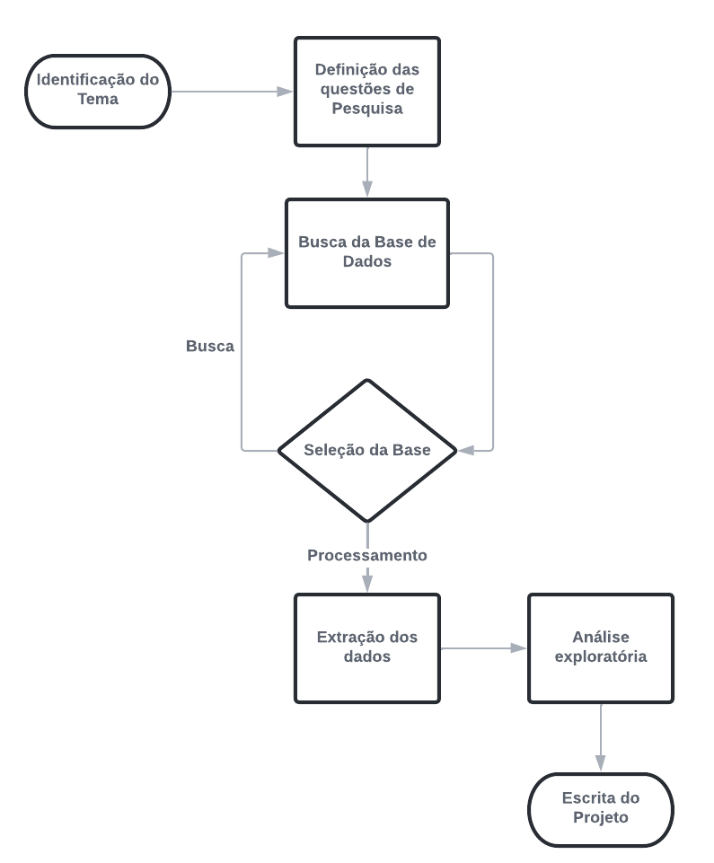

Fonte: Autores(2023)

## Bases de Dados e Evolução
A fim de responder a questão de pesquisa algumas bases foram pré-selecionadas e análisadas, e podem ser visualizadas na Tabela 2.

### Tabela 2- Bases de dados previamente selecionadas

Base de Dados | Endereço na Web | Resumo descritivo
----- | ----- | -----
Pre-infection 25-hydroxyvitamin D3 levels and association with severity of COVID-19 illness Amiel A. Dror | [Dataset 1](https://doi.org/10.1371/journal.pone.0263069.s001) | Base de dados pública fornecida pelo [artigo](https://journals.plos.org/plosone/article?id=10.1371/journal.pone.0263069).  Os dados clínicos foram coletados durante a internação hospitalar no Galilee Medical Center, contendo informações como: duração da hospitalização, gravidade da doença, mortalidade, comorbidades e nível de 25(OH)D de cada paciente.
Effect of a Single High Dose of Vitamin D3 on Hospital Length of Stay in Patients With Moderate to Severe COVID-19 | [Dataset 2](https://jamanetwork.com/journals/jama/fullarticle/2776738) | Base contendo 240 pacientes hospitalizados com COVID-19 no Hospital das Clínicas da Faculdade de Medicina da Universidade de São Paulo e no hospital de campanha do Ibirapuera. Dados com caracterização demográfica abrangente, ou seja, diversas raças/etnias. Pacientes foram divididos igualmente, para receber a vitamina D3 ou placebo.
No association between vitamin D status and COVID-19 infection in São Paulo, Brazil | [Dataset 3](https://www.scielo.br/j/aem/a/V9XTjvzvHk6qLDXLX8dzMJR/?lang=en#) | Base de dados não pública, coletada pelo Grupo Fleury. 14.692 indivíduos que realizaram testes de RT-PCR para diagnóstico de COVID-19 e que também tiveram o 25(OH)D medidos. 
UK Biobank | [Dataset 4](https://www.ukbiobank.ac.uk) | O UK Biobank é um banco de dados biomédico, contendo informações genéticas e de saúde detalhadas de meio milhão de participantes do Reino Unido. O banco de dados é regularmente atualizado com dados adicionais e está acessível mundialmente para pesquisadores aprovados que conduzem estudos essenciais sobre doenças comuns e potencialmente fatais.

Fonte: Autores(2023)

## Bases Estudadas mas Não Adotadas

Para o presente estudo um pré-requisito para seleção do dataset era os níves de vitamina D pré-infecção por COVID-19, como nem todos continham a informação requerida, tiveram que ser desconsiderados. As bases não utilizadas podem ser vistas na Tabela 3, que também menciona o motivo para ter sido retirada do estudo. 

### Tabela 3- Bases de dados desconsideradas
Base de Dados | Endereço na Web | Motivo da Exclusão
----- | ----- | -----
Effect of a Single High Dose of Vitamin D3 on Hospital Length of Stay in Patients With Moderate to Severe COVID-19 | [Dataset 2](https://jamanetwork.com/journals/jama/fullarticle/2776738) | Não adotada pois não foi obtido resposta por parte dos pesquisadores sobre o fornecimento dos dados, além disso a base tratava da aplicação de doses de vitamina D em indivíduos hospitalizados por COVID-19.
No association between vitamin D status and COVID-19 infection in São Paulo, Brazil | [Dataset 3](https://www.scielo.br/j/aem/a/V9XTjvzvHk6qLDXLX8dzMJR/?lang=en#) | A Base não foi selecionada uma vez que apresentava somente a informação de indivíduos que realizaram testes de RT-PCR para diagnóstico de COVID-19 e que também tiveram o 25(OH)D medidos, sem nenhum dado sobre nível pré-infecção ou gravidade hospitalar.
UK Biobank | [Dataset 4](https://www.ukbiobank.ac.uk) | O UK Biobank não foi adotado em nosso estudo, pois os Centros de avaliação selecionados não possuíam informações sobre os níveis de vitamina D pré-infecção.

Fonte: Autores(2023)

## Base Selecionada

A fim de responder a questão de pesquisa previamente estipulada, uma base de dados foi selecionada para dar sequência ao projeto e pode ser vista na Tabela 4, que além do link de acesso também apresenta a justificativa para a devida inclusão.

### Tabela 4- Base Selecionada
Base de Dados | Endereço na Web | Motivo da Seleção
----- | ----- | -----
Pre-infection 25-hydroxyvitamin D3 levels and association with severity of COVID-19 illness Amiel A. Dror | [Dataset 1](https://doi.org/10.1371/journal.pone.0263069.s001) | Mesmo não se tratando de uma base Brasileira, optou-se por seleciona-la, já que contava com todos os parâmetros necessários para análise. Desde os níveis de vitamina D pré-infecção, até a gravidade da doença em cada indivíduo. 

Fonte: Autores(2023)

## Análise Exploratória
A base de dados conta com 253 amostras de pacientes infectados por COVID-19 (confirmados por PCR) e internados no Galilee Medical Center (GMC) entre 7 de abril de 2020 e 4 de fevereiro de 2021 . Pacientes menores de 18 anos foram excluídos da criação da base de dados. 

A Figura 2 apresenta o fluxo de trabalho adotado durante o processo da análise exploratória, em que, primeiro houve a preparação da base, a criação de um dicionário, para posteriormente realizar a extração das informações. 

### Figura 2- Fluxo de Trabalho da Análise 

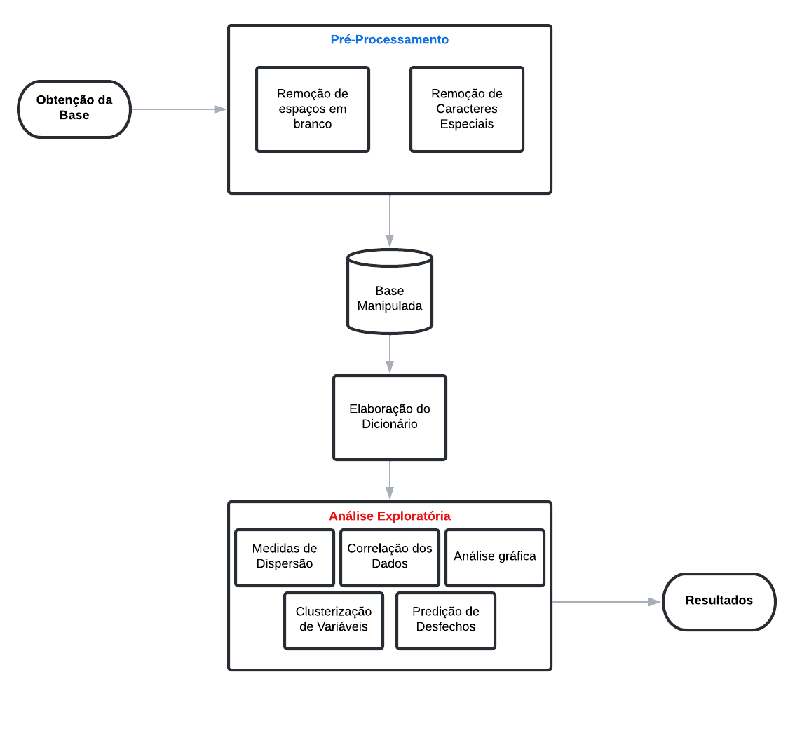

Fonte: Autores(2023)

Antes de iniciar de fato a análise dos dados, algumas manipulações foram feitas. Linhas com o caracter * e com NaN foram removidas da base, a fim de trabalhar apenas com  as informações totalmente preenchidas. A Tabela 6 apresenta as métricas antes e após as manipulações. 

### Tabela 5- Resumo das Dimensões
| | Linhas | Colunas| % Alterada|
 |--|--|--|--|
 |Antes| 253| 25 | 0% |
 |Depois|246 | 25 | 2.77% |

 Fonte: Autores(2023)

Diversos parâmetros foram adotados para a criação do dataset, desde dados básicos como genêro e idade, até dados específicos do prontuário do paciente, como comorbidades associadas, nível de 25(OH)D, gravidade durante a internação e entre outros. A Tabela 6 explicita um guia com a explicação de todas as variáveis utilizadas, juntamente com as subcategorias, aplicadas durante a análise. 

### Tabela 6- Dicionário 
|Nome Variável | Significado | Sub Categorias|
 |--|--|--|
 | Patient  | Identificador anônimo do Paciente  |  |
 | Age Group  | Grupos de Idade | 1= Pacientes com idade inferior a 50   2= Pacientes com idade entre 50 e 64 anos   3= Pacientes com idade acima dos 65 anos. |
 | Gender  | Genêro  | 0 = Feminino   1 = Masculino |
 | Religion  | Religião  | 1 = Judeu   2 = Árabe muçulmano   3 = Árabe Cristão   4 = Druzo  5 = Cristão   6 = Outra|
 | Maximal degree of severity during hospitalization  | Refere-se ao grau de gravidade durante a internação  | 0 = Leve   1 = Moderado   2 = Grave    3 = Crítico|
 | BMI | Índice de massa corporal  | 0 = Menor que 30   1 = Maior que 30|
 | Date of 25(OH)D test| Data da realização do exame de vitamina D  | |
 | Month of 25(OH)D examination| Mês da realização do exame de vitamina D  | |
 | Month of hospitalization in corona dep.| Mês de internação no departamento de COVID | |
 | Death during hospitalization| Indica se o paciente foi ou não a óbito| 0 = Não   1 = Sim  |
 | COPD | Doença pulmonar obstrutiva crônica | 0 = Não   1 = Sim   |
 | CHF | Insuficiência cardíaca congestiva | 0 = Não   1 = Sim   |
 | CIHD |Doença Cardíaca Isquêmica Crônica | 0 = Não   1 = Sim   |
 | HTN |Hipertensão | 0 = Não   1 = Sim   |
 | CRF | Insuficiência Renal Crônica | 0 = Não   1 = Sim   |
 | DM |Diabetes Mellitus | 0 = Não   1 = Sim   |
 | Hospitalization length (days)| Indica a quantidade de dias que o paciente passou hospitalizado| |
 | Pre-infection 25(OH)D level (ng/mL)| Nível de 25(OH)D pré-infecção (ng/mL) obtido do prontuário do paciente| 1 = <=19.99   2 =  20-29.99   3 = 30-39.99   4 = 40+|
 
 Fonte: Autores(2023)

Algumas informações prévias podem ser retiradas do dataset, tais como predominância de idade, o percentual que cada nível de gravidade representa, os índices de vitamina D de acordo com a religião e a relação entre os níveis 25(OH) D e o número de mortos. 
Primeiramente analizando a faixa etária da base, há um número maior de pessoas de ambos os gêneros com idade acima de ">64", como pode ser visto no Gráfico 1.

### Gráfico 1- Distribuição dos Pacientes por Faixa Etária e Gênero 

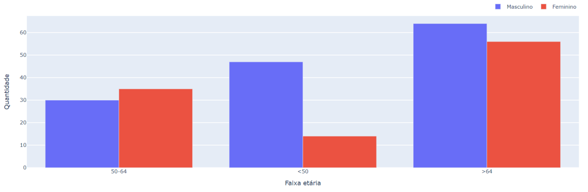

Fonte: Autores(2023)

Em relação ao gravidade dos casos, há uma soberania em casos de grau moderado, entretando casos graves e críticos, quando juntos, correspondem a cerca de 1/3 das
amostras, como demonstrado no Gráfico 2.

### Gráfico 2- Gravidade Durante Hospitalização

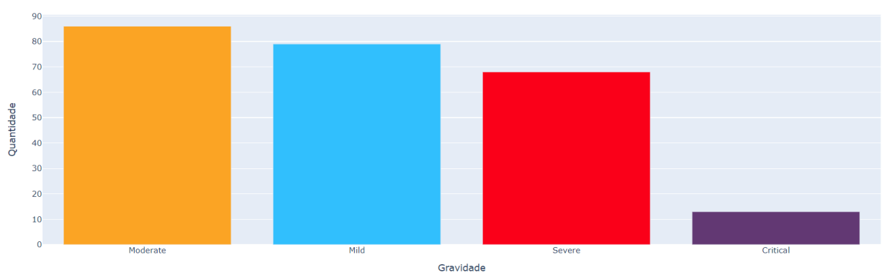

Fonte: Autores(2023)

Com relação aos índices de vitamina D, pode-se observar que, na maioria dos casos, eles são inferiores a "19,99" para todos os tipos de religião. Vale ressaltar que como não trata-se de uma base brasileira, considerou-se religião um critério importante, dado que para produzir vitamina D, o ideal é tomar sol  com o máximo de partes do corpo expostas, e sabe-se que religiões muçulmanas fazem o uso de roupas que cobrem grande parte do corpo, sendo assim, trata-se de uma variável relevante para este dataset. 

### Gráfico 3- Distribuição dos Níveis de 25(OH)D pré-infecção X Religião

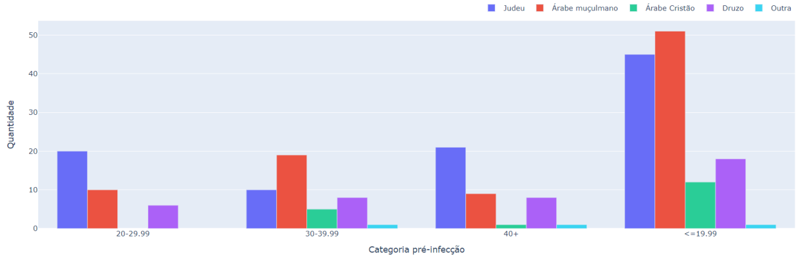

Fonte: Autores(2023)

A maioria dos pacientes presentes na base não foi a óbito durante a hospitalização, no entanto, para valores abaixo de "19,99", o
número de mortes é considerável em comparação com o restante das categorias.

### Gráfico 4- Relação dos Níveis de 25(OH)D pré-infecção X Morte Durante Hospitalização

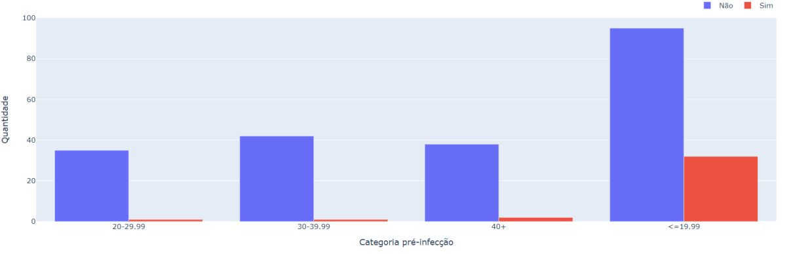

Fonte: Autores(2023)

Métricas como média, desvio padrão, mediana e moda foram calculados dos indices de 25(OH) D pré-infecção, a fim de se obter mais informações para as avaliações e para diferenciar os comportamentos entre amostras. As medidas obtidas podem ser vistas na Tabela 7, em que, além do cálculo geral, amostras foram divididas de acordo com o grau de gravidade durante a internação e as variáveis foram calculadas novamente.

### Tabela 7- Medidas Estatísticas
|Amostra | Média | Desvio Padrão| Moda | Mediana|
 |--|--|--|--|--|
 | Geral | 26.138|19.995 | 10.0| 19.25|
 | Grau de Gravidade -Leve | 38.589|15.430 | 34.2|34.2 |
 | Grau de Gravidade -Moderado | 25.570|23.224 | 15.1| 18.95|
 | Grau de Gravidade -Grave |15.307 |11.907 | 10.0| 11.3|
 | Grau de Gravidade -Crítico | 10.8923| 4.266|10.0 |10.0 |
  
 Fonte: Autores(2023)
 
Em seguida para análises de correlação, foram calculados os p-valores utilizando do teste de Wilcoxon (duas amostras independentes) a fim de comparar os valores de 25(OH)D pré-infecção entre as categorias de gravidade da doença COVID-19. A Tabela 8 demonstra os valores obtidos na comparação entre as amostras de Leve e moderado, moderado e grave, e grave e crítico. Uma diferença significativa no nível de 25(OH)D foi encontrada entre as categorias de doença leve em comparação com moderada (p < 0.001) e moderada em comparação com grave (p < 0.002). Não foi observada diferença entre indivíduos graves e críticos em relação à 25(OH)D (p = 0.04). 

### Tabela 8- P-valor Wilcoxon rank-sum test
|Amostra | p-valor|
 |--|--|
 | Leve-Moderado | p-value<0.0001 |
 | Moderado-Grave | p-value<0.0001 |
 | Grave-Crítico |p-value=0.04|
 
 Fonte: Autores(2023)
 
A fim de verificar a posição dos dados, simetria e dispersão um Box Plot foi plotado e pode ser visto na Figura 3. Por meio dele, é possível visualizar a distribuição de dados com base em mínimo, primeiro quartil (Q1), mediana, terceiro quartil(Q3) e o máximo, com as métricas apresentadas é possível notar uma diminuição progressiva nos níveis de 25(OH)D à medida que a gravidade da doença aumenta. 

### Figura 3- Box Plot 25(OH)D pré-infecção X Gravidade da doença COVID-19

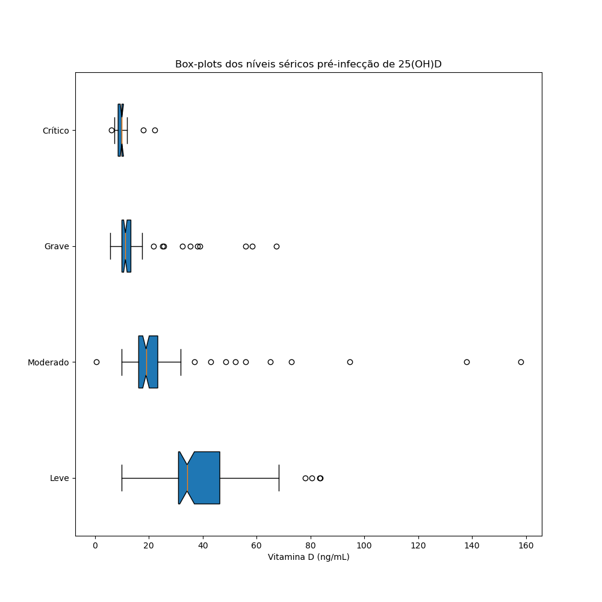

Fonte: Autores(2023)

A correlação entre variáveis pode ser vista na Figura 4, em que, quanto mais escuro mais diretamente correlacionadas. A linha diagonal tem correlação 1 pois se refere à correlação de uma variável com ela mesma, mas é possível notar que a hipertensão HTN e COPD apresentam uma alta correlação. Isso sugere que há uma associação significativa entre essas duas condições crônicas. Fatores como tabagismo, obesidade e problemas de saúde em geral podem contribuir para o desenvolvimento e a progressão de ambas as doenças.

### Figura 4- Correlação entre Variáveis

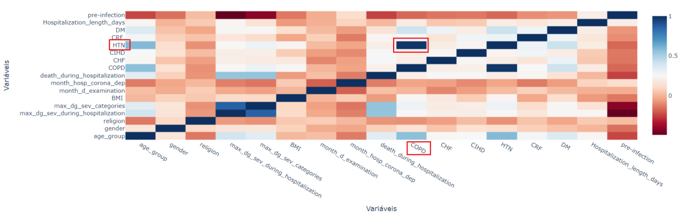

Fonte: Autores(2023)

Analisando as informações obtidas na até aqui é possível verificar que, de acordo com a Figura 4 a correlação mais forte entre os níveis mais baixos de 25(OH)D e a gravidade da doença de COVID-19 foi observada em pacientes com idade acima dos 50 anos (r = – 0,73; p <0,001 para idades de 50 a 64 anos; r = – 0,72; p < 0,001 para idades ≥65). Em pacientes com menos de 50 anos de idade, a gravidade da COVID-19 ainda estava correlacionada com a deficiência de vitamina D, mas em menor grau (r = – 0,66; p < 0,001). 

### Análise de Componentes Princicais e Clusterização

Uma forma de segregar os dados bucando por descobrir relacionamentos entre variáveis é a aplicação de técnica de agrupamento ou clusterização. Esta técnica pode contribuir no processo de descoberta observando-se como as amostras se essemalham mas sem o uso da uma variável alvo, um processo chamado de aprendizado não-supervisionado.
Antes de executar a clusterização, buscando por descobrir mais sobre os dados e o relacionamento entre as variáveis, foi feita análise de componentes principais (PCA) para redução de dimensionalidade. Isso poderia reduzir ruídos de variáveis que agregam pouco na variância dos dados e trazer melhores resultados na clusterização.

O PCA mostrou que  seriam necessárias as nove primeiras componentes para explicar, pelo menos, 80% da variância dos dados. Esse número pode ser retirado do gráfico 5 que mostra a variância acumulada a cada componente principal do PCA.

### Gráfico 5 - Variância acumulado no PCA

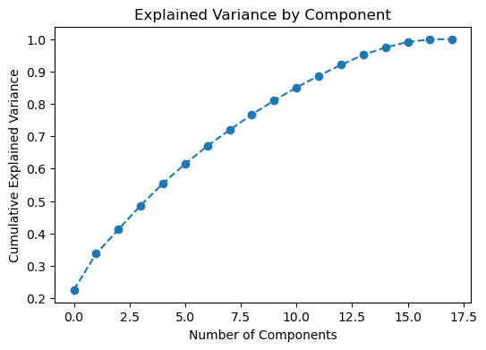

O PCA com nove componentes resulta numa variância de 81%.

Foi aplicada então uma clusterização pelo método K-Means que encontra agrupamentos atra'ves do cálculo de "centróides" nos dados e da distância de cada amostra a esses centróides.
O método exige que o número K de agrupamentos seja fornecido a priori. Para uma busca por um número ótimo de agrupamentos, o modelo foi executado com número de clusters de 1 a 20 e depois utilizamos o gráfico do "cotovelo" para selecionarmos o melhor valor de K.

### Gráfico 6 - Resultado das distâncias médias quadradas para cada valor de K de 1 a 20

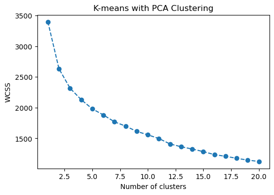

Pelo gráfico 6 foi feita a escolha do número quatro como o melhor número de clusters para nosso problema.

Foi feito, então o plot dos quatros clusters identificados pelo K-Means considerando-se os dois primeiros componentes principais do PCA, como uma forma de simplificar a visualização.

### Gráfico 7 - Resultado da clusterização com quatro agrupamentos (K = 4)

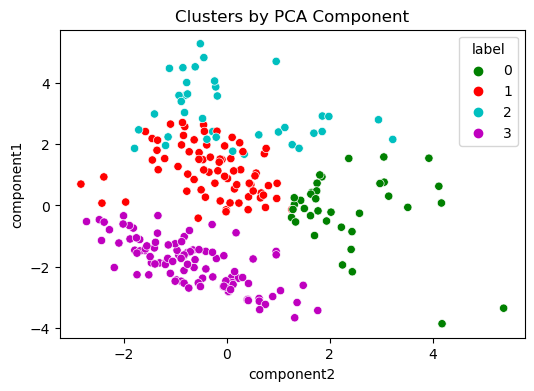

Alguns gráficos foram elaborados para cada cluster na busca por encontrar relacionamentos interessantes à resolução do nosso problema. Estes gráficos foram:

> Faixa etária versus quantidade de pacientes homens e mulheres
> Quantidade da casos versus a gravidade da doença
> Quantidade de pacientes obesos e não obesos
> Nível de vitamina D pré-infecção versus desfecho de óbito ou não-óbito

### Gráficos do Cluster 1

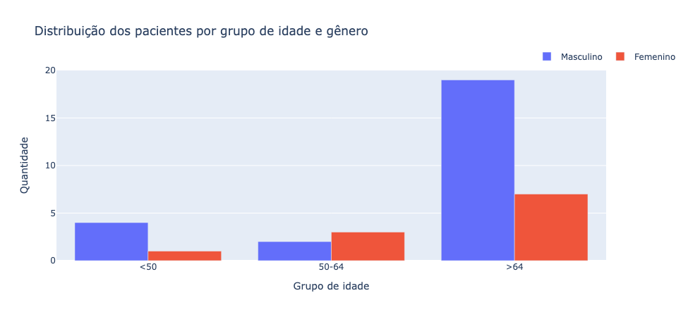

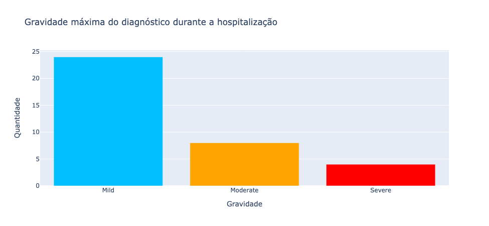

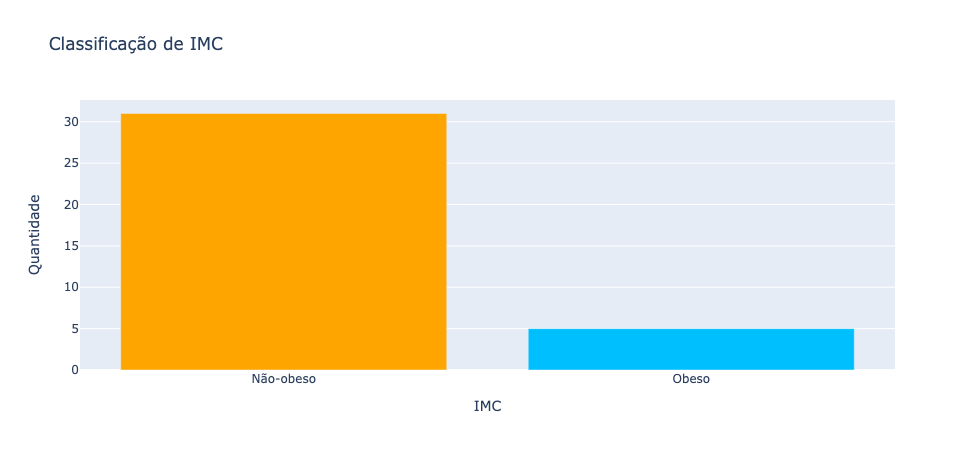

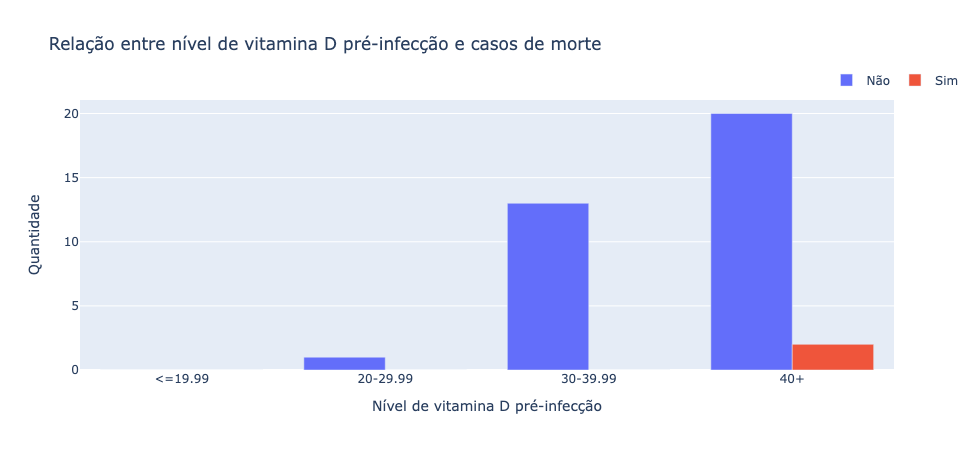

### Gráficos do Cluster 2

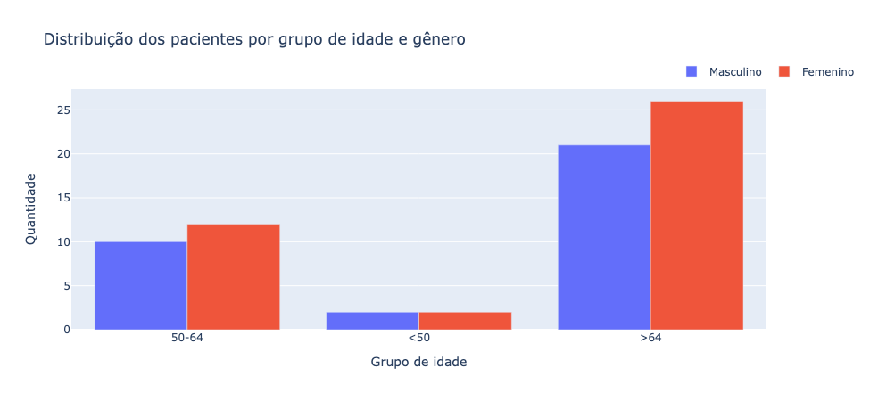

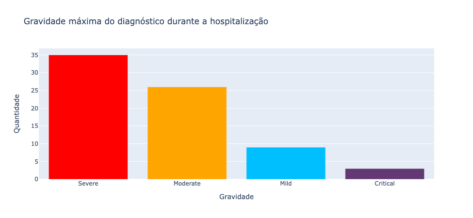

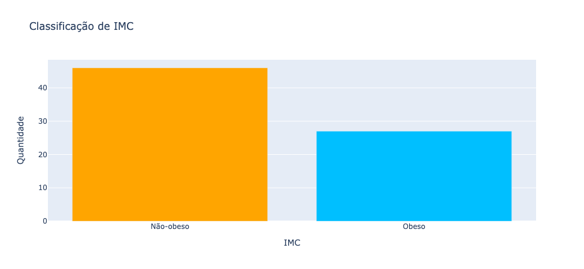

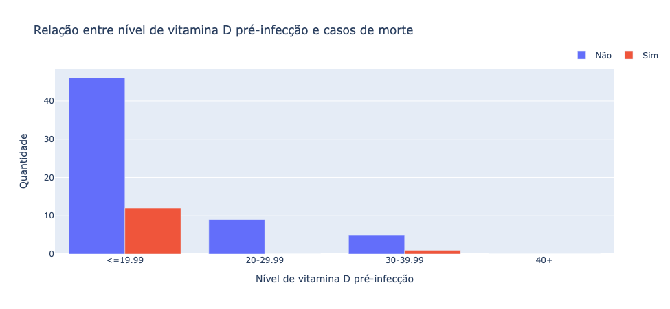

### Gráficos do Cluster 3

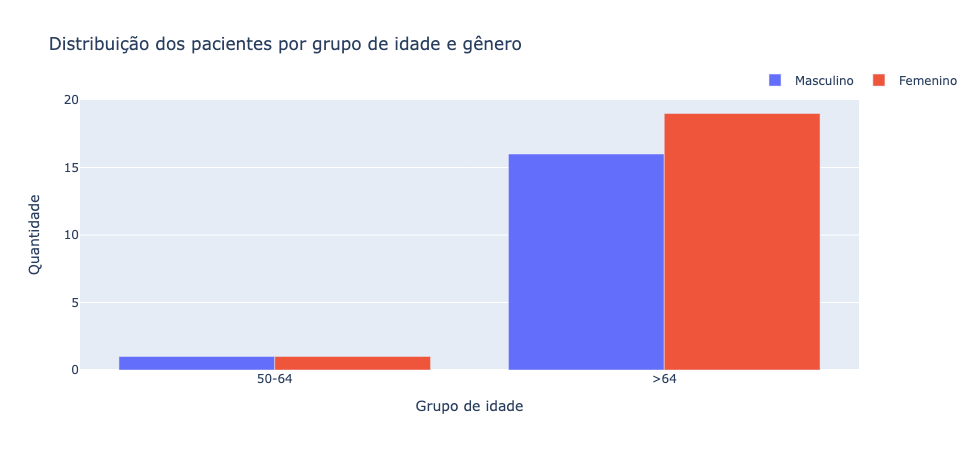

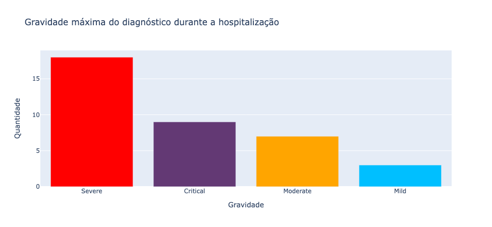

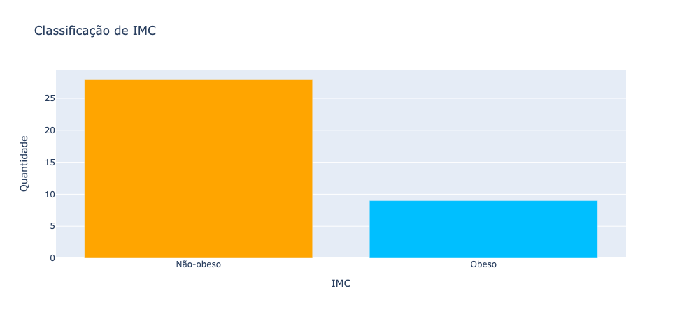

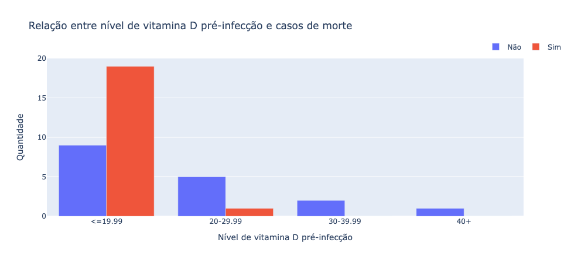

### Gráficos do Cluster 4

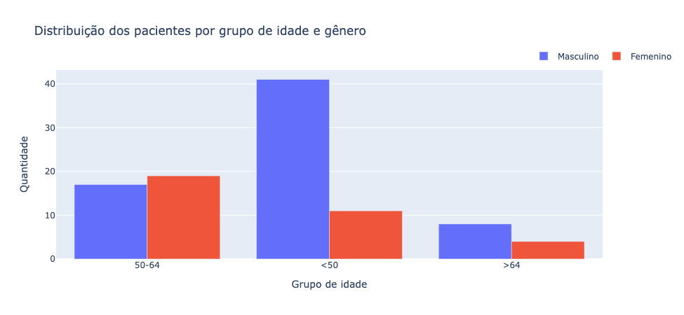

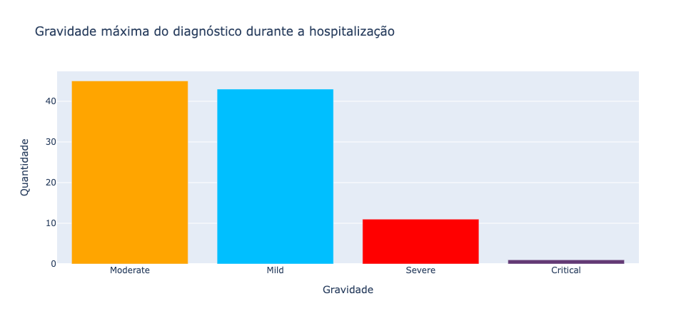

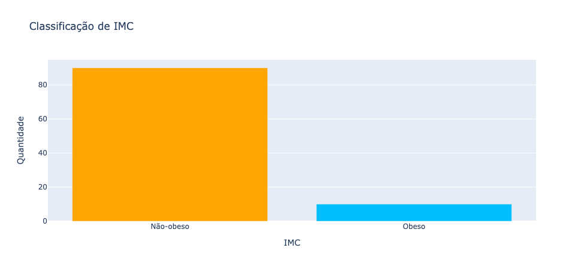

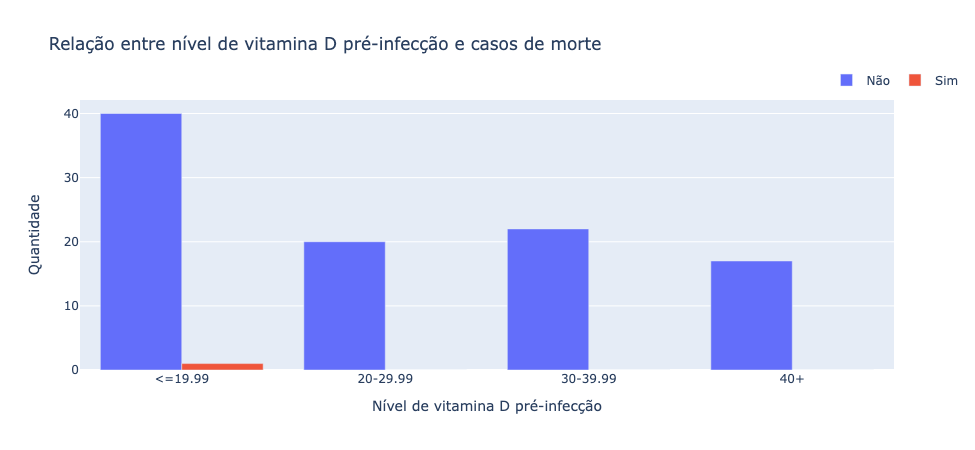

Dos gráficos acima, conseguimos destacar os resultados do Cluster 1 (verde) e do Cluster 4 (lilás). No primeiro, há um grande número de pacientes idosos, porém o índice de obesidade é menor e os níveis de vitamina D pré-infecção são altos. Para esse grupo não houve ocorrência de óbitos.

Um segundo resultado interessante foi o do Cluster 4, que é um grupo de pacientes mais jovens, não obesos, mas com baixos índices de vitamina D. Porém, mesmo com estes baixos índices, o número de óbitos foi de apenas um caso.

Esses foram justamenta os dois clusters mais bem separados se observarmos o gráfico 7 da clusterização.

Um modelo de regressão linear múltipla foi aplicado com todas as variáveis, obtendo-se uma baixa explicação do
modelo; no entanto, a remoção de algumas variantes atingiu uma eficácia de 65%. A Figura 5 apresenta a saída obtida para o melhor resultado. 

### Figura 5- Regressão Linear Múltipla

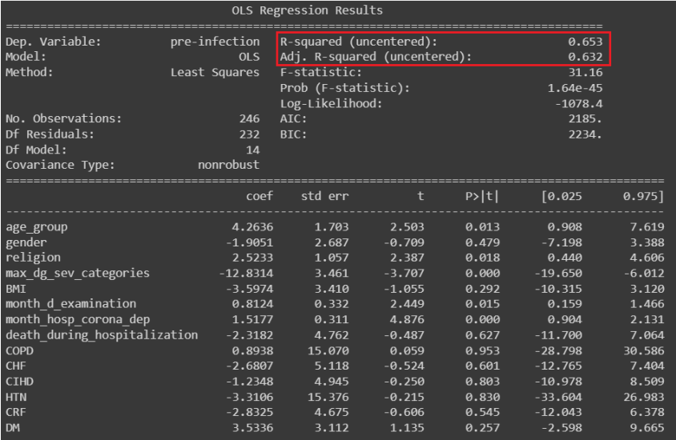

Fonte: Autores(2023)

## Ferramentas
 Por conter um vasto conjunto de bibliotecas estatísticas, gráficas e numéricas, optou-se pela utilização da ferramenta Python, que além da implementação mais "simplificada" faz parte do conhecimento de todos os participantes do projeto.
 As bibliotecas utilizadas para implementação e análises estão dispostas na Tabela 9.

### Tabela 9- Bibliotecas Utilizadas
 |Nome | Utilização|
 |--|--|
 | statistics | Utilizada para calcular média, moda, desvio padrão, e mediana dos conjuntos |
 | numpy | Utilizada para cálculos básicos e para manipulação de vetores |
 | matplotilib | Utilizada para plotar gráficos simples|
 | seaborn | Utilizada para plotar gráficos estatísticos variados|
 
 Fonte: Autores(2023)
 

 
 
# Cronograma
 
### Tabela 10- Divisão das Atividades
<table>
<thead>
  <tr>
    <th rowspan="3">  Atividades </th>
    <th colspan="12">Mês</th>
  </tr>
  <tr>
    <th colspan="4">Abril</th>
    <th colspan="4">Maio</th>
    <th colspan="4">Junho</th>
  </tr>
  <tr>
    <th>1</th>
    <th>2</th>
    <th>3</th>
    <th>4</th>
    <th>1</th>
    <th>2</th>
    <th>3</th>
    <th>4</th>
    <th>1</th>
    <th>2</th>
    <th>3</th>
    <th>4</th>
  </tr>
</thead>
<tbody>
  <tr>
    <td>Escolha do tema</td>
    <td>X</td>
    <td>X</td>
    <td></td>
    <td></td>
    <td></td>
    <td></td>
    <td></td>
    <td></td>
    <td></td>
    <td></td>
    <td></td>
    <td></td>
  </tr>
  <tr>
    <td>Escolha da base da dados</td>
    <td></td>
    <td>X</td>
    <td>X</td>
    <td>X</td>
    <td></td>
    <td></td>
    <td></td>
    <td></td>
    <td></td>
    <td></td>
    <td></td>
    <td></td>
  </tr>
  <tr>
    <td>Entrega 1ª versão</td>
    <td></td>
    <td></td>
    <td></td>
    <td>X</td>
    <td></td>
    <td></td>
    <td></td>
    <td></td>
    <td></td>
    <td></td>
    <td></td>
    <td></td>
  </tr>
  <tr>
    <td>Preparação dos dados</td>
    <td></td>
    <td></td>
    <td></td>
    <td>X</td>
    <td>X</td>
    <td></td>
    <td></td>
    <td></td>
    <td></td>
    <td></td>
    <td></td>
    <td></td>
  </tr>
  <tr>
    <td>Implementação</td>
    <td></td>
    <td></td>
    <td></td>
    <td>X</td>
    <td>X</td>
    <td>X</td>
    <td></td>
    <td></td>
    <td></td>
    <td></td>
    <td></td>
    <td></td>
  </tr>
  <tr>
    <td>Entrega 2ª versão</td>
    <td></td>
    <td></td>
    <td></td>
    <td></td>
    <td></td>
    <td></td>
    <td>X</td>
    <td></td>
    <td></td>
    <td></td>
    <td></td>
    <td></td>
  </tr>
  <tr>
    <td>Aplicação da Metodologia</td>
    <td></td>
    <td></td>
    <td></td>
    <td></td>
    <td></td>
    <td></td>
    <td>X</td>
    <td>X</td>
    <td>X</td>
    <td></td>
    <td></td>
    <td></td>
  </tr>
  <tr>
    <td>Análise dos resultados</td>
    <td></td>
    <td></td>
    <td></td>
    <td></td>
    <td></td>
    <td></td>
    <td></td>
    <td></td>
    <td>X</td>
    <td>X</td>
    <td></td>
    <td></td>
  </tr>
  <tr>
    <td>Escrita do relatório</td>
    <td></td>
    <td></td>
    <td></td>
    <td></td>
    <td></td>
    <td></td>
    <td></td>
    <td></td>
    <td></td>
    <td>X</td>
    <td>X</td>
    <td></td>
  </tr>
  <tr>
    <td>Entrega final</td>
    <td></td>
    <td></td>
    <td></td>
    <td></td>
    <td></td>
    <td></td>
    <td></td>
    <td></td>
    <td></td>
    <td></td>
    <td></td>
    <td>X</td>
  </tr>
</tbody>
</table>

Fonte: Autores(2023)

# Análises Futuras

A fim de verificar outras informações e realizar análises pertinentes a base estudada, alguns tópicos foram estipulados para entrega futura, dentre eles estão:
<!--ts-->
   * Predição do desfecho
   * Clusterização das Variáveis
   * Análises das variáveis de confusão
<!--te-->

# Referências

AKBAR, M. R. et al. Low Serum 25-hydroxyvitamin D (Vitamin D) Level Is Associated With Susceptibility  to COVID-19, Severity, and Mortality: A Systematic Review and Meta-Analysis.Frontiers in nutritionSwitzerland, 2021. 

AL-YATAMA, F. I. et al. The Effect of Clothing on Vitamin D Status, Bone Turnover Markers, and Bone Mineral  Density in Young Kuwaiti Females. International journal of endocrinology, v. 2019, p. 6794837, 2019. 

ALBERGAMO, A.; APPRATO, G.; SILVAGNO, F. The Role of Vitamin D in Supporting Health in the COVID-19 Era. International journal of molecular sciences, v. 23, n. 7, mar. 2022. 

ALONSO, N. et al. Vitamin D Metabolites: Analytical Challenges and Clinical Relevance. Calcified tissue international, v. 112, n. 2, p. 158–177, fev. 2023. 

AMREIN, K. et al. Vitamin D deficiency 2.0: an update on the current status worldwide. European journal of clinical nutrition, v. 74, n. 11, p. 1498–1513, nov. 2020. 

ARAÚJO, T. S. S. et al. Vitamin D: a potentially important secosteroid for coping with COVID-19. Anais da Academia Brasileira de Ciencias, v. 94, n. 2, p. e20201545, 2022. 

BAEKE, F. et al. Vitamin D: modulator of the immune system. Current opinion in pharmacology, v. 10, n. 4, p. 482–496, ago. 2010. 
BALACHANDAR, R. et al. Relative Efficacy of Vitamin D(2) and Vitamin D(3) in Improving Vitamin D Status:  Systematic Review and Meta-Analysis. Nutrients, v. 13, n. 10, set. 2021. 

BIKLE, D. D.; PATZEK, S.; WANG, Y. Physiologic and pathophysiologic roles of extra renal CYP27b1: Case report and  review. Bone reports, v. 8, p. 255–267, jun. 2018. 

BOTROS, R. M. et al. Vitamin D Status in Hospitalized Chronically Ill Patients. Journal of the American College of Nutrition, v. 37, n. 7, p. 578–582, 2018. 

BRAUN, A. et al. Association of low serum 25-hydroxyvitamin D levels and mortality in the  critically ill. Critical care medicine, v. 39, n. 4, p. 671–677, abr. 2011. 

BUCURICA, S. et al. Association of Vitamin D Deficiency and Insufficiency with Pathology in  Hospitalized Patients. Diagnostics (Basel, Switzerland), v. 13, n. 5, mar. 2023. 

CARDWELL, G. et al. A Review of Mushrooms as a Potential Source of Dietary Vitamin D. Nutrients, v. 10, n. 10, out. 2018. 
CHANG, S.-W.; LEE, H.-C. Vitamin D and health - The missing vitamin in humans. Pediatrics and neonatology, v. 60, n. 3, p. 237–244, jun. 2019. 

CHAROENNGAM, N.; SHIRVANI, A.; HOLICK, M. F. Vitamin D for skeletal and non-skeletal health: What we should know. Journal of clinical orthopaedics and trauma, v. 10, n. 6, p. 1082–1093, 2019. 

CHAROENNGAM, N.; SHIRVANI, A.; HOLICK, M. F. Vitamin D and Its Potential Benefit for the COVID-19 Pandemic. Endocrine practice : official journal of the American College of Endocrinology  and the American Association of Clinical Endocrinologists, v. 27, n. 5, p. 484–493, maio 2021. 

CORSELLO, A. et al. Vitamin D in pediatric age: Current evidence, recommendations, and  misunderstandings. Frontiers in medicine, v. 10, p. 1107855, 2023. 

DE PAULA, F. J. A.; ROSEN, C. J. Vitamin D safety and requirements. Archives of biochemistry and biophysics, v. 523, n. 1, p. 64–72, jul. 2012. 

DELRUE, C.; SPEECKAERT, M. M. Vitamin D and Vitamin D-Binding Protein in Health and Disease.International journal of molecular sciencesSwitzerland, fev. 2023. 

DUARTE, C. et al. Prevalence of vitamin D deficiency and its predictors in the Portuguese  population: a nationwide population-based study. Archives of osteoporosis, v. 15, n. 1, p. 36, mar. 2020. 

DUSSO, A. S.; BAUERLE, K. T.; BERNAL-MIZRACHI, C. Non-classical Vitamin D Actions for Renal Protection. Frontiers in medicine, v. 8, p. 790513, 2021. 

GANMAA, D. et al. Vitamin D, respiratory infections, and chronic disease: Review of meta-analyses  and randomized clinical trials. Journal of internal medicine, v. 291, n. 2, p. 141–164, fev. 2022. 

GOIS, P. H. F. et al. Vitamin D and Infectious Diseases: Simple Bystander or Contributing Factor? Nutrients, v. 9, n. 7, jun. 2017. 

GOMES, T. L. et al. Low vitamin D at ICU admission is associated with cancer, infections, acute  respiratory insufficiency, and liver failure. Nutrition (Burbank, Los Angeles County, Calif.), v. 60, p. 235–240, abr. 2019. 

GORDON, C. M. et al. Prevalence of vitamin D deficiency among healthy adolescents. Archives of pediatrics & adolescent medicine, v. 158, n. 6, p. 531–537, jun. 2004. 

HAJHASHEMY, Z. et al. Serum vitamin D levels in relation to abdominal obesity: A systematic review and  dose-response meta-analysis of epidemiologic studies. Obesity reviews : an official journal of the International Association for the  Study of Obesity, v. 22, n. 2, p. e13134, fev. 2021. 

HASTIE, C. E. et al. Vitamin D concentrations and COVID-19 infection in UK Biobank. Diabetes & metabolic syndrome, v. 14, n. 4, p. 561–565, 2020. 

HASTIE, C. E.; PELL, J. P.; SATTAR, N. Vitamin D and COVID-19 infection and mortality in UK Biobank. European journal of nutrition, v. 60, n. 1, p. 545–548, fev. 2021. 

HILL, A. et al. An update of the effects of vitamins D and C in critical illness. Frontiers in medicine, v. 9, p. 1083760, 2022. 
HOLICK, M. F. Vitamin D status: measurement, interpretation, and clinical application. Annals of epidemiology, v. 19, n. 2, p. 73–78, fev. 2009. 

HOLICK, M. F. The vitamin D deficiency pandemic: Approaches for diagnosis, treatment and  prevention. Reviews in endocrine & metabolic disorders, v. 18, n. 2, p. 153–165, jun. 2017. 

HU, B. et al. Characteristics of SARS-CoV-2 and COVID-19. Nature reviews. Microbiology, v. 19, n. 3, p. 141–154, mar. 2021. 
JÄPELT, R. B.; JAKOBSEN, J. Vitamin D in plants: a review of occurrence, analysis, and biosynthesis. Frontiers in plant science, v. 4, p. 136, 2013. 

JONES, K. S. et al. Predictors of 25(OH)D half-life and plasma 25(OH)D concentration in The Gambia  and the UK. Osteoporosis international : a journal established as result of cooperation  between the European Foundation for Osteoporosis and the National Osteoporosis Foundation of the USA, v. 26, n. 3, p. 1137–1146, mar. 2015. 

JOSE, R. J.; MANUEL, A. COVID-19 cytokine storm: the interplay between inflammation and coagulation.The Lancet. Respiratory medicineEngland, jun. 2020. 

KLOC, M. et al. Effects of vitamin D on macrophages and myeloid-derived suppressor cells (MDSCs)  hyperinflammatory response in the lungs of COVID-19 patients. Cellular immunology, v. 360, p. 104259, fev. 2021. 
KOHLMEIER, M. Avoidance of vitamin D deficiency to slow the COVID-19 pandemic. BMJ nutrition, prevention & health, v. 3, n. 1, p. 67–73, 2020. 

LEGARTH, C. et al. The Impact of Vitamin D in the Treatment of Essential Hypertension. International journal of molecular sciences, v. 19, n. 2, fev. 2018. 

LEMIRE, J. M. et al. 1 alpha,25-dihydroxyvitamin D3 suppresses proliferation and immunoglobulin  production by normal human peripheral blood mononuclear cells. The Journal of clinical investigation, v. 74, n. 2, p. 657–661, ago. 1984. 

LU, R. et al. Genomic characterisation and epidemiology of 2019 novel coronavirus: implications  for virus origins and receptor binding. Lancet (London, England), v. 395, n. 10224, p. 565–574, fev. 2020. 

MALINOVSCHI, A. et al. Severe vitamin D deficiency is associated with frequent exacerbations and  hospitalization in COPD patients. Respiratory research, v. 15, n. 1, p. 131, dez. 2014. 

MCGONAGLE, D. et al. The Role of Cytokines including Interleukin-6 in COVID-19 induced Pneumonia and  Macrophage Activation Syndrome-Like Disease. Autoimmunity reviews, v. 19, n. 6, p. 102537, jun. 2020. 

MELTZER, D. O. et al. Association of Vitamin D Status and Other Clinical Characteristics With COVID-19  Test Results. JAMA network open, v. 3, n. 9, p. e2019722, set. 2020. 

PETRELLI, F. et al. Therapeutic and prognostic role of vitamin D for COVID-19 infection: A systematic  review and meta-analysis of 43 observational studies. The Journal of steroid biochemistry and molecular biology, v. 211, p. 105883, jul. 2021. 

PETRELLI, F. et al. Vitamin D3 and COVID-19 Outcomes: An Umbrella Review of Systematic Reviews and  Meta-Analyses. Antioxidants (Basel, Switzerland), v. 12, n. 2, jan. 2023. 

PRIETL, B. et al. Vitamin D and immune function. Nutrients, v. 5, n. 7, p. 2502–2521, jul. 2013. 

RIPPEL, C. et al. Vitamin D status in critically ill children. Intensive care medicine, v. 38, n. 12, p. 2055–2062, dez. 2012. 

ROZMUS, D. et al. Vitamin D Binding Protein (VDBP) and Its Gene Polymorphisms-The Risk of Malignant  Tumors and Other Diseases. International journal of molecular sciences, v. 21, n. 21, out. 2020. 

SAPONARO, F.; SABA, A.; ZUCCHI, R. An Update on Vitamin D Metabolism. International journal of molecular sciences, v. 21, n. 18, set. 2020.

SIRAJUDEEN, S.; SHAH, I.; AL MENHALI, A. A Narrative Role of Vitamin D and Its Receptor: With Current Evidence on the  Gastric Tissues. International journal of molecular sciences, v. 20, n. 15, ago. 2019. 

SKROBOT, A.; DEMKOW, U.; WACHOWSKA, M. Immunomodulatory Role of Vitamin D: A Review. Advances in experimental medicine and biology, v. 1108, p. 13–23, 2018. 

STEINMAN, R. M.; BANCHEREAU, J. Taking dendritic cells into medicine. Nature, v. 449, n. 7161, p. 419–426, set. 2007. 

SZETO, B. et al. Vitamin D Status and COVID-19 Clinical Outcomes in Hospitalized Patients. Endocrine research, v. 46, n. 2, p. 66–73, 2021.

THIELE, K. et al. The Role of Vitamin D(3) as an Independent Predicting Marker for One-Year  Mortality in Patients with Acute Heart Failure. Journal of clinical medicine, v. 11, n. 10, maio 2022. 

TSUPRYKOV, O. et al. Why should we measure free 25(OH) vitamin D? The Journal of steroid biochemistry and molecular biology, v. 180, p. 87–104, jun. 2018. 

UTHAIAH, C. A. et al. Role of Neural Stem Cells and Vitamin D Receptor (VDR)-Mediated Cellular  Signaling in the Mitigation of Neurological Diseases. Molecular neurobiology, v. 59, n. 7, p. 4065–4105, jul. 2022. 

VASSILIOU, A. G. et al. Low 25-Hydroxyvitamin D Levels on Admission to the Intensive Care Unit May  Predispose COVID-19 Pneumonia Patients to a Higher 28-Day Mortality Risk: A Pilot Study on a Greek ICU Cohort. Nutrients, v. 12, n. 12, dez. 2020. 

VIEIRA JUNIOR, W. G. et al. Influence of strains and environmental cultivation conditions on the  bioconversion of ergosterol and vitamin D(2) in the sun mushroom. Journal of the science of food and agriculture, v. 102, n. 4, p. 1699–1706, mar. 2022. 

WIMALAWANSA, S. J. Non-musculoskeletal benefits of vitamin D. The Journal of steroid biochemistry and molecular biology, v. 175, p. 60–81, jan. 2018. 

ZHU, A. et al. Vitamin D-Binding Protein, Bioavailable, and Free 25(OH)D, and Mortality: A  Systematic Review and Meta-Analysis. Nutrients, v. 14, n. 19, set. 2022. 

ŻUREK, G. et al. Novel Approach for the Approximation of Vitamin D(3) Pharmacokinetics from In  Vivo Absorption Studies. Pharmaceutics, v. 15, n. 3, fev. 2023. 

