# Projeto `Avaliação dos efeitos do aparelho intraoral de avanço mandibular no tratamento de pacientes com apneia do sono: um estudo retrospectivo`

# Project `Evaluation of the effects of the mandibular advancement intraoral device in the treatment of patients with sleep apnea: a retrospective study.`

# Apresentação
> 
> O presente projeto foi originado no contexto das atividades da disciplina de pós-graduação [*Ciência e Visualização de Dados em Saúde*](https://github.com/datasci4health/home), oferecida no primeiro semestre de 2023, na Unicamp.
> 

> ## **Membros do grupo.**
> |**Nome**  | **RA** | **Especialização**|
> |--|--|--|
> | Lidia Regina de Carvalho Freitas Barban  | 20362  | Tecnóloga em processamento de dados e engenheira de dados para saúde|
> | **Wladimir Arturo Garces Carrillo**  | **204059**  | **Candidado a Mestre em Ciência da Computação e Enginheiro em Mecatronica - Líder Github - @WladIMirG**|
> | Luciano de Melo Martins  | 223825  |  Bacharel em Ciências da Computação e Engenheiro de Software|
> | Denise Fernandes Barbosa  | 161452  | Ciências da Cirurgia e Odontologia na Medicina Sono|

# Slides da Apresentação Final
> - [Slides da Apresentação Final](https://docs.google.com/presentation/d/1owZvL1l1FhoMUqWMBlwgYRORD4hVznqA-ashmJg2DKk/edit?usp=sharing)
> - [video de apresentação do grupo](https://www.youtube.com/watch?v=4oD-iYRKIvA)

<!-- # Descrição Resumida do Projeto
> 
> Neste estudo retrospectivo, investigaremos os efeitos do aparelho intraoral de avanço mandibular no tratamento de pacientes com apneia do sono.
> 
> Seguiremos por algumas etapas para execução de um projeto relacionado com pacientes portadores de ronco e apneia obstrutiva do sono.
> 
> Incluiremos dados retrospectivos de exames de polissonografia tipo IV de pacientes antes e depois de receberem o tratamento com dispositivo de avanço mandibular. 
> 
> Será feita a anonimização da base de dados e geração de um dicionário de dados das informações presentes no dataset fornecido pela tecnólogo em processamentos de dados e a validação será feita pela cirurgiã-dentista integrante da equipe. -->

# Introdução e Referenciais Teóricos
<!-- Contextualização do projeto -->

<!-- Caracterização do problema -->

<!-- Motivação -->

<!-- Relevância -->

<!-- Trabalhos relacionados -->

<!-- Indicação (bastante resumida) da análise proposta -->

<!-- Indicação (bastante resumida) dos resultados alcançados -->

>O tratamento da apneia obstrutiva do sono (AOS) é um desafio clínico que envolve a escolha de diferentes abordagens terapêuticas. Nesse contexto, os dispositivos de avanço mandibular (MADs, na sigla em inglês) e a pressão positiva contínua nas vias aéreas (CPAP, na sigla em inglês) têm sido amplamente utilizados. No entanto, há uma necessidade de compreender melhor a eficácia e as diferenças entre esses tratamentos para a AOS.
>
>Um conjunto de pesquisas tem sido conduzido com o objetivo de explorar os desenhos e os resultados dos diferentes dispositivos de avanço mandibular disponíveis, a fim de auxiliar a tomada de decisão clínica. Esses estudos abordam tanto os desfechos objetivos quanto subjetivos relacionados aos dispositivos de avanço mandibular, fornecendo uma visão geral abrangente sobre sua eficácia.
>
>Uma revisão sistemática, descrita em ```[1]```, examinou estudos clínicos randomizados e coortes que compararam diferentes desenhos de dispositivos de avanço mandibular no tratamento da AOS. Os resultados indicaram que os dispositivos monobloco tiveram um desempenho mais favorável em comparação com os de impulso bilateral, enquanto os dispositivos de tração na linha média foram mais eficazes em relação a outros desenhos. Além disso, observou-se que os dispositivos personalizados foram superiores aos termoplásticos. No entanto, não foram encontradas diferenças clinicamente relevantes entre os desenhos dos dispositivos em relação a outros desfechos, como redução do índice de sonolência de Epworth (ESS), adesão ao tratamento, preferência do paciente, efeitos colaterais e custo-efetividade.
>
>Outra revisão sistemática, descrita em ```[2]```, comparou a eficácia do CPAP com os dispositivos de avanço mandibular no tratamento da AOS. Os resultados sugeriram que o CPAP foi mais eficaz na redução do índice de apneia-hipopneia (AHI) e na porcentagem do estágio 1 e 2 do sono após a terapia. No entanto, o CPAP também foi associado a uma diminuição significativa na pontuação de função social do SF-36 em comparação com os dispositivos de avanço mandibular. Não houve diferença significativa na pontuação de sonolência do Epworth entre os dois grupos.
>
>Além disso, uma revisão sistemática mais recente, descrita em ```[3]```, buscou identificar preditores da eficácia da terapia com dispositivos de avanço mandibular para a AOS em pacientes adultos. Os resultados indicaram que pacientes mais jovens, com circunferência de pescoço menor, índice de massa corporal mais baixo e medidas faciais específicas, tiveram uma resposta mais favorável ao tratamento com dispositivos de avanço mandibular. Além disso, os respondedores apresentaram uma menor pressão positiva contínua nas vias aéreas ótima do que os não respondedores. O tipo de dispositivo não afetou os resultados da meta-análise.
>
>Uma meta-análise comparativa, descrita em ```[4]```, teve como objetivo avaliar a eficácia do CPAP em comparação com os dispositivos de avanço mandibular no tratamento da AOS de leve a grave. Os resultados mostraram que o CPAP foi associado a uma redução significativa no AHI em comparação com os dispositivos de avanço mandibular. Além disso, a saturação de oxigênio mais baixa também foi menor no grupo de CPAP. No entanto, não houve diferença estatisticamente significativa na pontuação de sonolência do Epworth entre os dois grupos. Concluiu-se que o CPAP ainda é considerado o tratamento padrão-ouro para a AOS, mas os dispositivos de avanço mandibular podem ser uma opção eficaz para pacientes que não têm acesso fácil ao CPAP ou que não preferem essa terapia.
>
>Por fim, uma revisão sistemática enfocada na precisão do índice de dessaturação de oxigênio (ODI) em comparação com o índice de apneia-hipopneia (AHI) no diagnóstico da AOS em adultos foi descrita em ```[5]```. Os resultados sugeriram que um ODI de 4% igual ou maior que 15 eventos por hora poderia ser considerado como um valor de corte para o diagnóstico da AOS. Além disso, um ODI de 4% igual ou maior que 10 eventos por hora pode indicar a necessidade de uma avaliação adicional para o diagnóstico da AOS. No entanto, foram identificadas heterogeneidades significativas nos estudos analisados, destacando a necessidade de pesquisas adicionais nesse campo.
>
>Esses estudos demonstram a importância de compreender os diferentes tratamentos e abordagens terapêuticas disponíveis para a apneia obstrutiva do sono. Através de revisões sistemáticas e meta-análises, foi possível explorar os resultados de estudos clínicos e comparar a eficácia de diferentes dispositivos de avanço mandibular com o CPAP. Embora o CPAP ainda seja considerado o tratamento padrão-ouro, os dispositivos de avanço mandibular podem ser uma alternativa eficaz, especialmente para pacientes que têm dificuldade de aderir ao CPAP.
>
>Essas descobertas são de grande relevância para a prática clínica, auxiliando os profissionais de saúde na tomada de decisões e na escolha do tratamento mais adequado para pacientes com apneia obstrutiva do sono. A compreensão das características dos pacientes que respondem melhor aos dispositivos de avanço mandibular também contribui para a personalização do tratamento e a melhoria dos resultados clínicos.
>
>No presente trabalho, propomos o estudo retrospectivo, a travez da axploração de dados investigaremos os efeitos do aparelho intraoral de avanço mandibular no tratamento de pacientes com apneia do sono, considerando as ventagens e limitações na literatura. Com base nesses resultados, pretendemos fornecer insights valiosos para a prática clínica, destacando a importância de uma abordagem individualizada no tratamento da apneia obstrutiva do sono. A análise proposta busca contribuir para a melhoria dos desfechos clínicos e aprimoramento das opções terapêuticas disponíveis para os pacientes com apneia obstrutiva do sono.
>
>Nossa análise incluirá uma revisão minuciosa dos estudos mencionados anteriormente, levando em consideração os desenhos de estudo, os tamanhos das amostras, as medidas de resultado e as conclusões alcançadas por cada um deles. Também examinaremos as limitações e as lacunas de conhecimento identificadas nessas pesquisas, a fim de identificar áreas que necessitam de pesquisas futuras.
>
>Esperamos que essa análise proporcione uma visão mais abrangente sobre a eficácia dos dispositivos de avanço mandibular em comparação com o CPAP no tratamento da apneia obstrutiva do sono. Além disso, poderemos explorar os fatores preditivos de resposta ao tratamento com dispositivos de avanço mandibular e o uso do ODI como um indicador alternativo para o diagnóstico da doença.
>
>Os resultados alcançados por meio dessa análise contribuirão para a tomada de decisão clínica, fornecendo informações valiosas sobre as opções terapêuticas disponíveis para pacientes com apneia obstrutiva do sono. Além disso, poderemos identificar possíveis lacunas no conhecimento e direcionar pesquisas futuras para aprimorar ainda mais o tratamento dessa condição.
>
>Em resumo, a análise proposta tem como objetivo fornecer uma avaliação crítica sobre o uso de dispositivos de avanço mandibular. Esperamos que nossos resultados ajudem a melhorar a compreensão dessa condição e aprimorar a qualidade de vida dos pacientes afetados.


# **Perguntas de Pesquisa e Objetivos**
>
> ## **Perguntas de Pesquisa:**
> As questões de pesquisa a serem abordadas serão:
> 
> - **QP1:** O aparelho intraoral de avanço mandibular melhora o índice de dessaturação de oxigênio (IDO) em pacientes com apneia do sono?
> - **QP2:** O aparelho intraoral de avanço mandibular melhora a frequência cardíaca dos pacientes?
> - **QP3:** A melhora do índice de dessaturação de oxigênio (IDO) em pacientes com apneia do sono, consequentemente, melhora a frequência cardíaca dos pacientes tratados com aparelho intraoral de avanço mandibular?
> 
> ## **Objetivo:**
> - Estudar os efeitos do aparelho intraoral de avanço mandibular no tratamento de pacientes com apneia do sono.

# **Metodologia**

> Neste estudo, adotamos uma metodologia baseada em etapas para garantir a privacidade dos pacientes envolvidos e a qualidade dos dados coletados. Inicialmente, realizamos a anonimização dos dados, removendo informações individuais dos pacientes, a fim de preservar a confidencialidade.
> 
> A seguir, apresentamos uma visão geral das etapas da metodologia, conforme ilustrado no fluxo de processos abaixo:
> 
> 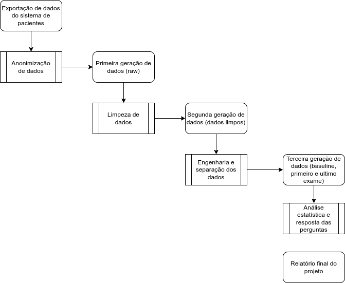
> 
> 1. Limpeza e organização dos dados: Realizamos a limpeza dos dados coletados, removendo possíveis erros ou inconsistências. Organizamos os dados em um formato adequado para análise posterior.
> 
> 2. Tratamento de dados nulos ou faltantes: Identificamos e lidamos com dados que apresentam valores nulos ou faltantes. Utilizamos técnicas apropriadas, como preenchimento ou exclusão desses valores, para evitar distorções nos resultados.
> 
> 3. Identificação de anomalias de coleta: Verificamos a presença de possíveis anomalias nos dados coletados. Caso identifiquemos valores discrepantes ou inconsistentes, tomamos decisões apropriadas sobre como tratá-los, seja por meio de correção, remoção ou aplicação de métodos adequados para lidar com tais anomalias.
> 
> 4. Engenharia de features: Realizamos atividades de engenharia de features para incluir informações importantes nos dados. Calculamos o índice de massa corporal (IMC) para cada paciente, utilizando a fórmula IMC = peso / (altura)². Com base nos valores de IMC, classificamos a situação do paciente em categorias, como abaixo do peso ideal, peso ideal, sobrepeso, obesidade, entre outras. Também registramos o status de apneia do paciente, indicando se ele possui apneia do sono e em qual nível.
> 
> 5. Análise do impacto na qualidade de vida: Realizamos análises estatísticas descritivas para avaliar o impacto, caso exista, do uso do aparelho intraoral de avanço mandibular na qualidade de vida dos pacientes. Utilizamos como métricas de avaliação a frequência cardíaca e o índice de dessaturação (IDO) dos pacientes, registrados antes e depois do uso do aparelho. Essas métricas nos permitem analisar possíveis alterações na saúde cardiorrespiratória dos pacientes e avaliar a eficácia do tratamento.
> 
> Ao seguir essa metodologia rigorosa, obtivemos resultados confiáveis e relevantes para compreender o impacto do aparelho intraoral de avanço mandibular na qualidade de vida dos pacientes com apneia obstrutiva do sono.

# Bases de Dados

## **Descrição da base de dados**
> 
> O conjunto de dados usados neste projeto corresponde a pacientes tratados para ronco e apneia do sono com dispositivo de avanço mandibular. Os pacientes foram monitorados com um equipamento de polissonografia do tipo IV, que coletará dados de frequência cardíaca e índice de dessaturação de oxigenio.
> 
> Os dados tem informação de pacientes para treis examen por cada um deles, dados que são capturados em tres momentos distintos durante o tratamento.
> 

## **Integração entre Bases e Análise Exploratória**
### **Anonimização**

> Inicialmente o conjunto de dados originais não estava anonimizada e ainda precisava passar por uma adequação dos pacientes que tinham fornecido o TCLE.
> 
> Utilizando o SGBD Postgresql 14.02 identificamos os campos que possibilitavam a identificação do paciente. Inicialmente o campos são os que estão na Tabela 1:
>  
> <center>
> 
> ### **_Tablela 1: Lista de Variaveis na base de dados original_**
> ||||||||||
> |:--:|:--:|:--:|:--:|:--:|:--:|:--:|:--:|:--:|
> |__nome do paciente__  |__idade__           |__sexo__         |__peso__            |__altura__       |__Classificação__   |__inicio__       |__termino__         |__ido__          |
> |__fcminima__        |__fcmedia__      |__fcmaxima__        |__bpm1__         |__bpm2__            |__bpm3__         |__bpm4__            |__bpm5__         |__bpm6__            |
> |__bpm7__         |__bpm8__            |__bpm9__         |__bpm10__           |__bpm11__        |__bpm12__           |__bpm13__        |__bpm14__           |__bpm15__|
> 
> </center>
> 
> 
> Além de isso, haviam pacientes que não tinham dado consentimento para utilizar os dados, por o que depois da retirada desses pacientes, foi gerado uma tabela so com os pacientes que precissavamos, gerando assim o ID de identificação do paciente para futuras nececidades de rastreamento do dado original do paciente.
> 

### **Dicionário de Dados**
> 
> Depois do processo de anonimização de dados, apresentados o dicionario com as caracteristicas dos dados que vamos a utilizar, na Tabela 2:
>  
> ### **_Tabela 2: Dicionário de Dados_**
> <center>
> 
> ***
> |Nome|	Tipo| 	Tamanho|	Classificação|	Descrição|Nome|	Tipo| 	Tamanho|	Classificação|	Descrição|
> |--|--|--|--|--|--|--|--|--|--|
> |**_id_paciente_**|	Numérica|	3|	qualitativa nominal|	Identificação do paciente|**_idade_**|	Numérica|	3|	quantitativa discreta|	Idade do paciente no dia do exame|
> |**_sexo_**|	Character|	1|	qualitativa nominal|	Sexo biológico do paciente (M - masculino, F - feminino)|**_peso_**|	Numérica|	3|	quantitativa continua|	Quantidade em kg|
> |**_altura_**|	Decimal|	3|	quantitativa continua|	Medida em cm|**_sequencia_**|	Numérica|	1|	quantitativa discreta|	Sequencia dos exames realizados|
> |**_data_inicio_**|	Data|	10|	qualitativa ordinal|	Data do inicio do exame|**_data_termino_**|	Data|	10|	qualitativa ordinal|	Data do termino do exame|
> |**_ido_**|	Decimal|	3|	quantitativa continua|	Sigla IDO (Índice de Dessaturação da Oxi-hemoglobina) |**_fcminima_**|	Numérica|	3|	quantitativa continua|	Medida da frequência cardíaca mínima|
> |**_fcmedia_**|	Numérica|	3|	quantitativa continua|	Medida da frequência cardíaca média|**_fcmaxima_**|	Numérica|	3|	quantitativa continua|	Medida da frequência cardíaca máxima|
> |**_bpm1_**|	Numérica|	2|	quantitativa continua|	Primeira medida de  frequência cardíaca durante o exame|**_bpm2_**|	Numérica|	2|	quantitativa continua|	Segunda medida de  frequência cardíaca durante o exame|
> |**_bpm3_**|	Numérica|	2|	quantitativa continua|	Terceira medida de  frequência cardíaca durante o exame|**_bpm4_**|	Numérica|	2|	quantitativa continua|	Quarta medida de  frequência cardíaca durante o exame|
> |**_bpm5_**|	Numérica|	2|	quantitativa continua|	Quinta medida de  frequência cardíaca durante o exame|**_bpm6_**|	Numérica|	2|	quantitativa continua|	Sexta medida de  frequência cardíaca durante o exame|
> |**_bpm7_**|	Numérica|	2|	quantitativa continua|	Sétima medida de  frequência cardíaca durante o exame|**_bpm8_**|	Numérica|	2|	quantitativa continua|	Oitava medida de  frequência cardíaca durante o exame|
> |**_bpm9_**|	Numérica|	2|	quantitativa continua|	Nona medida de  frequência cardíaca durante o exame|**_bpm10_**|	Numérica|	2|	quantitativa continua|	Décima medida de  frequência cardíaca durante o exame|
> |**_bpm11_**|	Numérica|	2|	quantitativa continua|	Décima primeira medida de  frequência cardíaca durante o exame|**_bpm12_**|	Numérica|	2|	quantitativa continua|	Décima segunda medida de  frequência cardíaca durante o exame|
> |**_bpm13_**|	Numérica|	2|	quantitativa continua|	Décima terceira medida de  frequência cardíaca durante o exame|**_bpm14_**|	Numérica|	2|	quantitativa continua|	Décima quarta medida de  frequência cardíaca durante o exame|
> |**_bpm15_**|	Numérica|	2|	quantitativa continua|	Décima quinta medida de  frequência cardíaca durante o exame|
> ***
> </center>
> 

### **Limpieza dos dados**

> Inicialmente comprovamos o formato dos dados. Entre os tipos de dados que encontramos estavam os tipo ```int64```, ```float64``` e ```object```, como se mostra a continuação:
> 
> ```py
> >> out:
> 
> id_paciente        int64
> idade              int64
> sexo              object
> peso               int64
> altura             int64
> Classificação      int64
> inicio            object
> termino           object
> ido              float64
> fcminima           int64
> fcmedia            int64
> fcmaxima           int64
> bpm1              object
> bpm2              object
> bpm3              object
> bpm4              object
> bpm5              object
> bpm6              object
> bpm7              object
> bpm8              object
> bpm9              object
> bpm10             object
> bpm11             object
> bpm12             object
> bpm13             object
> bpm14             object
> bpm15             object
> dtype: object
> ```
> 
> Então, procedemos a formatar os diferentes campos de maneira a garantir que estejam nos formatos corretos:
> 
> ```py
> >> Out:
> 
> id_paciente               int64
> idade                     int64
> sexo                     string
> peso                      int64
> altura                    int64
> Classificação             int64
> inicio           datetime64[ns]
> termino          datetime64[ns]
> ido                     float64
> fcminima                  int64
> fcmedia                   int64
> fcmaxima                  int64
> bpm1                    float64
> bpm2                    float64
> bpm3                    float64
> bpm4                    float64
> bpm5                    float64
> bpm6                    float64
> bpm7                    float64
> bpm8                    float64
> bpm9                    float64
> bpm10                   float64
> bpm11                   float64
> bpm12                   float64
> bpm13                   float64
> bpm14                   float64
> bpm15                   float64
> ```
> 
### **Inclusão de features importantes (Clusters de idades, IMC, grau de obesidade e grau de apneia)**

> Já com os dados limpos, consideramos o fato de calcular features que serão importantes para o nosso trabalho. Em primeiro lugar, agrupamos as idades em faixas de dez anos. Em seguida, calculamos o IMC utilizando a fórmula:
> 
> $$ imc = {peso \over altura²} $$
> 
> Com os dados do IMC, estabelecemos indicadores de obesidade. A partir dos dados de IDO, estabelecemos um indicador categórico para o grau de apneia. As descrições são fornecidas na Tabela 3.
> 
> 
> ### **_Tabela 3: Dicionário Adicional dos Dados_**
> <center>
> 
> ***
> |Nome|	Tipo| 	Tamanho|	Classificação|	Descrição|Nome|	Tipo| 	Tamanho|	Classificação|	Descrição|
> |:--|:--:|:--:|:--:|--:|:--|:--:|:--:|:--:|:--:|
> |**_grupo_idade_**|	Character|	5|	qualitativa nominal|	Para criar clusters de idades em intervalos de 10 anos (20-29, 30-39, 40-49, 50-59, 60-69, 70-79 e >80)|**_imc_**|	Decimal|	3|	quantitativa discreta|	Aplicando o calculo de imc entre as colunas peso e altura ($ imc = {peso \over altura²} $)|
> |**_situacao_imc_**|	Character|	15|	qualitativa nominal|	Utilizando a classificaçao de imc da OMS (abaixo do peso, peso normal, acima do peso, obesidade i, obesidade ii)|**_status_apneia_**|	Character|	20|	qualitativa nominal|	Baseado no valor do ido, classificando o paciente em sem apneia, com apneia leve, com apneia moderada ou apneia acentuada)|
> ***
> 
> </center>
> 

# Análises Realizadas
## **Separação de datasets (baseline, primeiro exame e ultimo exame)**

> Nossos dados consistem nos resultados do acompanhamento do uso do aparelho intraoral de avanço mandibular em pacientes de diferentes faixas etárias. Esse acompanhamento foi realizado em três momentos distintos, nos quais foram feitas medições das mesmas variáveis. Para organizar os dados de acordo com esses momentos, dividimos os dados em três grupos: ```baseline```, ```primeiro_exame``` e ```ultimo_exame```. Cada um desses grupos inclui os mesmos pacientes e as mesmas variáveis. Com base nesses novos dados, iniciamos a análise.

## **Visualização de dados**

<!-- 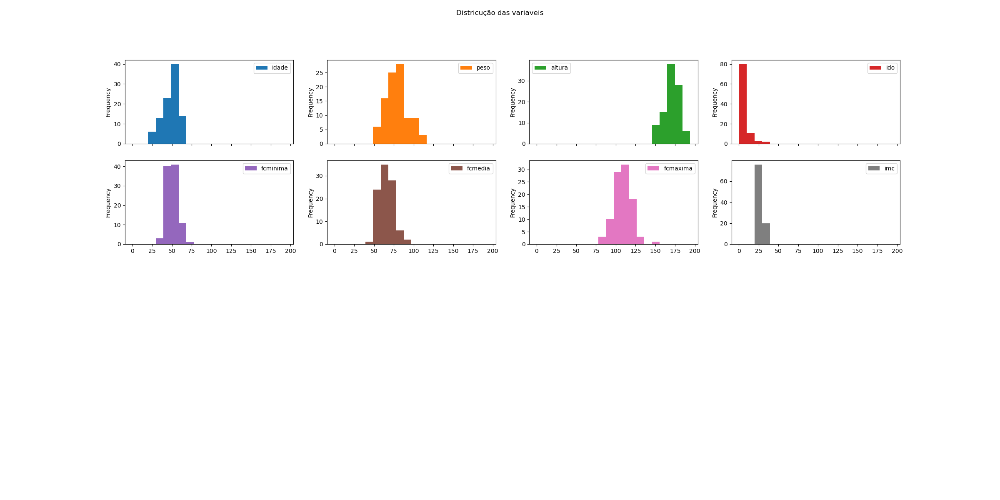 -->
> ### **Distribução dos pacientes por ```sexo```**
> <center>
> 
> 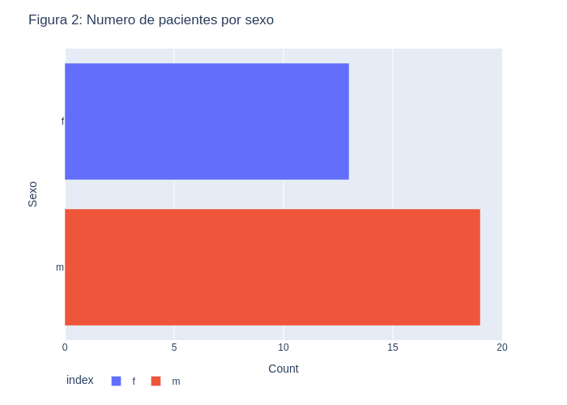
> 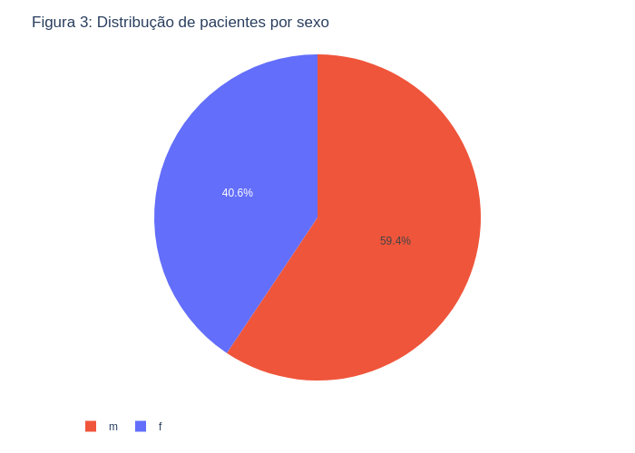
> </center>
> 
> 
> Na Figura 2 encontramos nos dados que o número de pacientes do sexo masculino foi maior do que o grupo de mulheres. No entanto, a proporção, como se mostra na Figura 3, é aceitável para continuar com nosso estudo como mostara, já que nesse aspecto os dados não apresentam um desequilíbrio significativo.
> 
> 

> ### **Numero de pacientes por ```grupo de idade```**
> <center>
> 
> 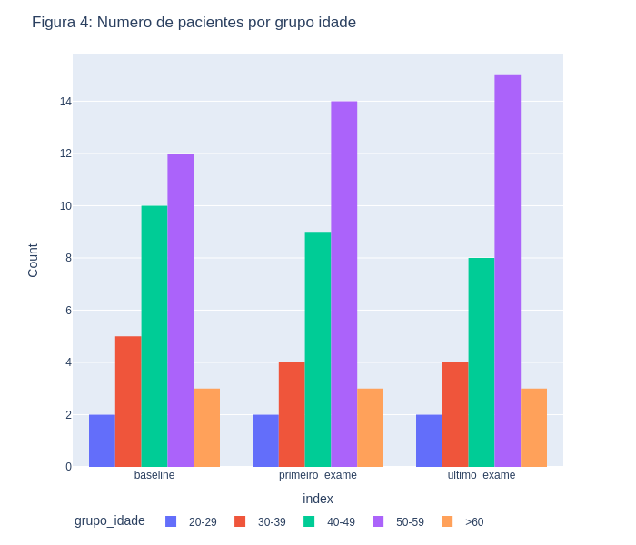
> </center>
>
>
>Na Figura 4, observamos uma mudança da distribuição de pacientes pelos grupos de idade que pode ser entendido como esperado, dado que os três exames ocorrem em um intervalo de alguns meses e os pacientes acabam fazendo aniversário no período e mudando de grupo


## **Integração entre Bases e Análise Exploratória**
<!-- Descreva etapas de integração de fontes de dados e apresente a seguir uma análise exploratória que envolva ambas. Inclua um sumário com estatísticas descritivas da(s) base(s) de estudo. Utilize gráficos que descrevam os aspectos principais da base que são relevantes para as perguntas de pesquisa consideradas. -->

> ### **Situação do IMC**
> 
> 
> <center>
> 
> 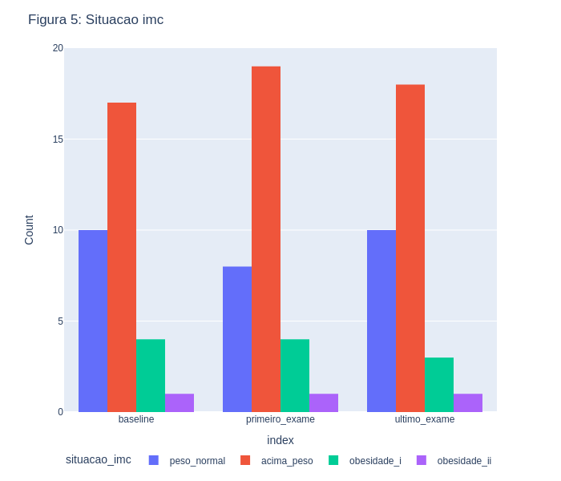
> </center>
> 
> Na Figura 5, encontramos a presença maior de pacientes acima do peso, incluindo pacientes com obesidade-I e obesidade-II, com uma menor quantidade de pacientes com peso considerado normal. No decorrer no tempo, não há mudanças drásticas nessas distribuições que possam ter impactado os resultados dos nossos estudos.

> ### **Situação da apneia**
> 
> <center>
> 
> 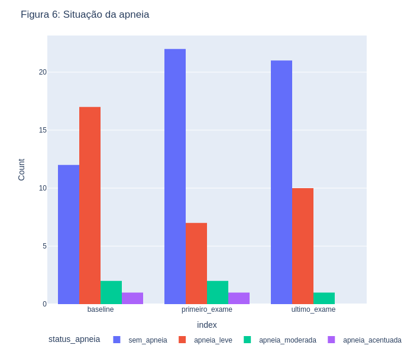
> </center>
>
> Na Figura 6, houve a ausência de pacientes com ```apnéia acentuada``` no fim do período analisado, assim também como a diminuição de pacientes com apnéias moderada e leve. Uma certa flutuação entre o tipo de apnéia observado pode ser influenciada por hábitos do paciente no dia do exame - por exemplo, consumo de bebidas alcóolicas ou refeições mais pesadas, porém a maioria dos pacientes não informa esses detalhes no questionário do exame.

<!-- temos os pacientes classificados de acordo com o status da apneia em cada exame. Observamos que, de forma geral, houve um aumento no número de pacientes classificados como ```Sem apneia``` e uma diminuição nos pacientes com qualquer tipo de apneia entre o exame de ```baseline``` e o ```último exame```. No entanto, há uma movimentação que não sabemos a origem, mas que evidencia uma possível relação entre as mudanças de estado nos pacientes relacionado ao uso do dispositivo de avanço mandibular. É necessário estudar mais a fundo esse fenômeno. -->

> ### **Situação apneia por grupo idade**
> <center>
> 
> 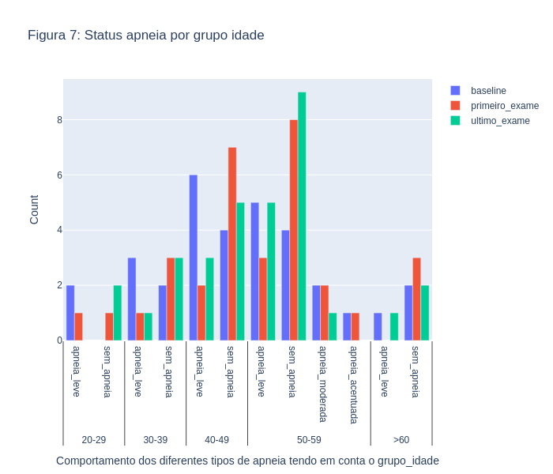
> </center>
> 
> Na Figura 7, descreve-se o comportamento da apneia por grupos de idade em cada um dos exames. Observamos que os pacientes nas faixas etárias de ```40-49``` e ```50-59``` são os que apresentam a maior quantidade de casos de apneia, mas também é mais evidente a melhora da condição nesses pacientes. Notamos que os pacientes ```sem apneia``` na faixa etária de ```40-49``` anos aumentaram para o ```primeiro exame```, mas diminuíram para o ```segundo exame```. Isso pode ser devido ao fato de que alguns pacientes mudaram de idade durante o curso do monitoramento, já que encontramos um aumento bastante significativo nos pacientes ```sem apneia``` para o ```segundo exame``` na faixa etária de ```50-59``` anos. Essa gráfica dá indícios de melhora nos pacientes com apneia, mas precisamos de mais informações e uma análise mais profunda do estudo.


> ### **Comportamento da frequençã cardiaca maxima**
>
<!-- > <center>
> 
> 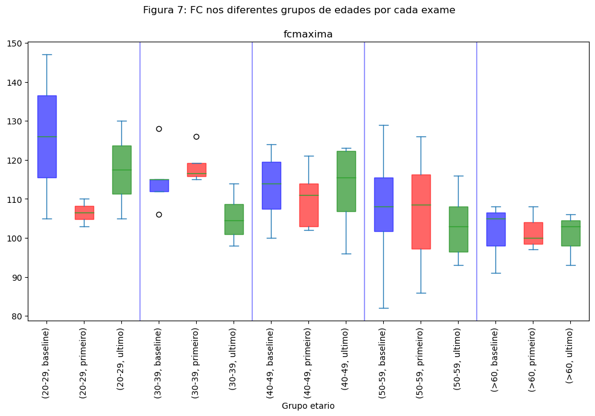
> </center> -->

> <center>
> 
> 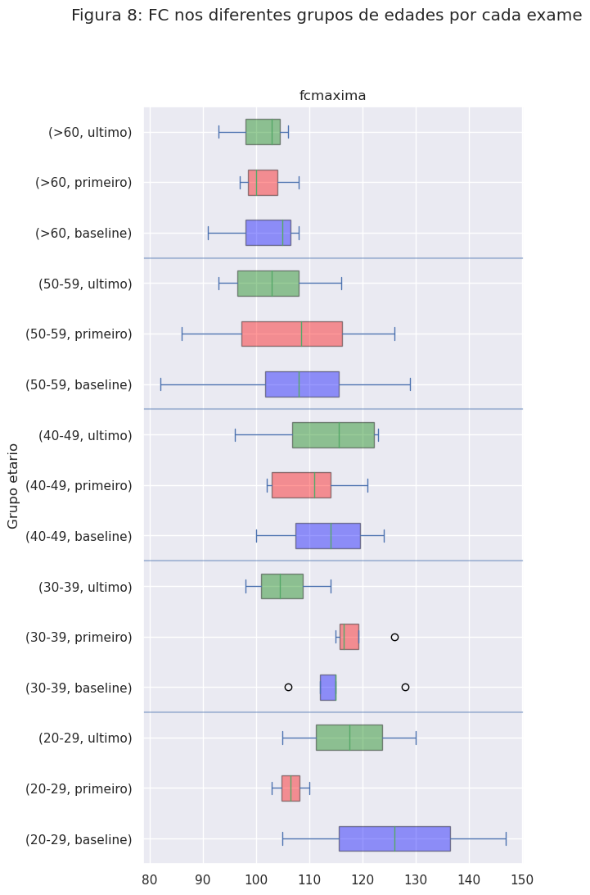
> </center>
>
>
>
> ### **Correlação dos diferentes grugor por exame**
> 
> Nas Figuras 8, 9 e 10, encontramos as correlações das diferentes variáveis em nosso conjunto de dados. Observamos que as correlações entre ```IDO``` e ```peso``` e entre ```IDO``` e ```altura``` melhoram quando incluímos o valor do ```IMC```. Estaremos analisando mais detalhadamente essas correlações para nossa análise futura.
> 
> <center>
> 
> 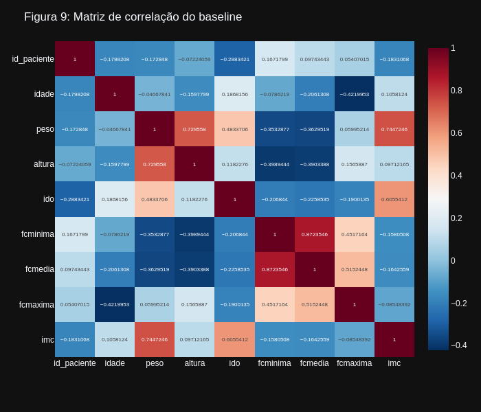
> </center>
> 
> <center>
> 
> 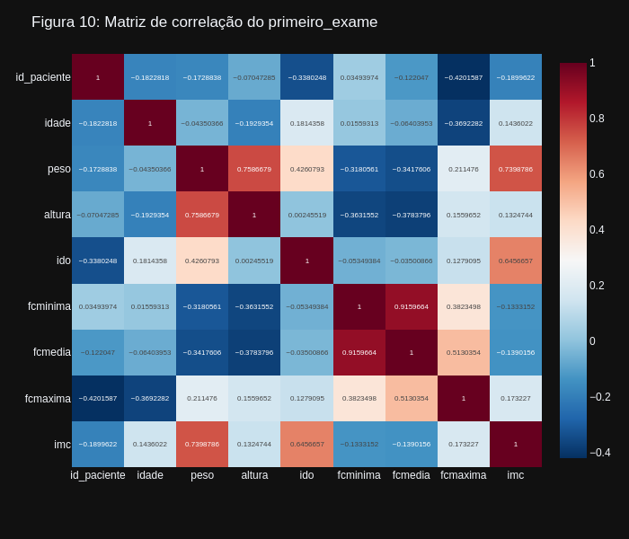
> </center>
> 
> <center>
> 
> 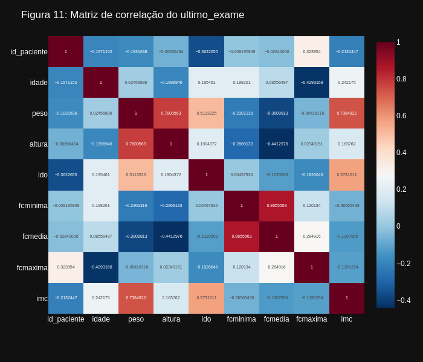
> </center>

> <center>
> 
> 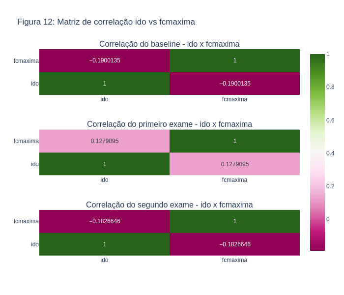
> </center>

> <center>
> 
> 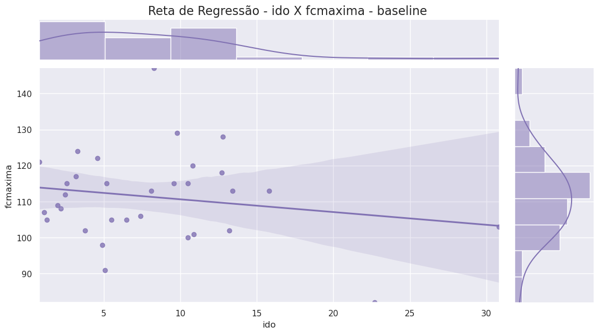
> </center>

> Nas Figuras 9, 10 e 11, 12 e 13, apesar de observarmos a melhora das duas variáveis (IDO e frequência cardíaca) no período analisado, não encontramos uma correlação significativa entre ambas - Algo que pudéssemos concluir que uma variável está influenciando a outra com certeza.

# Ferramentas

Para o desenvolvimento deste projeto, iremos utilizar um conjunto de ferramentas que nos habilite realizar as análises estatísticas, comparações e estimativas que planejamos na seção Metodologia. Isso inclui, mas não se limita, a:
desenvolvimento com a linguagem de programação Python
experimentações utilizando dataframes com o framework Pandas
Ferramentas matemáticas e estatísticas como statsmodels e Scipy
Utilização de jupyter notebooks como plataforma de organização dos experimentos e preparação para a confecção de relatórios

No decorrer da análise, pode se fazer necessário adotar novas ferramentas ou técnicas para refinar/ratificar respostas às perguntas - Caso isso aconteça, esta sessão será continuamente atualizada.

# Cronograma

|Data|Atividade|Milestone|
|---|---|---|
|28/Abr/2023|Preparação dos dados|dataset pronto para experimentação|
|30/Abr/2023|Validação da organização do dataset pela cirurgiã-dentista integrante da equipe|de acordo que o dataset está pronto para a evolução do projeto|
|05/Mai/2023|Análise exploratória dos dados|Entendimento da organização e distribuição dos dados|
|12/Mai/2023|Primeira versão das respostas para os questionamentos do projeto|Respostas preliminares, baseadas em dados, junto com sua análise|
|21/Mai/2023|Segunda entrega do projeto|Segunda entrega do projeto|
|28/Mai/2023|Refinamento das respostas encontradas|Refinamento das respostas encontradas|
|04/Jun/2023|Preparo da terceira entrega do projeto|Preparo da terceira entrega do projeto|

# Conclusões

Após todo o trabalho de análise de dados quantitativos realizados, conseguimos chegar às seguintes respostas para as perguntas que propusemos:

### **QP1:** O aparelho intraoral de avanço mandibular melhora o índice de dessaturação de oxigênio (IDO) em pacientes com apneia do sono?

Para esta primeira pergunta, de acordo com as análises demonstradas nas Figura 5 e 6 acima, conseguimos verificar um impacto positivo na melhora do ```IDO``` nos pacientes analisados antes e depois da utilização do aparelho. Conseguimos verificar que os pacientes com ```apnéia acentuada``` no primeiro exame (baseline) tiveram regressão de seu estado no exame final (```ultimo_exame```), assim também como uma regressão do número de pacientes com ```apnéia moderada``` e ```apnéia leve```. Porém, dado o tamanho do cohorte utilizado (32 pacientes), precisaríamos expandir o estudo para um cohorte maior para chegarmos a conclusões mais efetivas sobre a correlação entre o uso do aparelho de avanço mandibular e a diminuição consistente do ```IDO```.

### **QP2:** O aparelho intraoral de avanço mandibular melhora a frequência cardíaca dos pacientes?

Na segunda pergunta, conforme visualizado nas  ```Figuras 8``` acima, conseguimos verificar uma diminuição considerada da frequência cardíaca máxima (```fcmax```) dos pacientes, o que sugere uma melhora de saúde cardiovascular, porém não houve uma diminuição considerável nos índices de frequência cardíaca média (```fcmedia```) e mínima (```fcmínima```). Sendo assim, observamos uma tendência de diminuição da ```fcmax```, porém dada limitação de tamanho do nosso cohorte analisado, poderemos ser mais conclusivos quanto ao impacto positivo na frequência cardíaca em uma população maior.

### **QP3:** A melhora do índice de dessaturação de oxigênio (```IDO```) em pacientes com apneia do sono, consequentemente, melhora a frequência cardíaca dos pacientes tratados com aparelho intraoral de avanço mandibular?

Para nossa última pergunta, conforme análise de correlação nas ```Figuras 9, 10 e 11, 12 e 13```, apesar de observarmos a melhora das duas variáveis (```IDO``` e ```frequência cardíaca maxima```) no período analisado, não encontramos uma correlação significativa entre ambas - Algo que pudéssemos concluir que uma variável está influenciando a outra com certeza. Expandimos nossa análise para outros estudos (como em Use of mandibular advancement devices for the treatment of primary snoring with or without obstructive sleep apnea (OSA): A systematic review; De Meyer, MMD; Vanderveken, OM; (...); Jacquet, W; Apr 2021; Sleep Medicine Reviews) nesta área e não encontramos outros estudos, com bases de dados diferentes, que concluam, baseados em dados, que ```IDO``` e frequência cardíaca sejam fortemente relacionados.

Precisamos considerar, ainda, como explicamos junto a ```Figura 6```, que há alguns fatores contextuais dos pacientes (como comorbidades, hábitos e estado no dia do exame) que acabam não sendo informados pelos pacientes e que podem influenciar tanto o IDO quanto a ```frequência cardíaca maxima```.


# **Referências bibliográficas**
> - [1] Uniken Venema JAM, Rosenmöller BRAM, de Vries N, et al. Mandibular advancement device design: A systematic review on outcomes in obstructive sleep apnea treatment. Sleep Med Rev. 2021;60:101557. doi:10.1016/j.smrv.2021.101557
> - [2] Li P, Ning XH, Lin H, Zhang N, Gao YF, Ping F. Continuous positive airway pressure versus mandibular advancement device in the treatment of obstructive sleep apnea: a systematic review and meta-analysis. Sleep Med. 2020;72:5-11. doi:10.1016/j.sleep.2020.03.015
> - [3] Camañes-Gonzalvo S, Bellot-Arcís C, Marco-Pitarch R, et al. Comparison of the phenotypic characteristics between responders and non-responders to obstructive sleep apnea treatment using mandibular advancement devices in adult patients: Systematic review and meta-analysis. Sleep Med Rev. 2022;64:101644. doi:10.1016/j.smrv.2022.101644
> - [4] Pattipati M, Gudavalli G, Zin M, et al. Continuous Positive Airway Pressure vs Mandibular Advancement Devices in the Treatment of Obstructive Sleep Apnea: An Updated Systematic Review and Meta-Analysis. Cureus. 2022;14(1):e21759. Published 2022 Jan 31. doi:10.7759/cureus.21759
> - [5] Rashid NH, Zaghi S, Scapuccin M, Camacho M, Certal V, Capasso R. The Value of Oxygen Desaturation Index for Diagnosing Obstructive Sleep Apnea: A Systematic Review. Laryngoscope. 2021;131(2):440-447. doi:10.1002/lary.28663
> - [6] Ramar K, Dort LC, Katz SG, Lettieri CJ, Harrod CG, Thomas SM, et al. 2015. Clinical practice guideline for the treatment of obstructive sleep apnea and snoring with oral appliance therapy: an update for 2015. J Clin Sleep Med. 2015 Jul 15;11(7):773-827.
> - [7] Aarab G, Lobbezoo F, Heymans MW, Hamburger HL, Naeije M. Long-term follow-up of a randomized controlled trial of oral appliance therapy in obstructive sleep apnea. Respiration. 2011 Mar 31;82(2):162-8.
> - [8] Schwartz M, Acosta L, Hung YL, Padilla M, Enciso R. 2018. Effects of CPAP and mandibular advancement device treatment in obstructive sleep apnea patients: a systematic review and meta-analysis. Sleep Breath. 2018 Sep;22(3):555-6.
> - [9] Barbosa, D. F., Giannasi, L. C., Ferreira, L. M. D. B., Alves, M. C., & Berzin, F. (2020). A singular oral appliance to treat obstructive sleep apnea in CPAP non-adherent patients. Dental Press Journal of Orthodontics, 25, 44-50.
> - [10] Barbosa, D. F., Meira e Cruz, M., Alves, M. C., Zancanella, E., Berzin, F., & Júnior, A. J. M. (2022). Effectiveness of a uniquely designed oral appliance on obstructive sleep apnea control: a pilot study. European Journal of Dentistry, 16(03), 564-572.