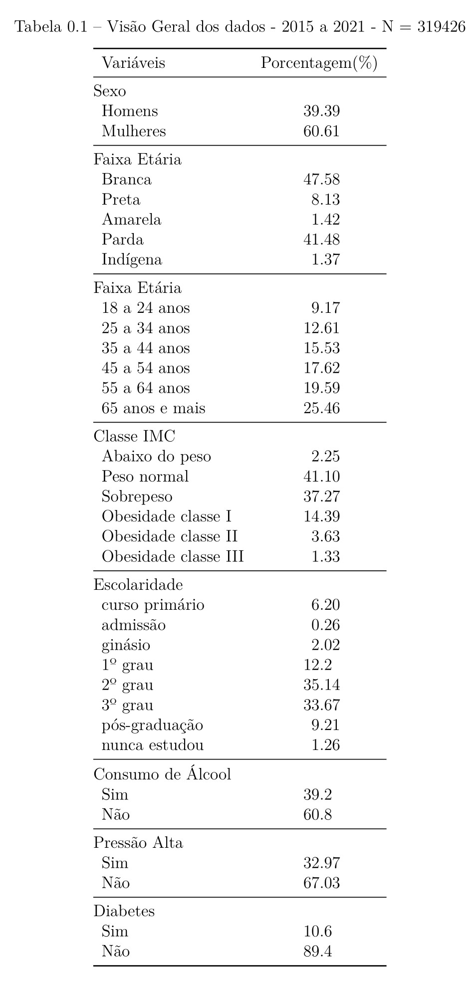
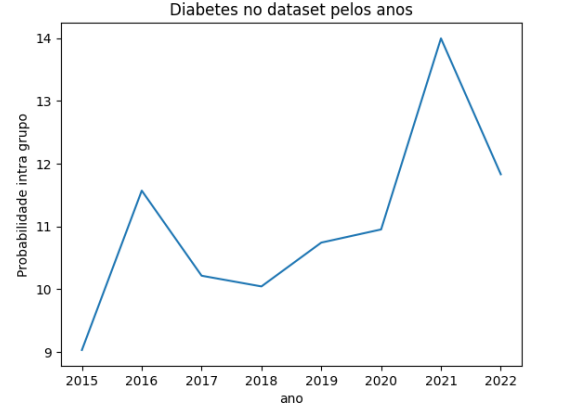
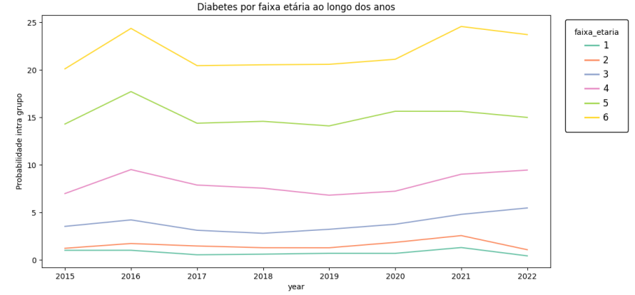
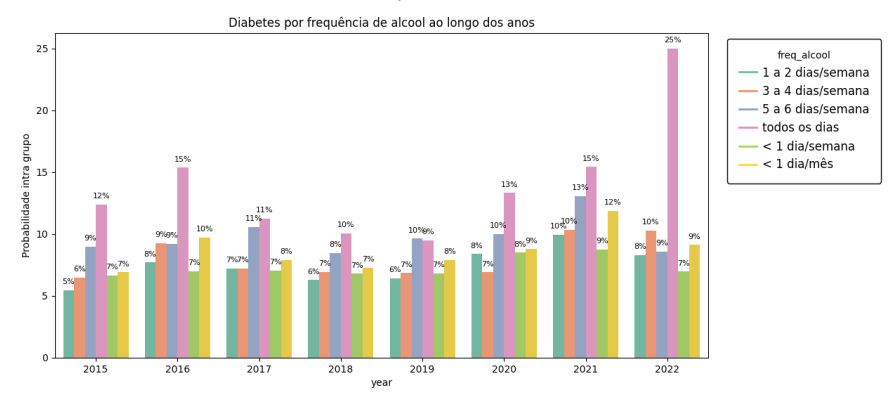

# Projeto `DataBetes - Prevendo Diabetes`

# Apresentação

O presente projeto foi originado no contexto das atividades da disciplina de pós-graduação [*Ciência e Visualização de Dados em Saúde*](https://github.com/datasci4health/home), oferecida no primeiro semestre de 2023, na Unicamp, pelos membros:

|Nome  | RA | Especialização|
|--|--|--|
| Ana Carolina Benite Alves  | 165741  | Saúde Coletiva - Nutrição|
| João Victor Palhares Barbosa  | 173664  | Computação - Líder Github - Conta jvpalhares |
| Caique Santos Lima  | 217040  | Eng. Elétrica e Computação |
| Gustavo Pessoa Caixeta Pinto de Luz  | 271582  | Computação |

# Descrição Resumida do Projeto
As doenças crônicas são as principais causas de morte no Brasil e no mundo, sendo a diabetes uma doença cronica que atinge 6,9% da população nacional, o que equivale a 13 milhões de pessoas. A diabetes tipo 2 é a mais prevalente entre os casos (90%), caracterizada pelo mal aproveitamento da insulina produzida pelo corpo, e sua principal causa são os determinantes sociais de saúde (SDOH), como hábitos alimentares, atividade física, renda e outras questões de saúde, o que torna importante o debate dessa doença em âmbito populacional. Dessa forma nosso projeto se propõe a desenvolver um modelo de aprendizagem de máquina que auxilie governantes e resposáveis técnicos a identificarem os fatores de risco em sua população para o desenvolvimento de diabetes e assim facilitar o desenvovlimento de estratégias para lidar com essa questão em sua região. 

O contexto gerador foi o interesse em trabalhar com o problema de diabetes que foi um elo entre os membros da equipe que vieram de diferentes cursos com a motivação em comum de estudar este assunto.

Link para vídeo de apresentação da proposta do projeto:

https://youtu.be/Ti_Q1Hb_aM4

# Perguntas de Pesquisa
**Objetivo geral**
Modelar determinantes sociais de saúde (SDOH) em populações de capitais brasileiras para o desenvolvimento de diabetes.

**Objetivos específicos*
1. Determinar principais variaveis socioeconômicas e de saúde associadas ao desfecho diabetes.
2. Analisar possiveis diferenças de hábitos dos anos pré e durante pandemia para seleção de dados

# Metodologia
Para fortalecer o debate sobre o tema escolhido pelo grupo (diabetes) elaboramos uma breve [revisão da literatura](https://docs.google.com/spreadsheets/d/16Tx_cRwd-Si_22261u3sc9vwINxoUJbDIam9G-gOqMw/edit?usp=share_link) sobre a temática.

Após definir a base de dados que vamos usar, classificamos as variaveis todas as variaveis do [dicionario](https://docs.google.com/spreadsheets/d/1aNySJ5izNeSEnhFt3PwWIv_5IPRt3P12/edit?usp=sharing&ouid=106016703712140707137&rtpof=true&sd=true) geral (contém as variaveis de todos os anos) em 3 categorias, (1) muito relevante; (2) pouco relevante e (3) irrelevante para o desfecho do nosso estudo. A classficação das variaveis foi feita com base em informações já consolidadas sobre os principais temas relacionados a diabetes, com o objetivo de reduzir o número de variáveis a serem analisadas porteriormente. 

Para nosso estudo vamos selecionar os anos que melhor explicam os hábitos da população atualmente, a partir de uma análise de correlação com todas as variáveis calssificadas como (1) muito relevante existentes nos anos selecionados. Com base nas variáveis presentes no período selecionado, criamos uma [serie de perguntas](https://docs.google.com/document/d/1_7RMeBFHca32wVxBhwUvWz-3Or6s_1LFaEVwYnwiljg/edit?usp=share_link) para fazer a análise exploratória dos nossos dados e gerar as primeiras tabelas/graficos descritivas. As perguntas também foram criadas a partir de conhecimentos já consolidados na literatura em relação a diabetes. 

A metodologia prevista é o CRISP-DM, em que será desenvolvido um modelo de classificação de aprendizado supervisionado que retorna a classe de uma pessoa ser diabética ou não. Antes do desenvolvimento do modelo, será realizado um entendimento do negócio, análise exploratória de dados, estratificação para ver a diferença por grupos, escolha de features e pré processamento dos dados. Depois de chegar em um modelo baseline, ele será refinado até que esteja de acordo com o desempenho considerado aceitável. Iniciaremos criando um modelo para todas as capitais e, caso necessário, segmetaremos por região se os grupos forem muito diversos. Quando o modelo estiver concluído, será apresentado para a turma, correspondendo a fase de deploy do CRISP-DM.

Fonte: https://www.datageeks.com.br/pre-processamento-de-dados/

Detalhamento por fases:
1. Business Understanding: Entendimento de qual contexto o projeto pode ser utilizado, como aplicar o modelo, quais bases existem tratando o problema, quem são as partes interessadas. Feito a partir de buscas bibliográficas de dados e artigos relacionados e discussões em grupo.
2. Data Understanding: Ganhar mais familiaridade com os dados, entender problemas existentes, análise de quais variáveis estão presentes em todos os anos, o que pode ser usado de forma genérica a estar disponível em outras bases, análise descritiva sobre a prevalência de diabetes por IMC, sexo, escolaridade, hábitos, condição socioeconômica. Feito a partir de gráficos, tabelas, clusterização, análise de evolução de variáveis pelo tempo e discussões em grupo.
3. Data Preparation: Criação do dataset a ser usado pelo modelo, escolha do ano(s) utilizados no treino,seleção de variáveis, limpeza de dados faltantes, outliers, inconsistências. Feito a partir de funções de pré-processamento e discussões em grupo.
4. Modeling: Criação de modelo capaz de classificar uma ou várias entradas como diabéticas ou não diabéticas. Feito a partir de modelos como regressão logística, random forest, ou redes neurais e partir da dificuldade do problema. Será feito um modelo baseline que será melhorado até apresentar um resultado satisfatório.
5. Evaluation: O modelo será avaliado e será questionado qual será a métrica aceitável para esse problema baseado em trabalhos relacionados.
6. Deployment: Quando o modelo apresentar o resultado desejado, será finalizado e rodado para o conjunto de teste da base. Se possível, também será avaliado em outras bases, mostrando sua capacidade de generalização.

# Bases de Dados

Link do google drive com subsets da base e dicionários de dados com pré seleção de features: https://drive.google.com/drive/folders/1NMwv2sC3bnlQBedWxnHki7KG_jT0peuU?usp=sharing

### Bases Estudadas mas Não Adotadas

> Para cada base, coloque uma mini-tabela no modelo a seguir e depois detalhamento sobre como ela foi analisada/usada, conforme exemplo a seguir.

Segunda opção de base: base de diabetes internacional já com processamentos e dados de saúde das pessoas: https://data.mendeley.com/datasets/wj9rwkp9c2/1/files/2eb60cac-96b8-46ea-b971-6415e972afc9

Base de Dados | Endereço na Web | Resumo descritivo
----- | ----- | -----
Título da Base | http://base1.org/ | Breve resumo (duas ou três linhas) sobre a base.

> Faça uma descrição sobre o que concluiu sobre esta base. Sugere-se que respondam perguntas ou forneçam informações indicadas a seguir:
> * Qual o esquema/dicionário desse banco (o formato é livre)?
> * O que descobriu sobre esse banco?
> * Quais as transformações e tratamentos (e.g., dados faltantes e limpeza) feitos?
> * Apresente aqui uma Análise Exploratória (inicial) sobre esta base.

### Bases Estudadas e Adotadas

> Para cada base, coloque uma mini-tabela no modelo a seguir e depois detalhamento sobre como ela foi analisada/usada, conforme exemplo a seguir.

Base de Dados | Endereço na Web | Resumo descritivo
----- | ----- | -----
Vigitel | [link](https://svs.aids.gov.br/download/Vigitel/) | Um dos mais tradicionais questionários de saúde do Brasil, feito por telefone e com resultados que subsidiam o monitoramento de metas governamentais para enfrentamento de doenças

A tabela mostra a porcentagem de variáveis incluindo dados de 2015 a 2021 da base do Vigitel. 

Pode se notar que é uma base majoritariamente composta de mulheres, brancas, de 65 anos ou mais, com peso normal, com pelo menos 2º grau de escolaridade, que não consome álcool, não possui pressão alta. A porcentagem de entrevistados com diabetes é de cerca de 10%.

#### Análises

Pode se notar que a probabilidade de um indivíduo possuir diabetes aumentou de 9 para 14% de 2015 a 2021. Mesmo assim, a variação não foi tão grande e isso pode tornar o modelo mais generalizável. Por enquanto a escolha foi de manter todos os anos após 2015.

As faixas etárias maiores apresentaram maiores taxas de diabéticos, com uma diferença clara entre elas.

Em geral a incidência de diabetes é balanceada entre as cores, com um número levemente maior para as cores indígena e amarela.

Pessoas com maior escolaridade possuem menos diabetes.

A pressão alta é um fator ligado a diabetes consistentemente ao longo dos anos, como mostra o gráfico.

O consumo de álcool diário aumenta consideravelmente a chance de desenvolver diabetes, com uma diferença de até 6% entre o consumo de 5 a 6 dias para todos os dias.

Alguns fatores foram diferentes do esperado, como por exemplo a frequência do consumo de refrigerantes.

Espera-se que quanto maior a frequência, maior a possibilidade do desfecho diabetes. No entanto, os dados revelaram uma chance maior para quem nunca consome. Isso pode se dar por conta de uma mudança de hábitos dos indivíduos que são diagnosticados com a doença. Por isso, variáveis como essa não serão usadas pelo modelo, para não gerar um fator de confusão.

#### Seleção de variáveis

A seleção inicial de variáveis após a análise foi de:
- faixa etária
- escolaridade
- IMC
- pressão alta
- frequência de consumo de álcool
- cor

O link com todos os gráficos de análise está aqui (inserir link), foram selecionadas as mais relevantes para a justificativa.

### Integração entre Bases e Análise Exploratória

> Descreva etapas de integração de fontes de dados e apresente a seguir uma análise exploratória que envolva ambas.
> Inclua um sumário com estatísticas descritivas da(s) base(s) de estudo.
> Utilize gráficos que descrevam os aspectos principais da base que são relevantes para as perguntas de pesquisa consideradas.

# Ferramentas
Ferramenta teórica: Pubmed, Google Scholar e documentos/protocolos governamentais.
Ferramente de dados: Python, Google Colab, bibliotecas de manipulação de dados(Pandas, NumPy), bibliotecas de machine learning (Scikit-learn, TensorFlow, PyTorch - a depender da dificuldade do problema), bibliotecas de visualização de dados (Matplotlib, Seaborn, Plotly) e o que mais for necessário para resolver o problema.

# Cronograma

|Data  | Entrega Esperada |
|--|--|
| 14 de maio | Resultado parcial: análise descritiva estratificada por grupos, seleção de dados. 3 primeiras etapas do CRISP-DM   |
| 22 de junho | Modelo refinado e finalizado. Últimas etapas da metodologia  |
| 22 ou 27 de junho  | Apresentação  |

