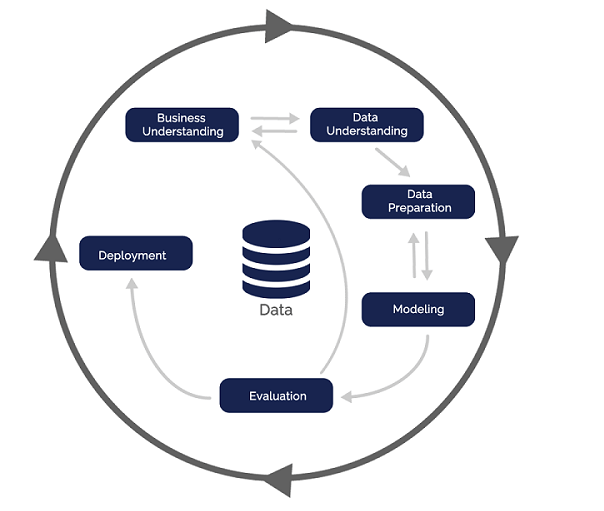

# Projeto `DataBetes - Prevendo Diabetes`

# Apresentação

O presente projeto foi originado no contexto das atividades da disciplina de pós-graduação [*Ciência e Visualização de Dados em Saúde*](https://github.com/datasci4health/home), oferecida no primeiro semestre de 2023, na Unicamp, pelos membros:

|Nome  | RA | Especialização|
|--|--|--|
| Ana Carolina Benite Alves  | 165741  | Saúde Coletiva - Nutrição|
| João Victor Palhares Barbosa  | 173664  | Computação - Líder Github - Conta jvpalhares |
| Caique Santos Lima  | 217040  | Eng. Elétrica e Computação |
| Gustavo Pessoa Caixeta Pinto de Luz  | 271582  | Computação |

# Descrição Resumida do Projeto
As doenças crônicas são as principais cuasas de morte no Brasil e no mundo, sendo a diabetes uma doença cronica que atinge 6,9% da população nacional, o que equivale a 13 milhões de pessoas. A diabeste tipo 2 é a mais prevalente entre os casos (90%), caracterizada pelo mal aproveitamento da insulina produzida pelo corpo, e sua principal causa são os determinantes sociais de saúde (SDOH), como habitos alimentares, atividade fisica, renda e outras questões de saúde, o que torna importante o debate dessa doença em ambito populacional. Dessa forma nosso projeto se prope a desenvolver um modelo de aprendizagem de maquina que auxilie governantes e resposnsaveis tecnicos a identificarem os fatores de risco em sua população para o desenvolvimento de diabetes e assim facilitar o desenvovlimento de estrategias para lidar com essa questão em sua região. 

Faremos isso a partir do uso de aprendizado de máquina. O contexto gerador foi o interesse em trabalhar com o problema de diabetes que foi um elo entre os membros da equipe que vieram de diferentes cursos com a motivação em comum de estudar este assunto

Link para vídeo de apresentação da proposta do projeto:

https://youtu.be/Ti_Q1Hb_aM4

# Perguntas de Pesquisa
**Objetivo geral**
Modelar determinantes sociais de saúde (SDOH) em populações de capitais brasileiras para o desenvolvimento de diabetes.

**Objetivos especificos*
1. Determinar principais variaveis socioeconomicas e de saúde associadas ao desfecho diabetes.
2. Analisar possiveis diferenças de habitos dos anos pré e durante pandemia

# Bases de Dados

Link da base oficial: https://svs.aids.gov.br/download/Vigitel/

Segundo o ministério da saúde: "trata-se de dados de um dos mais tradicionais questionários de saúde do Brasil, o Sistema de Vigilância de Fatores de Risco e Proteção para Doenças Crônicas por Inquérito Telefônico, o **Vigitel**. Os resultados desse sistema subsidiam o monitoramento das metas propostas no Plano de Ações Estratégicas para o Enfrentamento das Doenças Crônicas Não Transmissíveis no Brasil 2011-2022 e do Plano de Ações Estratégicas para o Enfrentamento das Doenças Crônicas e Agravos não Transmissíveis no Brasil 2021-2030, entre outros, a nível global." Fonte: https://www.gov.br/saude/pt-br/assuntos/noticias/2022/setembro/com-entrevistas-por-telefone-saude-comeca-operacao-do-vigitel-2022

Link do google drive com subsets da base e dicionários de dados com pré seleção de features: https://drive.google.com/drive/folders/1NMwv2sC3bnlQBedWxnHki7KG_jT0peuU?usp=sharing

Segunda opção de base: base de diabetes internacional já com processamentos e dados de saúde das pessoas: https://data.mendeley.com/datasets/wj9rwkp9c2/1/files/2eb60cac-96b8-46ea-b971-6415e972afc9

# Metodologia
Para fortalecer o debate sobre o tema escolhido pelo grupo (diabetes) elaboramos uma breve [revisão da literatura](https://docs.google.com/spreadsheets/d/16Tx_cRwd-Si_22261u3sc9vwINxoUJbDIam9G-gOqMw/edit?usp=share_link) sobre a tematica.

Após definir a base de dados que vamos usar, classificamos as variaveis todas as variaveis do [dicionario](https://docs.google.com/spreadsheets/d/1aNySJ5izNeSEnhFt3PwWIv_5IPRt3P12/edit?usp=sharing&ouid=106016703712140707137&rtpof=true&sd=true) geral (contém as variaveis de todos os anos) em 3 categorias, (1) muito relevante; (2) pouco relevante e (3) irrelevante para o desfecho do nosso estudo. A classficação das variaveis foi feita com base em infomações já consolidadas sobre os principais temas relacionados a diabetes, com o objetivo de reduzir o número de variaveis a serem analisadas porteriormente. 

Para nosso estudo vamos usar somente os **anos de 2019, 2020 e 2021**, fizemos uma analise de correlação com todas as variaveis calssficadas como (1) muito relevante existentes nos anos selecionados. Com base nas variaveis presentes no periodo selecionado, criamos uma [serie de perguntas](https://docs.google.com/document/d/1_7RMeBFHca32wVxBhwUvWz-3Or6s_1LFaEVwYnwiljg/edit?usp=share_link) para fazer a analise exploratoria dos nossos dados e gerar as primeiras tabelas/graficos descritivas. As perguntas também foram criadas a partir de conhecimentos já consolidados na literatura em relação a diabetes. 

A metodologia prevista é o CRISP-DM, em que será desenvolvido um modelo de classificação de aprendizado supervisionado que retorna a classe de uma pessoa ser diabética ou não. Antes do desenvolvimento do modelo, será realizado um entendimento do negócio, análise exploratória de dados, estratificação para ver a diferença por grupos, escolha de features e pré processamento dos dados. Depois de chegar em um modelo baseline, ele será refinado até que esteja de acordo com o desempenho considerado aceitável. Iniciaremos criando um modelo para todas as capitais e, caso necessário, segmetaremos por região se os grupos forem muito diversos. Quando o modelo estiver concluído, será apresentado para a turma, correspondendo a fase de deploy do CRISP-DM.

Fonte: https://www.datageeks.com.br/pre-processamento-de-dados/

# Ferramentas
Ferramenta teorica: Pubmed, Google Escolar e documentos/protocolos governamentais.
Ferramente de dados: Python, Google Colab, bibliotecas de manipulação de dados(Pandas, NumPy), bibliotecas de machine learning (Scikit-learn, TensorFlow, PyTorch - a depender da dificuldade do problema), bibliotecas de visualização de dados (Matplotlib, Seaborn, Plotly) e o que mais for necessário para resolver o problema.

# Cronograma

|Data  | Entrega Esperada |
|--|--|
| 14 de maio | Resultado parcial: análise descritiva estratificada por grupos, modelo baseline. 4 primeiras etapas do CRISP-DM   |
| 22 de junho | Modelo refinado e finalizado. Últimas etapas de metodologia  |
| 22 ou 27 de junho  | Apresentação  |

