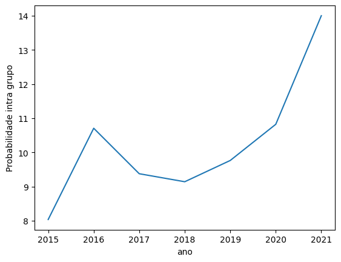
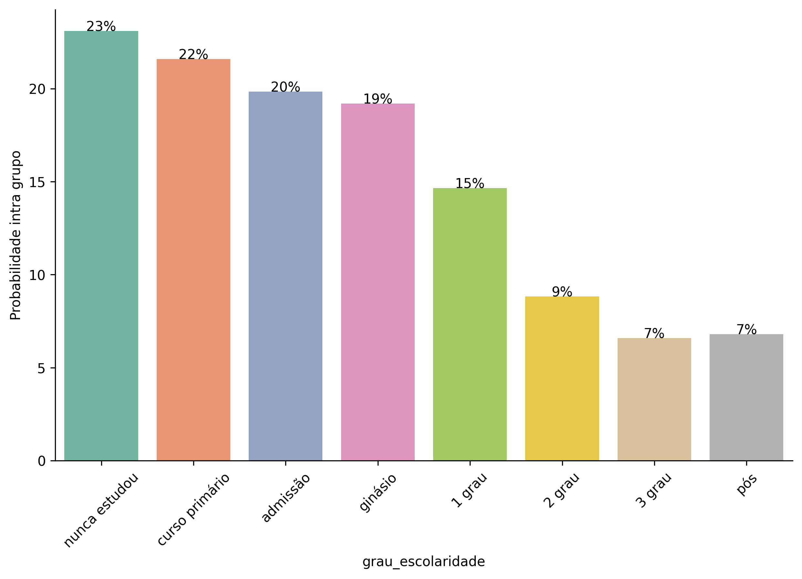
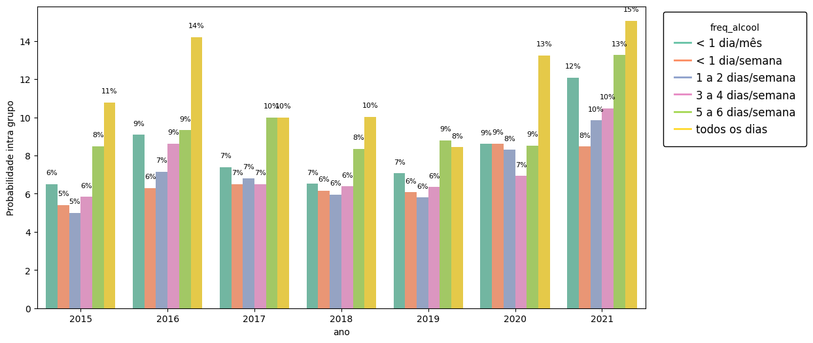
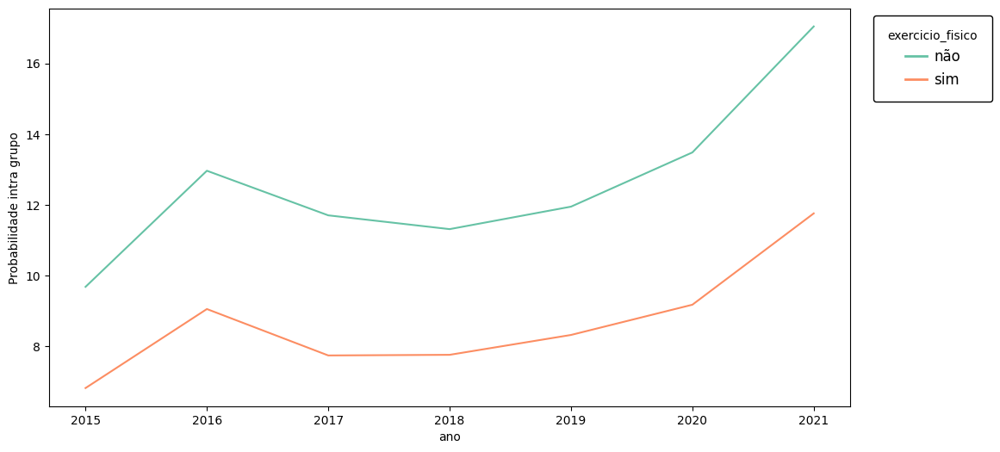
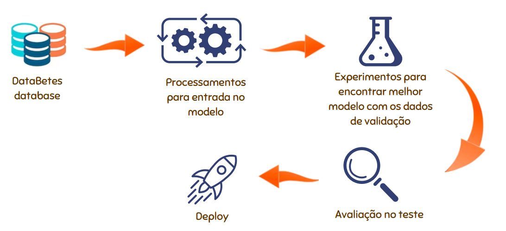
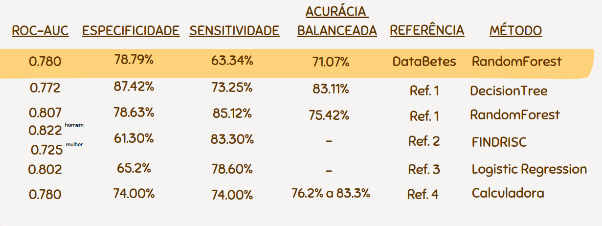

# Projeto `DataBetes - Prevendo Diabetes`

# Apresentação

O presente projeto foi originado no contexto das atividades da disciplina de pós-graduação [*Ciência e Visualização de Dados em Saúde*](https://github.com/datasci4health/home), oferecida no primeiro semestre de 2023, na Unicamp, pelos membros:

|Nome  | RA | Especialização|
|--|--|--|
| Ana Carolina Benite Alves  | 165741  | Saúde Coletiva - Nutrição|
| João Victor Palhares Barbosa  | 173664  | Computação - Líder Github - Conta jvpalhares |
| Caique Santos Lima  | 217040  | Eng. Elétrica e Computação |
| Gustavo Pessoa Caixeta Pinto de Luz  | 271582  | Computação |

# Descrição Resumida do Projeto
As doenças crônicas são as principais causas de morte no Brasil e no mundo, sendo a diabetes uma doença crônica que atinge 6,9% da população nacional, o que equivale a 13 milhões de pessoas. A diabetes tipo 2 é a mais prevalente entre os casos (90%), caracterizada pelo mal aproveitamento da insulina produzida pelo corpo, e sua principal causa são caracteristicas socioeconômicas e de saúde, como hábitos alimentares, atividade física, renda e outras questões de saúde, o que torna importante o debate dessa doença em âmbito populacional. Dessa forma, nosso projeto se propõe a desenvolver um modelo de aprendizagem de máquina que auxilie gestores públicos e resposáveis técnicos a identificarem os fatores de risco na população para o desenvolvimento de diabetes e assim facilitar o desenvolvimento de estratégias para mitigar os problemas associados a esta questão em sua região. 

O contexto gerador foi o interesse em trabalhar com o problema de diabetes que foi um elo entre os membros da equipe que vieram de diferentes cursos com a motivação em comum de estudar este assunto.

O vídeo de apresentação da proposta do projeto pode ser acessado clicando [aqui](https://youtu.be/Ti_Q1Hb_aM4).

https://youtu.be/Ti_Q1Hb_aM4

# Perguntas de Pesquisa
**Objetivo geral**
Determinar características socioeconômicas e de saúde relacionadas com o desfecho diabetes tipo 2 em capitais brasileiras.

Levando em conta que os usuários direto do nosso modelo serão os gestores e responsaveis técnicos, para a identificação de grupos de riscos para aulixiar na elaboração de política públicas e em tomada de decisões.

# Metodologia
Método aplicado à base escolhida
A metodologia prevista é o CRISP-DM (_cross-industry standard process for data mining_), em que será desenvolvido um modelo de classificação de aprendizado supervisionado que retorna a classe de uma pessoa ser diabética ou não. Antes do desenvolvimento do modelo, será realizado um entendimento do negócio, análise exploratória de dados, estratificação para ver a diferença por grupos, escolha de _features_ e pré processamento dos dados. Depois de chegar em um modelo _baseline_, ele será refinado até que esteja de acordo com o desempenho considerado aceitável. Iniciaremos criando um modelo para todas as capitais e, caso necessário, segmentaremos por região se os grupos forem muito diversos. Quando o modelo estiver concluído, será apresentado para a turma, correspondendo à fase de _deploy_ do CRISP-DM.

Adaptado de [data geeks](https://www.datageeks.com.br/pre-processamento-de-dados/) a partir de:

Detalhamento por fases:
1. _Business Understanding_: Entendimento de qual contexto o projeto pode ser utilizado, como aplicar o modelo, quais bases existem tratando o problema, quem são as partes interessadas. Feito a partir de buscas bibliográficas de dados e artigos relacionados e discussões em grupo.

2. _Data Understanding_: Ganhar mais familiaridade com os dados, entender problemas existentes, análise de quais variáveis estão presentes em todos os anos, o que pode ser usado de forma genérica a estar disponível em outras bases, análise descritiva sobre a prevalência de diabetes por IMC, sexo, escolaridade, hábitos, condição socioeconômica. Feito a partir de gráficos, tabelas, clusterização, análise de evolução de variáveis pelo tempo e discussões em grupo.

3. _Data Preparation_: Criação do dataset a ser usado pelo modelo, escolha do ano(s) utilizados no treino,seleção de variáveis, limpeza de dados faltantes, outliers, inconsistências. Feito a partir de funções de pré-processamento e discussões em grupo.

4. _Modeling_: Criação de modelo capaz de classificar uma ou várias entradas como diabéticas ou não diabéticas. Feito a partir de modelos como regressão logística, _random forest_ ou redes neurais artificiais, dependendo da dificuldade do problema. Foi feito um modelo _baseline_ que será melhorado até apresentar um resultado satisfatório.
5. _Evaluation_: Para o modelo avaliado será questionado qual será a métrica aceitável para esse problema baseado em trabalhos relacionados.
6. _Deployment_: Quando o modelo apresentar o resultado desejado, será finalizado e aplicado para o conjunto de teste da base de dados. Se possível, também será avaliado em outras bases, mostrando sua capacidade de generalização.

# Bases de Dados

Os subconjuntos da base de dados e dicionários de dados com pré-seleção de _features_ podem ser acessados clicando [aqui](https://drive.google.com/drive/folders/1NMwv2sC3bnlQBedWxnHki7KG_jT0peuU?usp=sharing)

## Bases Estudadas mas Não Adotadas

Base de Dados | Endereço na Web | Resumo descritivo
----- | ----- | -----
Diabetes Dataset | [link](https://data.mendeley.com/datasets/wj9rwkp9c2/1/files/2eb60cac-96b8-46ea-b971-6415e972afc9) | Os dados desta base se referem a indivíduos iraquianos, pois os dados foram adquiridos do laboratório do Medical City Hospital (Centro Especializado de Endocrinologia e Hospital Universitário Diabetes-Al-Kindy). Os dados consistem em informações médicas e análises laboratoriais dos indivíduos, sendo elas: nº do paciente, nível de açúcar no sangue, idade, sexo, taxa de creatinina (Cr), índice de massa corporal (IMC), uréia, colesterol (Chol), perfil lipídico em jejum, incluindo total, LDL, VLDL, Triglicerídeos (TG) e colesterol HDL, HBA1C e a classe (podendo ser diabética, não diabética ou pré-diabética).

A base não foi usada pois se trata de uma base internacional e que já estava organizada e pronta para a análise, o que o grupo cogitou que não seria tão interessante para aprendizado.

## Bases Estudadas e Adotadas

Base de Dados | Endereço na Web | Resumo descritivo
----- | ----- | -----
Vigitel | [link](https://svs.aids.gov.br/download/Vigitel/) | Um dos mais tradicionais questionários de saúde do Brasil, feito por telefone e com resultados que subsidiam o monitoramento de metas governamentais para enfrentamento de doenças.

O grupo decidiu usar a base Vigitel, que segundo o Ministério da Saúde "trata-se de dados de um dos mais tradicionais questionários de saúde do Brasil [...]. Os resultados desse sistema subsidiam o monitoramento das metas propostas no Plano de Ações Estratégicas para o Enfrentamento das Doenças Crônicas Não Transmissíveis no Brasil 2011-2022 e do Plano de Ações Estratégicas para o Enfrentamento das Doenças Crônicas e Agravos não Transmissíveis no Brasil 2021-2030." [Fonte](https://www.gov.br/saude/pt-br/assuntos/noticias/2022/setembro/com-entrevistas-por-telefone-saude-comeca-operacao-do-vigitel-2022)

Para fortalecer o debate sobre o tema escolhido pelo grupo (diabetes), elaboramos uma breve revisão da literatura sobre a temática.
Por exemplo, para enfatizar que mesmo o Vigitel sendo um inquérito telefônico, portanto, autorrelatado, ele apresentou validade em relação às informações diretamente coletadas. Os artigos selecionados podem ser consultados neste [link]( https://drive.google.com/drive/folders/1QA7mYDjIb0ZWAW6_aaSv3JodTv2eFeqW?usp=sharing) com anotações realizadas pelo grupo.

#### Análises

Após definirmos a base de dados que vamos usar, classificamos todas as variáveis do dicionário geral (contém as variáveis de todos os anos) já fornecido junto com as bases em 3 categorias: (1) muito relevante; (2) pouco relevante e (3) irrelevante para o desfecho do nosso estudo. A classificação das variáveis foi feita com base em informações já consolidadas sobre os principais temas relacionados à diabetes, com o objetivo de reduzir o número de variáveis a serem usadas durante a análise descritiva.

Em seguida identificamos quais anos continham todas as variáveis de interesse para o nosso desfecho, para que pudéssemos usar o maior número de indivíduos para nossa modelagem e que proporcionasse maior confiança/credibilidade no resultado encontrado. Após essa seleção, definimos os anos que compreende o período de 2015 a 2021.  Além disso, o Vigitel é feito somente com pessoas acima de 18 anos, portanto, nossa amostra inclui somente pessoas maiores de idade.

A partir de uma análise de correlação com todas as variáveis classificadas como muito relevantes (1) existentes nos anos selecionados (2015 a 2021), elaboramos diversas perguntas para fazer a análise exploratória de dados e gerar as primeiras tabelas e gráficos descritivos. As perguntas também foram criadas a partir de conhecimentos já consolidados na literatura em relação à diabetes. Todas as perguntas formuladas podem ser encontradas no documento “Tomada de Decisão” que pode ser acessado neste [link](https://docs.google.com/document/d/1_7RMeBFHca32wVxBhwUvWz-3Or6s_1LFaEVwYnwiljg/edit?usp=sharing).

### Análise Descritiva

Antes de fazer os gráficos e tabelas descritivas, foi observada a quantidade de dados faltantes e feita uma matriz de correlação com todas as variáveis que possivelmente seriam utilizadas. As análises foram realizadas com as visualizações, descrição do dataset e gráficos para um entendimento mais amplo dos dados. Após as análises, foram selecionadas as variáveis mais relevantes para este estudo.

<figure>
<figcaption align = "center"><b>Gráfico 1: Visualização de dados ausentes por variável. Cada coluna deste gráfico representa uma variável entre as pré-selecionadas, os espaços vazios (em branco) idicam a presença de valores faltantes (NaNs).
</b></figcaption>

</figure>

A visualização foi gerada com o pacote msno que permite observar padrões de dados ausentes e guiar as análises. O minigráfico à direita resume a forma geral da integridade dos dados.

<figure>
<figcaption align = "center"><b>Gráfico 2. Correlação de Pearson entre as variáveis pré-selecionadas.</b></figcaption>

</figure>

<figure>
<figcaption align = "center"><b>Gráfico 3. Grafo de correlação das variáveis selecionadas, em que as linhas azuis indicam uma correlação de Pearson entre os pares maior ou igual a 0,3 (positiva moderada).</b></figcaption>

</figure>

<figure>
<figcaption align = "center"><b>Tabela 1. Características da amostra final para todas as capitais do Brasil no período de 2015 a 2021 a ser utilizada no modelo de aprendizagem. A tabela mostra a porcentagem de variáveis incluindo dados de 2015 a 2021 da base Vigitel.</b></figcaption>

</figure>

A amostra selecionada tem um total de 235430 (n° total de pessoas na amostra) adultos, sendo que 60,9 % são mulheres, com média de idade de 50 anos (DP = 17,7 ; min. 18 e máx. 106 anos) e com prevalência de cor branca e parda de 47,58% e 41,48%, respectivamente.
A média do IMC é de 26,2 kg/m² (DP=4.23; min. 17,4 e máx. 41,4), sendo que 42,23% da população se encontra acima do peso considerado adequado.

<figure>
<figcaption align = "center"><b>Gráfico 4. Histograma da distribuição do IMC para os anos de 2015 a 2021.</b></figcaption>

</figure>

O histograma mostra uma distribuição unimodal se assemelhando a uma normal.

<figure>
<figcaption align = "center"><b>Gráfico 5. Prevalência de diabéticos tipo 2 para todas as capitais nos anos de 2015 a 2021. .</b></figcaption>

</figure>

Pode se notar que a probabilidade de um indivíduo possuir diabetes aumentou de 9 para 14% de 2015 a 2021. Por enquanto, a escolha foi de manter todos os anos após 2015.

<figure>
</figure>
<figure>
<figcaption align = "center"><b>Gráfico 6. Prevalência de diabetes segundo a faixa etaria para os anos 2015 a 2021.</b></figcaption>

</figure>

As faixas etárias maiores apresentaram maiores taxas de diabéticos, com uma diferença clara entre elas.

<figure>
<figcaption align = "center"><b>Gráfico 7. Prevalência de diabetes por cor na amostra para os anos.</b></figcaption>

</figure>

No primeiro ano de coleta, a porcentagem de diabetes entre os grupos eram relativamente próximas, porém, com o passar dos anos a população indígena, preta e amarela tiveram um aumento considerável na porcentagem de diabéticos.

<figure>
<figcaption align = "center"><b>Gráfico 8. Prevalência de diabetes por grau de escolaridade para os anos de 2015 a 2021. 
</b></figcaption>

</figure>

É possível observar que quanto maior a escolaridade da pessoa, menor a probabilidade de a pessoa ter diabetes em relação a outro grupo de menor escolaridade. 

<figure>
<figcaption align = "center"><b>Gráfico 9. Prevalência de diabetes em relação à pressão alta de 2015 a 2021. A pressão alta é um fator ligado à diabetes consistentemente ao longo dos anos, como mostra o gráfico.
</b></figcaption>

</figure>

A pressão alta mostrou uma grande relação com a prevalência de diabetes.

<figure>
<figcaption align = "center"><b>Gráfico 10. Prevalência de diabetes em relação a frequência de consumo de álcool, para aqueles que responderam que consomem álcool.
</b></figcaption>

</figure>

Os indivíduos que relataram consumir bebida alcoólica todos os dias fazem parte do grupo que apresentou maior porcentagem de pessoas com diabetes. Assim, a consumo de álcool diário aumenta consideravelmente a chance de desenvolver diabetes, com uma diferença de até 6% entre o consumo de 5 a 6 dias para todos os dias.

<figure>
<figcaption align = "center"><b>Gráfico 11. Evolução da prevalência de diabetes em relação a prática de exercício físico.
</b></figcaption>

</figure>

Nota-se que não praticar exercício cada vez mais leva a diabetes, se mostrando relevante em todos os anos.

### Variáveis excluídas do modelo.
Algumas variáveis que inicialmente foram classificadas como boas para serem usadas como preditoras de diabetes, já era previamente estabelecidas pela literatura na área da saúde, como os hábitos em relação ao consumo de verduras, legumes e consumo de refrigerante.

<figure>
<figcaption align = "center"><b>Gráfico 12. Prevalência de diabetes segundo o consumo de refrigerante para os anos 2015 a 2021.
</b></figcaption>

</figure>

Espera-se que quanto maior a frequência, maior a possibilidade do desfecho diabetes. No entanto, os dados revelaram uma chance maior para quem nunca consome. Isso pode ocorrer por conta de uma mudança de hábitos dos indivíduos que são diagnosticados com a doença. Por isso, as variáveis como essas não serão usadas pelo modelo, para não gerar um fator de confusão.

<figure>
<figcaption align = "center"><b>Gráfico 13: Relação do UMAP entre pessoas com diabetes, pressão alta e IMC.
</b></figcaption>

</figure>

Nesta análise descritiva, buscamos explorar a possível relação entre diabetes, pressão alta e o índice de Massa Corporal (IMC) por meio de uma visualização UMAP (_Uniform Manifold Approximation and Projection_). O UMAP é uma técnica de redução dimensional que permite representar dados complexos em um espaço de menor dimensão, facilitando a visualização e a identificação de padrões. Ao aplicar o UMAP aos dados, geramos a representação de um espaço reduzido, e procuramos identificar agrupamentos ou padrões que podem indicar uma relação entre as variáveis estudadas. No entanto, ao analisar a imagem resultante, não encontramos os agrupamentos claros ou distinções evidentes entre as pessoas com as variáveis já mencionadas anteriormente. Os pontos estão dispersos pelo espaço de forma aparentemente não relacionada diretamente, mas que não indicam uma ausência de relação. A falta de relação identificável na visualização UMAP não descarta completamente a existência de uma relação entre diabetes, pressão alta e IMC. Pode ser que a relação entre as variáveis seja complexa e não linear, ou que outros fatores não considerados no conjunto de dados estejam influenciando a relação entre as variáveis.

Portanto, concluímos que, com base na análise descritiva da visualização UMAP, não é possível estabelecer uma relação direta entre pessoas que possuem diabetes, pressão alta e diferentes valores de IMC. Para uma compreensão mais abrangente e conclusões mais robustas, é necessário considerar outras técnicas de análise, como testes estatísticos mais sofisticados ou modelagem preditiva, e também levar em conta outras variáveis relevantes que possam influenciar a relação entre essas características de saúde.

### Seleção de variáveis
Após todas essas análises, definimos que as variáveis que serão usadas no modelo são:
- faixa etária
- escolaridade
- IMC
- pressão alta
- frequência de consumo de álcool
- atividade física

### Transformações e tratamentos realizados:
O objetivo do modelo é identificar diabetes tipo 2, portanto, retiramos da amostra todas as pessoas que tinham idade de diagnóstico de diabetes antes dos 18 anos, pois assim excluiremos a maior parte das pessoas com possível diagnóstico de diabetes tipo 1. [Fonte](https://bvsms.saude.gov.br/bvs/publicacoes/miolo2002.pdf)

Dentre as variávei escolhidas excluímos todas aquelas que a pessoa não quis responder e que não sabia responder (segundo códigos do dicionário).

Para as variáveis peso, altura e IMC, definimos a faixa de percentil de p1 a p99, excluindo os _outliers_ que ultrapassaram esse valor. Definimos este valor de percentil porque como nossa variável desfecho de interesse está muito relacionada com o IMC elevado, decidimos trabalhar com uma margem maior, o que nos proporcionou aproximadamente 11 mil amostras a mais. 

As análises realizadas já contam com os dados após as transformações e tratamentos, se tratando de etapas sequenciais e que se complementam.

## Integração entre Bases e Análise Exploratória
substituir pelo pns
Base de Dados | Endereço na Web | Resumo descritivo
----- | ----- | -----
Base do Aterolab | [link sobre o laboratório](https://intranet.fcm.unicamp.br/cadlab/laboratorios/laboratorio.php?idLab=5002) | Base de dados coletada em laboratório da Faculdade de Ciências Médicas da Unicamp, com coorte de 5 a 6 anos, de acompanhamento anual com mais de 1000 pacientes. O objetivo é acompanhar pacientes já diabéticos observando quais fatores de risco levam a desfechos cardiovasculares e em quanto tempo.

# Modelagem

## Passos Realizados

<figure>
<figcaption align = "center"><b>Gráfico 14: Passos Realizados na Modelagem
</b></figcaption>

</figure>

Durante a modelagem, após importar os dados processados, foram realizados alguns processamentos adicionais para a entrada do modelo como o one hot encoding e normalização. Após, foram feitos experimentos para encontrar o melhor modelo com o conjunto de validação e, encontrando ele, foi realizado o teste no conjunto de teste. Foi realizado também o deploy no formato pickle para consumo por outra base.

<figure>
<figcaption align = "center"><b>Gráfico 15: Comparação de Métricas por Modelo
</b></figcaption>

</figure>

Foram realizados diversos experimentos com o conjunto de validação utilizando modelos simples como Árvore de Decisão até modelos complexos como Auto Enconder. Estes experimentos foram combinados com diferentes estratégias de geração de dados sintéticos como o SMOTE, ADASYN, Borderline e Downsampling. Pode se notar que o modelo Random Forest apresentou os melhores resultados considerando explicabilidade, complexida, acurácia balanceada e AUC. Também foram levadas em consideração as métricas f1-score, especificidade e sensibilidade.

<figure>
<figcaption align = "center"><b>Gráfico 16: Modelo Final Selecionado
</b></figcaption>

</figure>

O gráfico mostra as métricas para o modelo final encontrado a partir de busca de hiperparâmetros e as métricas específicas para ele. Foi utilizado o SMOTE para a criação de dados sintéticos no conjunto de treino.

<figure>
<figcaption align = "center"><b>Gráfico 17: Comparação com Trabalhos Relacionados
</b></figcaption>

</figure>

Em comparação com os trabalhos relacionados, o nosso modelo apresentou um resultado competitivo, com destaque para a ROC-AUC, métrica amplamente utilizada no contexto de saúde. Add referências

## Estudo de Caso

# Conclusão
Podemos concluir que nosso modelo apresentou resultado competitivo em comparação a outros modelos já existentes e que conseguimos alcançar nosso objetivo de identificar grupos de risco para a diabetes tipo 2 a partir de variáveis de fácil acesso que podem ser auto relatadas. Pensando que o público alvo que irá utilizar nosso modelo são os gestores e responsáveis técnicos, é importante manter um certo nível de explicabilidade dos resultados apresentados para que seja possível identificar e estudar a importância de cada variável.

Temos ciência que nossa proposta é complexa e que mais testes poderiam ser feitos para melhorar os valores de acurácia, sensibilidade e especificidade, além de que mais estudos poderiam ser realizados para completar e contrapor tais resultados. Mas consideramos que a importância do nosso estudo está relacionada com a criação de uma nova ferramenta de avaliação de diabetes tipo 2 a partir de dados brasileiros, pensados na heterogeneidade genética e de hábitos de uma população tão diversa como a nossa. 

Isso partindo de que o escore mais utilizado atualmente para diabetes tipo 2 é o FINDRISC, desenvolvido e validado na Islândia, uma população muito mais homogênea e com hábitos muito diferentes que a brasileira. Tal escore já passou por validação e adaptação transcultural, porém o estudo usou uma amostra de conveniência na cidade do estudo e com um número limitado de pessoas, nosso estudo teria a capacidade de predição próxima, porém com uma amostra nacional e com capacidade de ser representativo para toda a população, o que traz mais força e confiabilidade para os resultados.

# Ferramentas
Ferramenta teórica: Pubmed, Google Scholar e documentos/protocolos governamentais.
Ferramente de dados: Python, Stata, Google Colab, bibliotecas de manipulação de dados(Pandas, NumPy), bibliotecas de machine learning (Scikit-learn, TensorFlow, PyTorch - a depender da dificuldade do problema), bibliotecas de visualização de dados (Matplotlib, Seaborn, Plotly) e o que mais for necessário para resolver o problema. LateX para formatação de tabelas e Drawio para criação de fluxogramas.

# Cronograma

|Data  | Entrega Esperada |
|--|--|
| 14 de maio | Resultado parcial: análise descritiva estratificada por grupos, seleção de dados. 3 primeiras etapas do CRISP-DM   |
| 22 de junho | Modelo refinado e finalizado. Últimas etapas da metodologia  |
| 22 ou 27 de junho  | Apresentação  |

