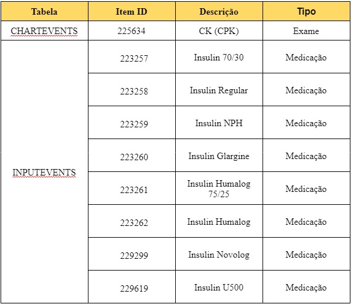
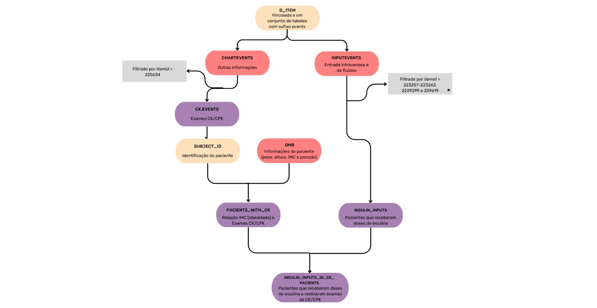
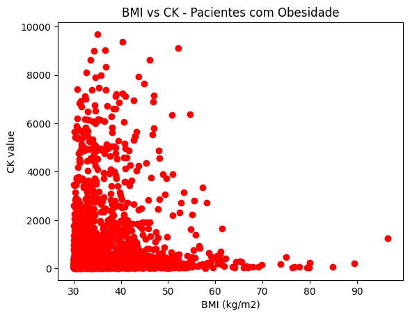
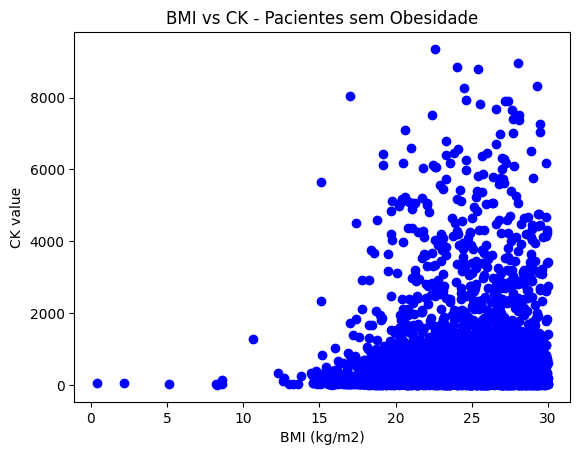

# Projeto `Avaliação da Correlação entre os Parâmetros Renais CK e CPK e a Administração Intravenosa de Insulina em Pacientes com Obesidade`

# Apresentação

O presente projeto foi originado no contexto das atividades da disciplina de pós-graduação Ciência e Visualização de Dados em Saúde, oferecida no primeiro semestre de 2023, na Unicamp.

|Nome  | RA | Especialização|
|--|--|--|
| Fernando Fortes Granado | 171517 | Computação |
| Glinka Lino Duarte Estadulho  | 271104  | Física|
| João Augusto Rosa Feltran  | 174083 | Computação |
| Michel Frank Ferrazo  | 224972  | Farmacologia |
| Thársis Salathiel | 226066 | Computação - Líder Github - Conta salathiel10|

# Descrição Resumida do Projeto

A obesidade é uma condição de saúde crescente em todo o mundo, afetando milhões de pessoas e apresentando diversos riscos à saúde, incluindo o desenvolvimento de diabetes tipo 2. A administração adequada de insulina é fundamental para o controle glicêmico em pacientes obesos com diabetes. No entanto, a dosagem correta de insulina e o método de administração ainda são desafios significativos na prática clínica.

Nesse contexto, uma área de pesquisa promissora é a investigação da relação entre os parâmetros renais CK (creatina quinase) e CPK (creatina fosfoquinase) e a escolha da administração intravenosa de insulina em pacientes com obesidade. Estudos anteriores sugerem que níveis elevados desses marcadores renais podem estar associados a complicações metabólicas e renais em pacientes obesos com diabetes.

O objetivo deste projeto é analisar se há uma correlação entre os exames laboratoriais de CK e CPK e a decisão de administrar insulina intravenosa em pacientes obesos. Além disso, buscamos determinar o tamanho da oportunidade de aumento na administração intravenosa de insulina em pacientes obesos, com base nos resultados obtidos.

Para alcançar esses objetivos, será conduzido um estudo retrospectivo envolvendo uma amostra representativa de pacientes obesos com diabetes, cujos dados laboratoriais de CK, CPK e a forma de administração de insulina estão disponíveis nos registros médicos. As informações serão analisadas estatisticamente, utilizando métodos apropriados, para identificar possíveis correlações entre os parâmetros renais e a administração intravenosa de insulina.

Espera-se que os resultados desse estudo possam fornecer insights valiosos para os profissionais de saúde envolvidos no tratamento de pacientes obesos com diabetes. Além disso, a análise da oportunidade de aumento na administração intravenosa de insulina poderá ajudar a melhorar as estratégias terapêuticas e promover uma abordagem mais individualizada no tratamento desses pacientes, com potenciais benefícios na gestão do diabetes e na prevenção de complicações metabólicas e renais.

Link para video:
https://drive.google.com/file/d/1ZVwDOocFzThgN53GMuOPy3mcSKYTh6Pq/view?usp=sharing

# Perguntas de Pesquisa

1. Existe uma correlação entre os exames laboratoriais de CK e CPK (parâmetros renais) e a escolha de administração de insulina intravenosa em pacientes com obesidade? 

2. Qual é o tamanho da oportunidade de aumento na administração intravenosa de insulina em pacientes obesos?

# Metodologia

1. Processar dados do MIMIC-IV
2. Observar parâmetros relativos ao CK e CPK e a administração intravenosa de insulina
3. Usar analise estatísticas descritivas para gerar conclusões

# Bases de Dados e Evolução

### Bases Estudadas mas Não Adotadas

Base de Dados | Endereço na Web | Resumo descritivo
----- | ----- | -----
Pub med (e outras bases de artigos) | https://pubmed.ncbi.nlm.nih.gov/ | Base de artigos sobre literatura biomedica.

Inicialmente o grupo tinha considerado se utilizar de dados provenientes de artigos da literatura. Entretanto, notou-se certa dificuldade em minerar esses dados a parti dos arquivos PDFs dos artigos. Assim, optou-se por abandonar esse tipo de abordagem.

### Bases Estudadas e Adotadas

Base de Dados | Endereço na Web | Resumo descritivo
----- | ----- | -----
MIMIC-IV1 | https://physionet.org/content/mimiciv/2.2/ | O banco de dados Medical Information Mart for Intensive Care (MIMIC) fornece dados de cuidados intensivos para mais de 40.000 pacientes internados em unidades de terapia intensiva no Beth Israel Deaconess Medical Center (BIDMC).

1Johnson, Alistair, et al. "MIMIC-IV" (version 2.2). PhysioNet (2023), https://doi.org/10.13026/6mm1-ek67.

Esse banco de dados é formado por diversas tabelas no formato CSV (comma-separated values), cada tabela aborda uma "entidade" do hospital. Assim, há uma tabela para informações dos pacientes, uma para medicamentos aplicados, uma para exames realizados, etc. Cada tabela tem seu próprio conjunto de colunas, mas a coluna relacionada ao ID do paciente aparece em praticamente todas as tabelas.

Houve um pré-processamento inicial da base para separar apenas os dados de interesse do projeto.

#### 1.1. Tabela `chartevents.csv` - Exames de CK (CPK)

Inicialmente, filtramos a tabela `chartevents.csv`, que contém diversas informações sobre eventos do hospital, incluindo exames de CK (CPK). Esses exames foram identificados pela coluna `itemid` igual a 225634, o número que identifica o exame foi verificado utilizando a tabela `d_items.csv`. Após o filtro, os resultados foram salvos na tabela `ck_events.csv`. É importante mencionar que, devido ao tamanho significativo da tabela `chartevents.csv` (30GB), ela foi processada em pedaços (chunks) para facilitar o manuseio dos dados.

#### 1.2. Tabela `omr.csv` - Informações dos Pacientes

Para obter informações detalhadas dos pacientes que realizaram o exame de CK (CPK), utilizamos o identificador do paciente, presente na coluna `subject_id` da tabela `ck_events.csv`. As informações dos pacientes do MIMIC-IV estão disponíveis na tabela `omr.csv`, que contém dados como peso, altura, IMC e pressão arterial. Os dados dos pacientes foram combinados com os resultados dos exames de CK (CPK) e salvos na tabela `patients_with_ck.csv`.

#### 1.3. Tabela `inputevents.csv` - Eventos de Aplicação de Insulina

Além das informações obtidas acima, também buscamos verificar se os pacientes que realizaram exames de CK (CPK) receberam doses de insulina. A tabela `inputevents.csv` possui informações sobre todos os eventos de entradas de fluido, incluindo a administração de insulina. Após uma análise da tabela `d_items.csv`, identificamos que a insulina era representada pelos seguintes itemid: 223257, 223258, 223259, 223260, 223261, 223262, 229299 e 229619, correspondendo às descrições de diferentes tipos de insulina. Com base nisso, geramos a tabela `insulin_inputs_in_ck_patients.csv`, que contém eventos de aplicação de insulina em pacientes que realizaram exames de CK (CPK), gerados a partir do cruzamento de id da tabela `patients_with_ck.csv` e da tabela intermediária `insulin_inputs`. Da mesma forma que a tabela `chartevents.csv`, a tabela "inputevents.csv" foi processada em pedaços (chunks) devido ao seu tamanho considerável (2,3GB).

A abaixo é mostrado a relação do `itemid` com os respectivos exames e medicações nas diferentes tabelas do MIMIC IV.

Mais informações sobre esse pre-processamento podem ser encontradas no notebook [process_raw_mimic.ipynb](notebooks/process_raw_mimic.ipynb). O workflow abaixo é a representação visual do processamento realizado:

Para realizar as primeiras análises, foi necessário aplicar alguns passos de limpeza de dados. Mais detalhes podem ser encontrados no notebook [limpeza_de_dados.ipynb](notebooks/limpeza_de_dados.ipynb). Após essa limpeza, são geradas 2 tabelas a parti das tabelas intermediarias geradas anteriormente:
- `bmi_norm.csv`: tabela das informações dos pacientes após filtragem de valores de BMI (IMC), com remoção de valores de BMI (IMC) extremamente elevados
- `ck_norm.csv`: tabela dos exames CK (CPK) após filtragem de valores de CK considerados outliers 

### Integração entre Bases e Análise Exploratória
Tendo os dados filtrados, foi feita a análise dos valores de BMI. Como cada paciente possuía diversas medições, foi calculada a média de BMI para cada paciente, criando uma nova tabela. Os pacientes foram então, divididos em dois grupos de acordo com seu valor de BMI. Aqueles com BMI maior ou igual a 30 foram considerados obesos. Mais informações podem ser encontradas no notebook [gráficos_obesidade_e_ck.ipynb](notebooks/gráficos_obesidade_e_ck.ipynb). Com isso, foram plotados os gráficos abaixo:

A análise desse gráfico permite identificar que em torno de um terço dos pacientes possui obesidade. Apesar desses pacientes serem minoria, essa proporção nos dá uma população grande o suficiente para fazer análises subsequentes.

Os identificadores de pacientes foram colocados no eixo y para permitir uma visualização em 2D. Com esse gráfico é possível verificar que a maior parte dos pacientes possui BMI na faixa de 20 a 40 kg/m^2. Além disso, há uma quantidade considerável de pacientes na faixa de 40 a 60 kg/m^2, mas poucos em outros valores. 

Além dos gráficos, foram obtidas estatísticas descritivas sobre os valores de BMI médios de cada paciente. As estatísticas foram calculadas para os pacientes como um todo assim como para aqueles com e sem obesidade. Mais detalhes sobre os cálculos podem ser encontrados no notebook [estatisticas_descritivas.ipynb](notebooks/estatisticas_descritivas.ipynb). 

Os valores gerais obtidos foram:
- Média = 28.51 kg/m^2
- Desvio Padrão = 7.18 kg/m^2
- Mediana = 27.25 kg/m^2
- Moda = 25.00 kg/m^2

Considerando somente os pacientes com obesidade, os valores obtidos foram:
- Média = 36.22 kg/m^2
- Desvio Padrão = 6.54 kg/m^2
- Mediana = 34.22 kg/m^2
- Moda = 32.10 kg/m^2

Por fim, considerando apenas pacientes sem obesidade:
- Média = 24.62 kg/m^2
- Desvio Padrão = 3.32 kg/m^2
- Mediana = 24.96 kg/m^2
- Moda = 25.00 kg/m^2

Analisando a mediana geral, é possível constatar que ela está abaixo do limiar de 30 kg/m^2, indicando uma maior quantidade de pacientes abaixo desse limiar do que acima. A média também contribui para essa afirmação. Como esperado, esses valores corroboram as análises feitas através dos gráficos. O alto desvio padrão de pacientes em geral e apenas com obesidade indica uma grande variação em valores, especialmente em comparação com os pacientes sem obesidade. 

Em seguida, foi feita a análise dos valores de CK dos pacientes, novamente considerando os valores médios de cada indivíduo. Usando as tabelas obtidas anteriormente, os pacientes e seus valores de CK (CPK) foram separados em obesos e não obesos. Por conta da eliminação de valores de CK muito altos, alguns pacientes presentes na tabela de BMI não possuíam valor de CK definido e foram desconsiderados. Mais informações podem ser encontradas no notebook [gráficos_obesidade_e_ck.ipynb](notebooks/gráficos_obesidade_e_ck.ipynb). Usando as informações de BMI e CK dos pacientes, foram plotados os gráficos abaixo:

Analisando os gráficos, é possível perceber que os valores de CK mais altos foram encontrados entre BMI de 20 e 60 kg/m^2. Além disso, valores de CK fora dessa faixa de BMI foram muito mais baixos do que aqueles dentro. Assim, pode-se perceber que em torno de limitante de obesidade (30 kg/m^2) há altos valores de CK, principalmente para pacientes com BMI maior que o limitante. Por fim, há muito mais pacientes com CK abaixo de 4000 IU/L do que acima.

Novamente, foram obtidas estatísticas descritivas, como detalhado no notebook [estatisticas_descritivas.ipynb](notebooks/estatisticas_descritivas.ipynb). 

Os valores gerais obtidos foram:
- Média = 574.45 IU/L
- Desvio Padrão = 1154.00 IU/L
- Mediana = 155.00 IU/L
- Moda = 38.00 IU/L

Considerando apenas pacientes com obesidade, os valores obtidos foram:
- Média = 661.31 IU/L
- Desvio Padrão = 1292.40 IU/L
- Mediana = 171.50 IU/L
- Moda = 30.00 IU/L

Por fim, considerando somente pacientes sem obesidade:
- Média = 466.49 IU/L
- Desvio Padrão = 982.92 IU/L 
- Mediana = 131.00 IU/L 
- Moda = 41.00 IU/L 

Novamente, as estatísticas numéricas revelam os comportamentos percebidos nos gráficos. As médias e medianas em todos os três grupos corroboram a grande quantidade de valores de CK abaixo de 4000 IU/L. Adicionalmente, os altíssimos desvios padrões  em relação as médias indicam a discrepância de valores de CK, que variam de 0 a 10000 IU/L.

# Ferramentas

- [Python](https://www.python.org/)
- [jupyter](https://jupyter.org/)
- [pandas](https://pandas.pydata.org/)
- [scipy](https://scipy.org/)
- [numpy](https://numpy.org/)

# Cronograma

1. Processar dados do MIMIC-IV: 3 semanas
3. Usar técnicas de análise estatística: 4 semanas
4. Escrever o texto relativo aos resultados obtidos na 3 etapa: 3 semanas