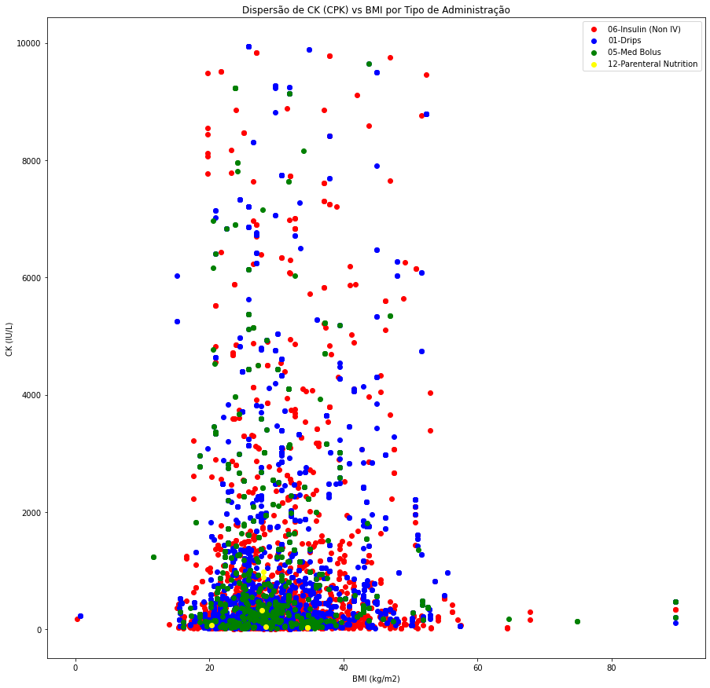

# Projeto `Avaliação da Correlação entre os Parâmetros Renais CK e CPK e a Administração Intravenosa de Insulina em Pacientes com Obesidade`

# Apresentação

O presente projeto foi originado no contexto das atividades da disciplina de pós-graduação Ciência e Visualização de Dados em Saúde, oferecida no primeiro semestre de 2023, na Unicamp.

|Nome  | RA | Especialização|
|--|--|--|
| Fernando Fortes Granado | 171517 | Computação |
| Glinka Lino Duarte Estadulho  | 271104  | Física|
| João Augusto Rosa Feltran  | 174083 | Computação |
| Michel Frank Ferrazo  | 224972  | Farmacologia |
| Thársis Salathiel | 226066 | Computação - Líder Github - Conta salathiel10|

## Slides da Apresentação Final

https://www.canva.com/design/DAFm98DaG9s/bfKV2C3TpqTNUho-Gk3A3g/edit?utm_content=DAFm98DaG9s&utm_campaign=designshare&utm_medium=link2&utm_source=sharebutton 

# Introdução e Referenciais Teóricos

A obesidade é uma condição de saúde cada vez mais prevalente em todo o mundo, representando um desafio significativo para os sistemas de saúde. Estima-se que mais de um bilhão de adultos estejam acima do peso, e desses, pelo menos 300 milhões são clinicamente obesos (Organização Mundial da Saúde, 2020). Além dos impactos na qualidade de vida e bem-estar dos indivíduos, a obesidade está associada a um maior risco de desenvolvimento de várias doenças crônicas, incluindo diabetes tipo 2. O controle adequado da diabetes em pacientes obesos é fundamental para evitar complicações e promover uma melhor qualidade de vida. Além disso, há estudos, por exemplo, sobre casos de hiperglicemia induzida pelo estresse (SIH), mesmo sem histórico de diabete (Zhang et al., 2023), mostrando a relevância dos estudos sobre o controle glicêmico.

Nesse contexto, a administração de insulina desempenha um papel crucial na regulação da glicemia desses pacientes. No entanto, a determinação da dosagem correta e o método de administração mais eficaz são desafios significativos na prática clínica. É nesse ponto que a pesquisa científica desempenha um papel importante, buscando entender melhor os mecanismos relacionados à obesidade, diabetes e insulina, a fim de aprimorar as estratégias terapêuticas disponíveis.

Uma área promissora de investigação é a análise da relação entre os parâmetros creatina quinase (CK) e a creatina fosfoquinase (CPK) como indicadores renais, e a escolha da administração intravenosa de insulina em pacientes obesos. Estudos anteriores sugerem que níveis elevados desses marcadores renais podem estar associados a complicações metabólicas e renais nesses pacientes (Sawicki et al., 2017). A CK é uma enzima encontrada principalmente nos músculos esqueléticos, cardíacos e tecidos cerebrais, e seu aumento no sangue pode ser um sinal de lesões musculares, rabdomiólise (destruição muscular), doenças musculares inflamatórias ou traumas físicos recentes.

Com base nesse contexto, a presente pesquisa propõe um estudo observacional retrospectivo utilizando os dados de pacientes do MIMIC IV. O objetivo é descrever uma abordagem abrangente para a extração e processamento de tratamentos com insulina e leituras de glicose sanguínea de pacientes enfermos, por meio da utilização de registros médicos eletrônicos. Essa abordagem permite converter consultas de banco de dados contendo valores não processados de glicose e insulina em um conjunto de dados clinicamente validado e reproduzível (Robles Arévalo et al., 2021). Dessa forma, evita-se a necessidade de uma revisão manual demorada dos prontuários dos pacientes, possibilitando uma análise eficiente dos dados. Além disso, o estudo busca analisar a possível correlação entre os níveis de CK ou CPK e a decisão de administrar insulina intravenosa, bem como avaliar a oportunidade de aumento na administração intravenosa de insulina nessa população, com base nos resultados obtidos.

A partir dessas análises e investigações futuras, espera-se obter conhecimentos e perspectivas no tratamento de pacientes obesos. Compreender a relação entre os parâmetros sanguíneos (renais) e a administração de insulina pode levar a abordagens terapêuticas mais individualizadas, o que poderia contribuir para um melhor controle glicêmico e prevenção de complicações metabólicas e renais.

Este estudo analisou a relação entre parâmetros renais e administração de insulina usando o dataset MIMIC IV. Embora não tenha encontrado uma relação direta, o estudo contribuiu com análises abrangentes e gerou dados intermediários para pesquisas futuras. Destacou-se a importância da filtragem de dados de saúde para possíveis correlações clínicas e melhores decisões terapêuticas em unidades de terapia intensiva.

# Perguntas de Pesquisa e Objetivos

#### Hipótese central

Existe uma correlação entre os exames laboratoriais de CK e CPK (parâmetros renais) e a escolha de administração de insulina intravenosa em pacientes com obesidade?

#### Objetivo Geral

Realizar um estudo observacional retrospectivo, usando a extração e processamento de dados de registros médicos eletrônicos, para validar a hipótese central.

#### Objetivos específicos

Compreender os processos acerca da datação e documentação eletrônica de prontuários hospitalares.

Desenvolver ferramental matemático/estatístico para análises exploratórias e integração de bases de dados que permitam realizar correlações entre o nível de CK (CPK) e o meio de administração de insulina, além da compreensão de outras características pertinentes e correlacionadas ao assunto.

Descrever uma abordagem abrangente para a extração e processamento de tratamentos com insulina, leituras de glicose sanguínea e exames de CK(CPK) de pacientes enfermos.

Desenvolver a cooperação interdisciplinar e interprofissional para a realização de projetos multidisciplinares.

Entender os conceitos principais sobre o tema de Ciência e Visualização de dados na área da saúde.

# Metodologia

#### População de estudo

Os dados foram extraídos do banco de dados Medical Information Mart for Intensive Care IV v2.2 (MIMIC-IVv2.2). O MIMIC-IV-v2.2 é um banco de dados de um único centro que foi atualizado com base no em versões anteriores dele mesmo. Foi lançado em janeiro de 2023 e é mantido pelo Massachusetts Institute of Technology (MIT). O banco de dados contém dados médicos do Beth Israel Deaconess Medical Center (Boston, Massachusetts, EUA) de 2008 a 2019.

Foram incorporados pacientes admitidos na UTI pela primeira vez e que fizeram exames de CK ou de glicose, com a administração de insulina, obesos e não obesos. Os critérios de exclusão incluíram: (1) pacientes que não realizaram exame de CK, (2) pacientes que não realizaram exame de glicose, (3) indivíduos com IMC > 100 kg/m², (4) para pacientes que fizeram exame de CK foram desconsiderados valores maiores do que 10.000 IU/L, (5) indivíduos que possuíam dados nulos ou sem medida, (6) pacientes que não realizaram aplicação de insulina. Por fim, os pacientes restantes após a limpeza de dados foram incluídos na coorte e divididos em dois grupos de acordo com os valores de corte para IMC - obesos e não obesos.

#### Processamento da base de dados

Durante o processo de processamento do banco de dados, diversas etapas foram realizadas para garantir a qualidade, integridade e utilidade das informações. Essas etapas foram conduzidas por meio de notebooks Jupyter, utilizando códigos em Python com diversas bibliotecas relevantes. O ambiente de desenvolvimento Google Colab também foi utilizado para facilitar o acesso aos recursos computacionais necessários.

Inicialmente, realizou-se o processo de junção (join) de tabelas existentes no banco de dados, utilizando características semelhantes e relacionamentos adequados. Esse procedimento resultou na criação de sub-tabelas que agregam informações pertinentes de diferentes fontes, permitindo uma visão abrangente dos dados. Além disso, foram aplicados ajustes nas tabelas que continham linhas referentes ao mesmo paciente, evitando informações duplicadas e proporcionando uma organização mais precisa dos dados específicos de cada paciente.

Em seguida, foi realizado um processo de limpeza para remover valores discrepantes ou inconsistentes dos dados. Essa etapa foi fundamental para garantir a confiabilidade dos resultados e evitar distorções causadas por outliers ou erros nos registros. Tanto as tabelas intermediárias quanto as finais geradas foram utilizadas para a obtenção de estatísticas descritivas, como média, mediana, desvio padrão, entre outros. Esses cálculos forneceram insights importantes sobre os dados e auxiliaram na compreensão dos padrões e tendências presentes.

Durante todo o processo, foram desconsiderados valores faltantes ou sem medida, a fim de preservar a consistência dos dados e garantir a precisão das análises realizadas. Por fim, todas as tabelas resultantes do processamento foram armazenadas em arquivos tabulares do tipo CSV.

#### Análise dos dados

A metodologia utilizada para a análise dos dados envolveu o uso de diversas ferramentas e bibliotecas que desempenharam um papel fundamental no processo. Os principais pontos adotados estão listados a seguir:

- Manipulação e processamento dos dados: Para a manipulação dos dados do MIMIC, foi utilizada a biblioteca Pandas. O Pandas facilitou a manipulação das tabelas, permitindo realizar operações como filtragem, limpeza, seleção de colunas, cálculo de estatísticas e transformações nos dados;
- Análise estatística: Além do Pandas, a biblioteca numpy e scipy foi empregada para a realização do cálculo de estatísticas descritivas e a aplicação de métodos estatísticos. O scipy oferece uma ampla gama de funções estatísticas e ferramentas para análise de dados, permitindo realizar testes estatísticos, ajuste de distribuições, análises de correlações e outros estudos;
- Visualização dos resultados: Para a geração de gráficos e visualização dos resultados, foi utilizada a biblioteca matplotlib em conjunto com o Pandas. Essa combinação permitiu criar diversos tipos de gráficos, como gráficos de setores, dispersão e histogramas, facilitando a visualização e interpretação dos dados.

# Bases de Dados e Evolução

### Bases Estudadas mas Não Adotadas

Base de Dados | Endereço na Web | Resumo descritivo
----- | ----- | -----
Pub med (e outras bases de artigos) | https://pubmed.ncbi.nlm.nih.gov/ | Base de artigos sobre literatura biomedica.

Inicialmente o grupo tinha considerado se utilizar de dados provenientes de artigos da literatura. Entretanto, notou-se certa dificuldade em minerar esses dados a parti dos arquivos PDFs dos artigos. Assim, optou-se por abandonar esse tipo de abordagem.

### Bases Estudadas e Adotadas

Base de Dados | Endereço na Web | Resumo descritivo
----- | ----- | -----
MIMIC-IV1 | https://physionet.org/content/mimiciv/2.2/ | O banco de dados Medical Information Mart for Intensive Care (MIMIC) fornece dados de cuidados intensivos para mais de 40.000 pacientes internados em unidades de terapia intensiva no Beth Israel Deaconess Medical Center (BIDMC).

1Johnson, Alistair, et al. "MIMIC-IV" (version 2.2). PhysioNet (2023), https://doi.org/10.13026/6mm1-ek67.

Os dados do MIMIC-IV são divididos em dois grandes módulos: _hosp_ se refere aos dados derivados do prontuário eletrônico do hospital, que incluem informações sobre pacientes, hospitalizações, transferências, resultados de exames laboratoriais, culturas microbiológicas, prescrições e administração de medicamentos, informações de faturamento do hospital, entre outros. Já _ICU_ (unidade de terapia intensiva, em inglês) é um módulo específico do MIMIC-IV que contém dados sobre pacientes internados em UTIs, incluindo informações sobre monitoramento fisiológico, ventilação mecânica, uso de drogas vasoativas, entre outros.

O banco de dados é constituído por múltiplas tabelas no formato CSV (comma-separated values), cada uma delas representando uma "entidade" específica do hospital. Cada tabela possui seu próprio conjunto de colunas, sendo que a coluna relacionada ao ID do paciente está presente em quase todas as tabelas. Essa estrutura organizada e segmentada permite uma abordagem mais eficiente e precisa na manipulação e análise dos dados. A presença consistente da coluna de ID do paciente em diversas tabelas facilita a identificação e associação dos registros relacionados a cada indivíduo, garantindo a integridade e a integração dos dados ao longo do banco de dados.

No desenvolvimento deste projeto, foi realizado um pré-processamento inicial da base de dados, com o objetivo de separar apenas os dados relevantes para as análises. Essa etapa de pré-processamento é fundamental para garantir que as informações utilizadas sejam específicas e adequadas ao escopo do projeto. Ao escolher os dados importantes, podemos focar nas mudanças necessárias e aplicar os tratamentos adequados a essas informações. Dessa forma, o pré-processamento atua como uma etapa de filtragem, organizando a base de dados e fornecendo um conjunto de informações mais relevante para as etapas subsequentes do projeto.

#### 1.1. Tabela `chartevents.csv` - Exames de CK (CPK) e glicose

Inicialmente, filtramos a tabela `chartevents.csv`, que é responsável por armazenar uma variedade de eventos registrados no hospital, como anotações médicas, testes laboratoriais e balanço de fluidos, incluindo os exames de CK (CPK). Esses exames foram identificados pela coluna `itemid` igual a 225634, o número que identifica o exame foi verificado utilizando a tabela `d_items.csv`, que funciona como um dicionário que nos ajuda a entender o significado dos identificadores (código de números) usados em outras tabelas. Após o filtro, os resultados foram salvos na tabela `ck_events.csv`.

Além dos exames de CK (CPK), também foram escolhidos exames de glicose para análise. Ao observar a tabela `d_items.csv`, identificamos várias referências à glicose. No entanto, os identificadores relacionados a métodos de profilaxia e ao escore Apache IV foram excluídos, pois não são o foco do projeto. Portanto, selecionamos os IDs 220621, 225664, 226537 e 228388 - os `itemid` com os respectivos exames e medicações nas diferentes tabelas do MIMIC IV estão apresentados na Tabela 1 - e a partir deles foi feito a tabela `glucose_events.csv` que apresenta todos os exames de glicose.

É importante mencionar que, devido ao tamanho significativo da tabela `chartevents.csv` (30GB), ela foi processada em pedaços (chunks) para facilitar o manuseio dos dados.

#### 1.2. Tabela `omr.csv` - Informações dos Pacientes

A partir da tabela `ck_events.csv`, que contém os resultados dos exames de CK (CPK), utilizamos a coluna `subject_id`, que é o identificador único de cada paciente, para cruzarmos as informações com a tabela `omr.csv`, que contém dados como peso, altura, IMC e pressão arterial dos pacientes no MIMIC-IV. Essa combinação de dados nos permitiu criar uma nova tabela chamada `patients_with_ck.csv`, que relaciona os resultados dos exames de CK (CPK) com as informações completas de cada paciente, proporcionando uma visão mais ampla e detalhada dos dados.

Utilizando o mesmo método utilizado na criação da tabela `patients_with_ck.csv`, procedemos à obtenção das informações dos pacientes em relação aos exames de glicose. Os dados obtidos foram consolidados na tabela `patients_with_glucose.csv`, que reúne as informações relevantes dos pacientes nesse contexto específico.

#### 1.3. Tabela `inputevents.csv` - Eventos de Aplicação de Insulina

Além das informações obtidas acima, também buscamos verificar se os pacientes que realizaram exames de CK (CPK) receberam doses de insulina. A tabela `inputevents.csv` possui informações sobre todos os eventos de entradas de fluidos, incluindo a administração de insulina. Após uma análise da tabela `d_items.csv`, identificamos que a insulina era representada pelos seguintes `itemid`: 223257, 223258, 223259, 223260, 223261, 223262, 229299 e 229619, correspondendo às descrições de diferentes tipos de insulina. Com base nisso, geramos a tabela `insulin_inputs_in_ck_patients.csv`. Primeiramente, criamos a tabela intermediária `insulin_inputs.csv`, que contém os eventos de aplicação de insulina registrados. Em seguida, cruzamos o ID do paciente presente na tabela `patients_with_ck.csv` com a tabela `insulin_inputs.csv`, resultando na tabela `insulin_inputs_in_ck_patients.csv`. Essa nova tabela é composta pelos eventos de aplicação de insulina específicos dos pacientes que realizaram os exames de CK (CPK), possibilitando uma análise mais direcionada desses casos.

Da mesma forma que foi feito para os exames de CK (CPK), também foram coletados os registros de administração de insulina para os pacientes, resultando na tabela `insulin_inputs_in_glucose_pacients.csv`. Esses processos de obtenção e combinação de informações estão mais detalhados no notebook [process_interim.ipynb](notebooks/process_interim.ipynb), onde são descritos passo a passo, facilitando a compreensão e replicação do procedimento utilizado. Essas tabelas constituem uma etapa intermediária importante do fluxo de trabalho, fornecendo dados organizados e prontos para análises posteriores.

Por fim, foi feita uma última tabela que contém os dados mais relevantes para o estudo: as tabelas `insulin_inputs_in_ck_patients.csv` e `insulin_inputs_in_glucose_pacients.csv` foram utilizadas para gerar uma tabela mais completa identificada como `paired_glucose_insulin_ck_death.csv`. Essa tabela apresenta diversos dados relevantes de pacientes que fizeram tanto o exame de CK quanto de glicose e aplicaram insulina, seguindo algumas regras de formação:

1. Uma leitura de glicose deve preceder a administração regular de insulina em até 90 minutos. Essa janela de tempo foi estabelecida com base nas diretrizes para cetoacidose diabética, que recomendam a medição dos valores de glicose a cada 60 minutos durante a infusão de insulina. Foi adicionado um período adicional de 30 minutos, totalizando 90 minutos, a esse intervalo para considerar o tempo que pode levar para os profissionais registrarem o evento. Esses intervalos de tempo estão dentro das recomendações.

2. Quando um evento de insulina regular não foi precedido, mas sim seguido, por uma medição de glicose no sangue, essa leitura de glicose foi associada à administração regular de insulina se elas fossem registradas dentro de 90 minutos uma da outra.

3. Às vezes, uma infusão/bolus de insulina regular ocorria entre duas medições de glicose no sangue. Nesse caso, o valor de glicose mais alto foi associado à entrada de insulina regular, desde que tenham sido registrados dentro de 90 minutos um do outro.

4. Quando um bolus de insulina regular ocorria muito próximo a uma taxa de infusão de insulina regular, assumia-se que o paciente recebeu um bolus e, em seguida, iniciou uma infusão. Ambas as entradas de insulina regular foram associadas à medição de glicose no sangue anterior, ou à leitura de glicose posterior, caso seu valor fosse maior que o da medição anterior e fosse registrada dentro de 90 minutos da dose de insulina.

5. Nenhum valor de glicose abaixo de 90mg/dL foi associado a um bolus ou infusão subsequente de insulina regular. Nenhum médico irá tratar um valor de glicose no sangue tão baixo com um bolus ou infusão de insulina regular.

6. A medição de CK está associada à medição de glicose e à aplicação de insulina, caso conste que foi feita 4h antes ou 4h depois da medição de insulina.

Da mesma forma que a tabela `chartevents.csv`, a tabela `inputevents.csv` foi processada em pedaços (chunks) devido ao seu tamanho considerável (2,3GB).

A abaixo é mostrado a relação do `itemid` com os respectivos exames e medicações nas diferentes tabelas do MIMIC IV.

|    CHARTEVENTS   | Item ID |           Descrição           |    Tipo   |   |
|:-----------:|:-------:|:-----------------------------:|:---------:|---|
|  | 225634  | CK (CPK)                      | Exame     |   |
|             | 220621  |        Glucose (serum)        | Exame     |   |
|             | 225664  | Glucose finger stick (70-100) | Exame     |   |
|             | 226537  |     Glucose (whole blood)     | Exame     |   |
|             | 228388  |  Glucose (whole blood) (soft) | Exame     |   |

|    INPUTEVENTS   | Item ID |           Descrição           |    Tipo   |   |
|:-----------:|:-------:|:-----------------------------:|:---------:|---|
|  | 223257  |         Insulin 70/30         | Medicação |   |
|             | 223258  |        Insulin Regular        | Medicação |   |
|             | 223259  |          Insulin NPH          | Medicação |   |
|             | 223260  |        Insulin Glargine       | Medicação |   |
|             | 223261  |     Insulin Humalog 75/25     | Medicação |   |
|             | 223262  |        Insulin Humalog        | Medicação |   |
|             | 229299  |        Insulin Novolog        | Medicação |   |
|             | 229619  |          Insulin U500         | Medicação |   |

Mais informações sobre esses pré-processamentos podem ser encontradas nos [notebooks disponibilizados](notebooks/). O workflow abaixo é a representação visual do processamento realizado:

A fim de conduzir as análises iniciais, foram executadas etapas de limpeza de dados para garantir a qualidade e consistência das informações. Para obter informações mais detalhadas sobre esses procedimentos, é possível consultar o notebook [limpeza_de_dados.ipynb](notebooks/limpeza_de_dados.ipynb). Após a conclusão dessa etapa de limpeza, foram geradas três tabelas a partir das tabelas intermediárias previamente criadas:

- `bmi_norm.csv`: tabela das informações dos pacientes após filtragem de valores de BMI (IMC), com remoção de valores de BMI (IMC) extremamente elevados;
- `ck_norm.csv`:  tabela dos exames CK (CPK) após filtragem de valores de CK considerados discrepantes (outliers);
- `glucose_norm.csv`: tabela dos exames de glicose após filtragem de valores considerados outliers, sem unidade e nulos.

Durante a criação dessa tabela, foram removidos valores considerados extremamente elevados, a fim de garantir a confiabilidade e coerência dos dados analisados. Essa abordagem de limpeza de dados adicionais é fundamental para assegurar a consistência e a validade dos resultados obtidos, contribuindo para uma análise mais precisa e confiável. Os detalhes sobre as etapas realizadas podem ser encontrados no notebook mencionado anteriormente e no notebook [limpeza_de_dados_2.ipynb](notebooks/limpeza_de_dados_2.ipynb).

### Integração entre Bases e Análise Exploratória

#### Estratificação e análise dos pacientes que fizeram exame CK

Os dados de CK (CPK) e clínicos dos pacientes, presentes na tabela `patients_with_ck.csv`, foram utilizados para a estratificação dos pacientes. Como cada paciente possui diferentes valores de IMC (devido a aferições de peso em diferentes tempos), foi calculada a média do IMC para cada paciente, criando uma nova tabela com as médias. Os pacientes foram divididos em dois grupos com base no valor de IMC: aqueles com IMC maior ou igual a 30 foram considerados obesos, enquanto o restante foi classificado como não obesos. Foi decidido esse critério com base em definições da Organização Mundial da Saúde. Mais detalhes podem ser encontrados no notebook [gráficos_obesidade_e_ck.ipynb](notebooks/gr%C3%A1ficos_obesidade_e_ck.ipynb), onde estão disponíveis informações adicionais. A análise resultou na criação dos gráficos que demonstram visualmente a relação entre os pacientes com e sem obesidade (gráfico de setores).

A análise desse gráfico permite identificar que em torno de um terço dos pacientes possuem obesidade. Apesar desses pacientes serem minoria, essa proporção nos dá uma população grande o suficiente para fazer análises subsequentes.

A fim de permitir uma representação em 2D para melhor visualização da distribuição de indivíduos obesos e não obesos, os identificadores de pacientes foram representados no eixo y vs o IMC (dados da tabela `patients_with_ck.csv`). A análise do gráfico revela que a maioria dos pacientes apresenta um índice de massa corporal na faixa de 20 a 40 kg/m². Além disso, observa-se que há uma quantidade significativa de pacientes na faixa de 40 a 60 kg/m², enquanto poucos pacientes estão distribuídos em outros valores de IMC. Essa representação gráfica fornece uma visão clara e intuitiva da distribuição dos pacientes de acordo com seus valores de BMI, destacando a concentração predominante na faixa de 20 a 40 kg/m².

Os identificadores de pacientes foram colocados no eixo y para permitir uma visualização em 2D. Com esse gráfico é possível verificar que a maior parte dos pacientes possui BMI na faixa de 20 a 40 kg/m^2. Além disso, há uma quantidade considerável de pacientes na faixa de 40 a 60 kg/m^2, mas poucos em outros valores. 

Além dos gráficos, foram obtidas estatísticas descritivas sobre os valores de BMI médios de cada paciente. Mais detalhes sobre os cálculos podem ser encontrados no notebook [estatisticas_descritivas.ipynb](notebooks/estatisticas_descritivas.ipynb). 

Os valores gerais obtidos foram:
- Média = 28.51 kg/m^2
- Desvio Padrão = 7.18 kg/m^2
- Mediana = 27.25 kg/m^2
- Moda = 25.00 kg/m^2

Considerando somente os pacientes com obesidade, os valores obtidos foram:
- Média = 36.22 kg/m^2
- Desvio Padrão = 6.54 kg/m^2
- Mediana = 34.22 kg/m^2
- Moda = 32.10 kg/m^2

Por fim, considerando apenas pacientes sem obesidade:
- Média = 24.62 kg/m^2
- Desvio Padrão = 3.32 kg/m^2
- Mediana = 24.96 kg/m^2
- Moda = 25.00 kg/m^2

Através da análise da mediana geral, podemos observar que ela está abaixo do limiar de 30 kg/m², o que indica que há uma maior quantidade de pacientes com valores abaixo deste limite do que acima dele. Essa constatação também é corroborada pela média. Esses resultados estão alinhados com as informações obtidas a partir dos gráficos. Além disso, o alto desvio padrão tanto para os pacientes em geral quanto para aqueles com obesidade indica uma grande variação nos valores, especialmente quando comparados aos pacientes sem obesidade.

## Ferramentas

As ferramentas Python, Jupyter, Google Colab, pandas, scipy, numpy, sklearn e matplotlib desempenham papéis importantes no processamento de dados e análise exploratória no contexto mencionado anteriormente.

- [Python](https://www.python.org/): é uma linguagem de programação amplamente utilizada em ciência de dados e oferece uma ampla gama de bibliotecas e pacotes voltados para análise, manipulação e visualização de dados;
- [jupyter](https://jupyter.org/): é uma plataforma interativa que permite a criação de notebooks, que combinam código, texto explicativo e visualizações. Os notebooks Jupyter são altamente flexíveis e facilitam a exploração interativa e a documentação dos processos de análise de dados;
- [Google Colab](https://colab.research.google.com/?hl=pt_BR): é um serviço baseado em nuvem que fornece um ambiente de desenvolvimento Jupyter Notebook pré-configurado. Ele permite a execução de notebooks Python em um ambiente virtual, sem a necessidade de instalação local de pacotes e bibliotecas.
- [pandas](https://pandas.pydata.org/): é uma biblioteca Python amplamente utilizada para manipulação e análise de dados. Ela fornece estruturas de dados eficientes, como o DataFrame, que facilita o trabalho com tabelas de dados, incluindo operações de junção, filtragem, agregação e limpeza.
- [scipy](https://scipy.org/) e [numpy](https://numpy.org/): são bibliotecas que fornecem uma ampla gama de funções e ferramentas para análise numérica, processamento de sinais, estatísticas e outras tarefas relacionadas ao processamento de dados. Elas oferecem métodos estatísticos, funções matemáticas avançadas e algoritmos eficientes para cálculos numéricos.
- [sklearn](https://scikit-learn.org/stable/index.html): é uma biblioteca de aprendizado de máquina em Python que oferece uma variedade de algoritmos de classificação, regressão, agrupamento e pré-processamento de dados. Ela permite realizar tarefas como treinamento de modelos preditivos, avaliação de desempenho e seleção de recursos.
- [matplotlib](https://matplotlib.org/): é uma biblioteca utilizada para a criação de visualizações em Python. Permite gerar, customizar e exportar vários tipos de gráficos. Pacotes como o pyplot fornecem ainda mais opções.

O grupo utilizou a biblioteca Pandas, uma ferramenta em Python, para manipular os dados do MIMIC. Essa biblioteca é muito útil para trabalhar com tabelas, facilitando a manipulação dos dados e o cálculo de estatísticas. Um destaque importante é a capacidade do Pandas em processar grandes tabelas em "pedaços menores". Essa funcionalidade foi fundamental para este trabalho, uma vez que algumas tabelas do MIMIC possuem uma quantidade muito grande de informações, tornando impossível carregá-las inteiramente na memória.

Além do Pandas, também utilizamos a biblioteca numpy para manipulação dos dados. Ambas são ferramentas poderosas para lidar com operações numéricas e estruturas de dados eficientes.

No processo de desenvolvimento, utilizamos notebooks Python em conjunto com a ferramenta Jupyter e a aplicação Google Colab. Essas ferramentas fornecem ambientes interativos e colaborativos, permitindo escrever, executar e compartilhar o código de maneira eficiente.

Para realizar o cálculo de estatísticas descritivas e aplicar métodos estatísticos, contamos com o auxílio das bibliotecas scipy e sklearn. Essas bibliotecas oferecem uma ampla gama de funcionalidades estatísticas e ferramentas de análise preditiva. Por fim, utilizamos matplotlib para gerar muitos dos gráficos apresentados, trabalhando em conjunto com Pandas e gerando vários tipos diferentes de gráficos.

Em resumo, o uso do Pandas, numpy, Jupyter, Google Colab, scipy, sklearn e matplotlib foi essencial para o processamento e análise dos dados do MIMIC. Essas ferramentas forneceram recursos poderosos, permitindo a manipulação eficiente das tabelas, cálculo de estatísticas, desenvolvimento de código interativo e aplicação de métodos estatísticos.

# Análises Realizadas e Resultados

## Investigação da relação de CK vs IMC

A análise dos níveis de CK dos pacientes foi realizada, levando em consideração os valores médios de cada indivíduo devido às múltiplas medições ao longo do tempo. Com base nas tabelas obtidas anteriormente, os pacientes e seus valores de CK foram separados em dois grupos: obesos e não obesos. Alguns pacientes da tabela de IMC foram excluídos, pois não possuíam valores de CK definidos, devido à remoção de valores muito elevados. Para obter mais detalhes, consulte o notebook [gráficos_obesidade_e_ck.ipynb](notebooks/gr%C3%A1ficos_obesidade_e_ck.ipynb). Utilizando as informações dos pacientes presentes na tabela `patients_with_ck.csv`, foi gerado o gráfico de CK vs IMC a seguir:

Analisando os gráficos, é possível perceber que os valores de CK mais altos foram encontrados entre IMC de 20 e 60 kg/m². Além disso, valores de CK fora dessa faixa de IMC foram muito mais baixos do que aqueles dentro. Assim, pode-se perceber que em torno de limitante de obesidade (30 kg/m²) há altos valores de CK, principalmente para pacientes com IMC maior que o limitante. Por fim, há muito mais pacientes com CK abaixo de 4000 IU/L do que acima.

Novamente, foram obtidas estatísticas descritivas, como detalhado no notebook [estatisticas_descritivas.ipynb](notebooks/estatisticas_descritivas.ipynb).

Os valores gerais obtidos foram:
- Média = 574.45 IU/L
- Desvio Padrão = 1154.00 IU/L
- Mediana = 155.00 IU/L
- Moda = 38.00 IU/L

Considerando apenas pacientes com obesidade, os valores obtidos foram:
- Média = 661.31 IU/L
- Desvio Padrão = 1292.40 IU/L
- Mediana = 171.50 IU/L
- Moda = 30.00 IU/L

Por fim, considerando somente pacientes sem obesidade:
- Média = 466.49 IU/L
- Desvio Padrão = 982.92 IU/L 
- Mediana = 131.00 IU/L 
- Moda = 41.00 IU/L 

Novamente, as estatísticas numéricas revelam os comportamentos percebidos nos gráficos. As médias e medianas em todos os três grupos corroboram a grande quantidade de valores de CK abaixo de 4000 IU/L. Adicionalmente, os altíssimos desvios padrões em relação às médias indicam a discrepância de valores de CK, que variam de 0 a 10000 IU/L.

Como não foi possível determinar nenhuma relação analisando o gráfico de CK vs IMC, foi tentada uma nova abordagem, usando os dados da tabela `paired_glucose_insulin_ck_death.csv`. Dessa vez, ao invés de dividir os pacientes com base em obesidade, a divisão foi baseada na via de administração de insulina. Mais detalhes estão no notebook [graficos_ck_glicose.ipynb](notebooks/graficos_ck_glicose.ipynb). Após a estratificação desses dados, foi gerado o gráfico a seguir:

Assim como o gráfico anterior de CK vs IMC, não é possível identificar nenhuma correlação entre os valores de CK e IMC. Porém, a quantidade de valores de CK altos parece ter diminuído ao incluir somente pacientes que também fizeram exames de glicose e receberam insulina. Considerando-se as vias de aplicação, foi possível perceber que valores de CK mais alto apresentam maior quantidade de infusões dos tipos “Insulin (Non-IV)” e “Drips”. Logo, o método não intravenoso parece não perder utilidade apesar de valores altos de CK, enquanto que dois dos três métodos intravenosos perdem.

## Investigação da relação de Glicose vs IMC

Usando os dados da tabela `paired_glucose_insulin_ck_death.csv`, foi possível novamente obter as médias de IMC, assim como glicose, para cada paciente. Com isso, os pacientes foram estratificados em obesos e não obesos. Como documentado no notebook [graficos_ck_glicose.ipynb](notebooks/graficos_ck_glicose.ipynb), foi gerado um gráfico de glicose vs IMC.

Analisando o gráfico é possível perceber que há grande concentração de valores baixos de glicose para IMC entre 20 e 40 kg/m2. Porém, os maiores valores registrados também são encontrados nessa região, mesmo que em menor quantidade. Assim, apenas com essa análise não é possível identificar uma relação entre valores de glicose e IMC.

Uma possível explicação para a falta de correlação entre valores de glicose e IMC é que, ao pegar a média dos exames, desconsideramos sua alta variação. Porém, tendo esses valores uma futura análise de resistência a ação da insulina com base em IMC pode revelar resultados interessantes.

## Estudo da forma de administração da insulina em relação ao nível de glicose

A administração da insulina de forma intravenosa é recomendada em casos de urgência, em que necessita-se de rápida metabolização. Portanto, em um cenário ideal, quanto mais crítico o nível de glicose do paciente, mais frequente deve ser a aplicação de insulina de forma intravenosa.

Ao analisar os dados da tabela `paired_glucose_insuline_ck_death.csv`, vê-se que essa relação segue uma forma mais complexa. A taxa de administração de insulina de forma intravenosa não é monotônica em relação à medição de glicose, como inicialmente antecipada, tendo, na verdade, um formato de U.

O formato em U do gráfico indica que há uma maior aplicação de insulina intravenosa tanto para os pacientes que se encontram no limiar logo acima do nível aceitável de glicose quanto para aqueles com níveis glicêmicos elevados. No entanto, é observado que a administração de insulina intravenosa é menor para os pacientes cujos valores de glicose estão no meio do gráfico, na faixa de 200 a 300.

## Investigação da relação entre os valores de CK e insulina

Primeiramente, foi feita uma análise utilizando a correlação de Pearson e seu p-valor. Da mesma forma que no item anterior, quanto mais crítico é o nível de CK do paciente, mais recomendado é que a insulina seja aplicada de forma intravenosa, dado que há evidências de que danos corporais estão ocorrendo. Ou seja, espera-se que haja uma relação entre a taxa de aplicação de insulina via intravenosa e o nível de CK no sangue. No entanto, as análises mostram um cenário mais complexo, resumido na tabela abaixo:

|            | Correlação (taxa de aplicação intravenosa x CK) | P-valor  |
|------------|-------------------------------------------------|----------|
| Não obesos |                      0,0735                     | < 0,0001 |
| Obesos     |                      0,0107                     |   0,568  |

A tabela mostra que essa correlação existe em pacientes não obesos, mas não existe em pacientes obesos. Ou seja, o fato de o paciente obeso ter alto CK não aumenta suas chances de receber insulina de forma intravenosa, o que diverge do que esperávamos.

Adicionalmente, foram utilizados modelos de aprendizado de máquina para avaliar a existência ou não de correlação. Essa análise está disponível no notebook [insulin_ck.ipynb](notebooks/isulin_cpk.ipynb). Seu objetivo é tentar predizer os valores CK com base nos valores de insulina administrados. Assim, caso seja possível encontrar um bom modelo, haveria uma forte indicação que existe uma relação direta entre a administração de insulina e valores de CK.

Observando a tabela relativa à aplicação de insulina no MIMIC IV (`insulin_inputs_in_ck_pacients.csv`) mais de um tipo de insulina é encontrada. Com os respectivos `item_ids`: 223258, 223262, 223259, 223260, 229299, 223261, 223257, 229619, esses ids correspondem respectivamente aos seguintes tipos de insulina: regular,  Humalog, NPH, glargina, Novolog, Humalog 75/25, 70/30, U500. Assim o modelo deve considerar também o tipo de insulina que foi administrada. 

Os dados foram divididos em dois: dados de pacientes gerais e dados de pacientes com obesidade. Para os pacientes gerais, foram coletados os dados relativos ao tipo de insulina administrada, a quantidade de insulina administrada, o IMC do paciente e o valor de CK medido do paciente. O IMC foi utilizado para tentar encontrar alguma possível relação entre o IMC e os valores de CK em pacientes gerais. Para pacientes obesos, os mesmos dados foram coletados menos os valores de IMC, uma vez que todos os pacientes nesse grupo apresentaram IMC maior igual a 30. Os dados foram normalizados para mantem a mesma escala utilizando a fórmula:

- Zi = Xi - min(x) / max(x) - min(x)

Inicialmente foi treinado um modelo de regressão linear para pacientes em geral. 80% das amostras foram utilizadas para treino e 20% para teste. A entrada do modelo é composta pelo tipo de insulina administrada (utilizando o formato _one hot encoding_), a quantidade de insulina administrada e o valor de IMC do paciente. A saída do modelo é o valor de CK do paciente.

O modelo linear apresentou no conjunto de teste um valor de 0.984 para a média das somas das distâncias quadradas (L2). Esse valor pode ser considerado alto (quanto menor o valor melhor), assim nosso modelo não teve um resultado satisfatório. Observando os coeficientes do modelo é possível notar que foi atribuído o mesmos valores para quase todos os tipos de insulina, apenas a insulina tipo U500 teve um peso de coeficiente diferente. O que talvez indique uma relação mais forte entre esse tipo de insulina, mas como o modelo não obteve uma boa métrica não é possível fazer afirmações.

Para tentar contornar os resultados ruins do modelo de regressão linear, o problema foi rearranjado para um problema de classificação. Para isso, foi calculado o valor médio de CK na base, os pacientes foram então divididos em dois grupos: pacientes com CK alto (ck > média) e CK baixo (ck <= média). Então um modelo de regressão logística foi treinado para tentar classificar os pacientes entre esses dois grupos com base no tipo de insulina, quantidade de insulina administrada e IMC. 

O modelo de regressão logística apresentou uma acurácia de 78.1% no conjunto de testes. Assim esse modelo pode ser considerado razoável. Analisando os pesos desse modelo é interessante observar que o modelo atribui pesos negativos para os tipos de insulina Humalog 75/25 e 70/30, o que pode indicar uma relação entre esse tipo de insulina e baixos valores de CK, enquanto os outros tipos tem maior relação com valores altos de CK, exceto o tipo U500 que teve coeficiente 0. O coeficiente relacionado à quantidade de insulina aplicada obteve um valor menor que o coeficiente do IMC, o que pode indicar que o IMC tem uma relação maior com os valores de CK.

Assim como foi feito para pacientes em geral, foi treinado um modelo de regressão linear e logística para pacientes com obesidade. Neste caso o IMC não é considerado como uma entrada do modelo. Assim como ocorreu com pacientes em geral, o modelo de regressão linear para pacientes obesos obteve um alto valor de para a média das somas das distâncias quadradas (L2): 0.998. Já a regressão logística teve uma acurácia de 74.2%, 3.9% menor que a acurácia obtida para pacientes em geral. Os piores resultados das métricas para modelos obesos provavelmente está relacionada com a exclusão dos valores de IMC como entrada para esses modelos. Esse fato pode indicar que o IMC em si tem alguma relação com os valores de CK.

# Discussão

## Relação entre CK e IMC

Valores elevados de CK geralmente indicam uma resposta do organismo a algum tipo de dano ou estresse muscular. É importante ressaltar que, embora valores altos de CK sejam um indicativo de lesão muscular, eles não fornecem informações específicas sobre a causa da lesão. Outros exames e avaliações clínicas são necessários para determinar a causa subjacente e fornecer um diagnóstico preciso.

Portanto, ao analisar os valores de CK, é importante considerar o contexto clínico do paciente, sintomas associados, histórico médico e outros resultados de exames complementares para uma avaliação abrangente e correta interpretação dos resultados. Pela análise dos gráficos, não é possível determinar uma relação direta e proporcional entre os valores de IMC e CK. Ademais, estudos mais aprofundados nessa área, para identificar outros fatores que possam ser associados a valores de CK elevados em pacientes com IMC entre 20 e 40 kg/m², são necessários.

## Relação de Glicose vs IMC

Pesquisas e estudos vêm tentando demonstrar que existe uma associação entre o IMC e a regulação da glicose no organismo. Geralmente, o aumento do IMC está associado a um maior risco de desenvolver resistência à insulina e diabetes tipo 2. A resistência à insulina ocorre quando as células do corpo não respondem adequadamente à ação da insulina, resultando em níveis elevados de glicose no sangue.

Quando o IMC está acima do intervalo considerado saudável, o risco de desenvolver resistência à insulina e diabetes tipo 2 aumenta. Isso ocorre porque o excesso de gordura corporal, especialmente no abdômen, está relacionado a alterações metabólicas que podem prejudicar a regulação da glicose.

No entanto, é importante destacar que são pesquisas de fronteira que podem ou não serem corroboradas por pares. Além disso, o IMC é apenas um indicador geral e não leva em consideração outros fatores individuais, como composição corporal e distribuição de gordura. Portanto, a correlação entre o IMC e o nível de glicose pode variar entre indivíduos. Levando esses fatores em consideração, a falta de correlação apresentada entre glicose e IMC nas nossas análises podem ser justificadas.

## Relação da via de administração da insulina em relação ao nível de glicose

Para entendermos essa relação seriam necessárias análises mais complexas. A tendência em formato de U do gráfico pode levantar algumas hipóteses: a administração de insulina de outras formas que não intravenosa, por exemplo subcutânea por meio de caneta ou seringa, poderia ser mais comumente observada em pacientes que já possuem um equilíbrio ou controle glicêmico, possivelmente devido à convivência prolongada com a doença, e apresentaria valores intermediários de glicose no sangue (entre 200 e 300).

Outra hipótese seria a escolha da aplicação subcutânea por conta de suas vantagens, uma vez que permite uma absorção mais lenta da insulina. Isso contribui para evitar picos abruptos de ação, ajudando a manter um controle mais preciso dos níveis de glicose ao longo do tempo. Dessa forma, é possível alcançar uma glicemia mais estável e evitar variações excessivas. Enquanto para casos com alto índice de glicose necessitaria de uma resposta imediata com a aplicação via intravenosa.

É importante ressaltar que a escolha da via de administração da insulina deve ser individualizada e considerar diversos fatores, como o perfil do paciente, suas necessidades específicas e a orientação médica. Portanto, é fundamental que a decisão seja tomada em conjunto com a equipe médica responsável, levando em consideração as características de cada paciente e suas particularidades.

## Relação entre CK e insulina

Como constatado anteriormente, diferentemente de pacientes não obesos, não foi identificada correlação entre CK alto e taxa de aplicação do método intravenoso em pacientes obesos. Uma hipótese para justificar esse fenômeno é a maior dificuldade de acesso à veia nesses pacientes, tornando impraticável a aplicação de insulina por essa via. Caso essa hipótese seja comprovada, torna-se uma evidência de que tecnologias que facilitam o acesso à veia possuem potencial de melhorar a qualidade do atendimento no hospital analisado, prevenindo mortes.

Ao analisar os resultados dos modelos treinados para correlacionar a aplicação de insulina com os valores de CK não foi possível correlacionar fortemente essas variáveis. Isso pode indicar que o tipo de modelo não foi adequado ou não existe uma relação forte entre as variáveis. Em especial o trabalho também considerou a estratificação de pacientes obesos, entretanto houve uma leve piora das métricas para modelos que consideraram apenas esse tipo de paciente, devido a que a maioria dos pacientes, que estavam com o valor de CPK díspar em relação aos valores de referência, estavam em situação crítica e de emergência, aumentando desta maneira parâmetros multifatoriais, que não foram mensurados ou correlacionados não somente com a possibilidade de uma hiperglicemia mas juntamente com possível nefropatia diabética e outras patologias pró-inflamatórias (Sia CH, et al 2021).

Um ponto a se destacar é a melhora nas métricas dos modelos quando o IMC do paciente é fornecido ao modelo como entrada. Esse fato pode indicar que existe alguma correlação entre os valores de IMC e valores de CK. Outro ponto interessante que pode ser observado nos modelos é o coeficiente relativo ao tipo de insulina que foi aplicada, em especial a insulina tipo U500 geralmente teve valores de coeficientes diferentes das demais. Assim, os dados indicam que esse tipo de insulina parece ter uma influência diferente das outras nos valores de CK porém o panorama de insulinoterapia demonstra que pode haver a necessidade de usar insulinas com o manejo e meia vida igual a (Actrapid) o que melhoraria a resposta insulínica do paciente (Lim BL, et al 2023) .

Os dados não demonstram a especificidade da doença e o manejo da mesma, lembrando que para cada causa patológica multifatorial pode-se usar um tipo específico de insulina, sendo desta maneira caso o acesso do paciente não ser possível é usado outra via fisiológica como a via nasal e inalatória, já que patologias como a cetoacidose diabética em casos de emergência, na falta de acesso venoso é possível a administração inalada (Bell DSH, et al 2020).

# Conclusão

O presente trabalho utilizou o dataset MIMIC IV para buscar compreender a relação entre os parâmetros renais e a administração de insulina. Apesar de não ter encontrado uma relação direta entre essas variáveis, o trabalho foi capaz de realizar uma análise geral dos dados e apontou possíveis caminhos para futura investigação. 

O primeiro desafio enfrentado foi relacionado ao próprio processamento da base de dados. Por se tratar de uma base de dados extensa com muitos dados disponíveis, foi necessário realizar filtragens e gerar tabelas intermediárias para diminuir o volume de dados tratado. Por se tratar de uma base de dados desconhecida também foi necessário alguma exploração inicial para se entender a relação entre as tabelas.

A contribuição deste trabalho não está somente relacionada às análises realizadas, mas também aos dados intermediários gerados. Foram realizadas filtragens e limpeza de dados que poderiam ser utilizadas em trabalhos futuros, com a disponibilização desses dados é possível evitar trabalhar com a quantidade massiva de dados fornecidos pelo MIMIC IV e focar apenas nos dados relevantes para o problema.

O trabalho também apresenta, a importância da filtragem dos dados da saúde  para possíveis correlações clínicas que podem se tornar _guidelines_ em indecisões da via de administração de fármacos usados em UTI como é o caso da insulina intravenosa e desta maneira se observar e se obter o melhor desfecho farmacoterapêutico do paciente, apesar do presente trabalho não achar nenhuma correlação entre os parâmetros de CK/CPK e  a administração do fármaco. 

# Trabalhos Futuros

Nesta seção são propostas alguns pontos para investigação futura relacionados a essa pesquisa:

- Análise das possíveis causas de altos valores de CK (CPK) em pacientes com IMC entre 25 e 35 kg/m², por meio da investigação de dados clínicos e exames laboratoriais;
- Integração maior dos parâmetros relevantes da análise, condensados em pouca ou até uma tabela;
- Investigação da influência dos tipos de insulina nos parâmetros renais, em especial a insulina tipo U500;
- Uso de modelos e tratamento de dados mais sofisticados para analisar a correlação entre a aplicação de insulina e valores de parâmetros renais.
- Investigação da relação entre resistência à ação de insulina e IMC

# Referências Bibliográficas

Johnson, A., Bulgarelli, L., Pollard, T., Horng, S., Celi, L. A., & Mark, R. (2023). MIMIC-IV (version 2.2). PhysioNet. https://doi.org/10.13026/6mm1-ek67.

Johnson, A.E.W., Bulgarelli, L., Shen, L. et al. MIMIC-IV, a freely accessible electronic health record dataset. Sci Data 10, 1 (2023). https://doi.org/10.1038/s41597-022-01899-x

Goldberger, A., Amaral, L., Glass, L., Hausdorff, J., Ivanov, P. C., Mark, R., ... & Stanley, H. E. (2000). PhysioBank, PhysioToolkit, and PhysioNet: Components of a new research resource for complex physiologic signals. Circulation [Online]. 101 (23), pp. e215–e220.

Tao, L., Zhou, S., Chang, P., & An, S. (2021). Effects of ondansetron use on outcomes of acute kidney injury in critically ill patients: an analysis based on the MIMIC-IV database. Journal of Critical Care, 66, 117-122.

Zhang, C., Shen, H. C., Liang, W. R., Ning, M., Wang, Z. X., Chen, Y., ... & Liu, Y. W. (2023). Relationship between stress hyperglycemia ratio and allcause mortality in critically ill patients: Results from the MIMIC-IV database. Frontiers in Endocrinology, 14, 1111026.

Gómez-Garrido, M., Rodilla-Fiz, A. M., Girón-Lacasa, M., Rodríguez-Rubio, L., Martínez-Blázquez, A., Martínez-López, F., ... & Núñez-Marín, J. M. (2017). Comparison of 2 intravenous insulin protocols: Glycemia variability in critically ill patients. Endocrinología, Diabetes y Nutrición (English ed.), 64(5), 250-257.

Braithwaite, S. S., Godara, H., Song, J., Cairns, B. A., Jones, S. W., & Umpierrez, G. E. (2009). Intermediary variables and algorithm parameters for an electronic algorithm for intravenous insulin infusion. Journal of Diabetes Science and Technology, 3(4), 835-856.

Sia CH, Chan MH, Zheng H, Ko J, Ho AF, Chong J, et al. Optimal glucose,
HbA1c, glucose-HbA1c ratio and stress-hyperglycaemia ratio cut-off values for
predicting 1-year mortality in diabetic and non-diabetic acute myocardial infarction
patients. Cardiovasc Diabetol (2021) 20(1):211. doi: 10.1186/s12933-021-01395-3.

Bell DSH, Goncalves E. Case Report: Efficient Avoidance of Hospitalization for Diabetic Ketosis Utilizing Technosphere Inhaled Insulin. Diabetes Ther. 2020 May;11(5):1175-1177. doi: 10.1007/s13300-020-00809-x. Epub 2020 Apr 9. PMID: 32270387; PMCID: PMC7192987.

Lim BL, Lee WF, Lee B, Chung YEL, Loo KV. Subcutaneous fast-acting insulin analogues, alone or in combination with long-acting insulin, versus intravenous regular insulin infusion in patients with diabetic ketoacidosis: protocol for an updated systematic review and meta-analysis of randomised trials. BMJ Open. 2023 Feb 10;13(2):e070131. doi: 10.1136/bmjopen-2022-070131. PMID: 36764729; PMCID: PMC9923333.

Barcelos, L.F., Aquino, J.L. (Eds.). (2018). Tratado de Análises Clínicas (1ª ed.). Rio de Janeiro: Atheneu.

Gaw, A., Murphy, M. J., Srivastava, R., Cowan, R. A., O'Reilly, D. S. J. (2015). Clinical Biochemistry. 5th edition. Rio de Janeiro: Elsevier.

Caquet, R. (2017). 250 exames de laboratório: prescrição e interpretação. 12ª edição. Rio de Janeiro, RJ: Thieme Revinter Publicações.

Marshall, W. J. (2013). Química clínica. Rio de Janeiro: Elsevier.

McPherson, R. A., & Pincus, M. R. (Eds.). (2017). Henry's clinical diagnosis and management by laboratory methods (23rd ed.). St. Louis, Missouri: Elsevier.

Burtis, C. A., Bruns, D. E. (Eds.). (2016). Tietz fundamentos de química clínica e diagnóstico molecular (1st ed.). Rio de Janeiro: Elsevier.
